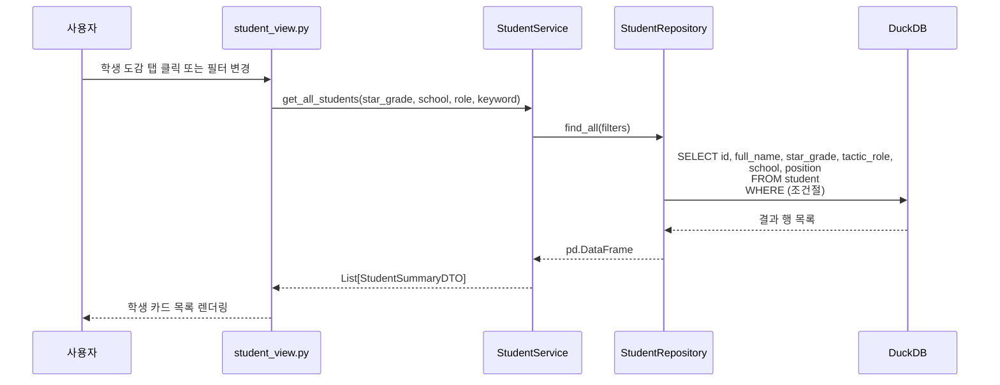
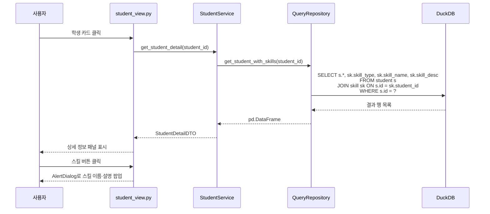
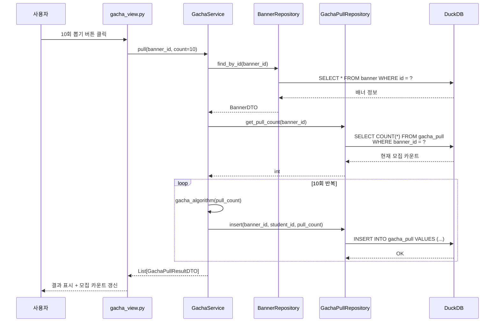
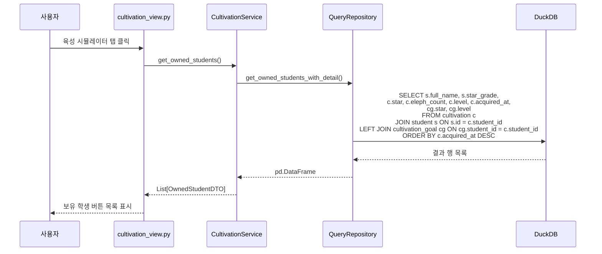
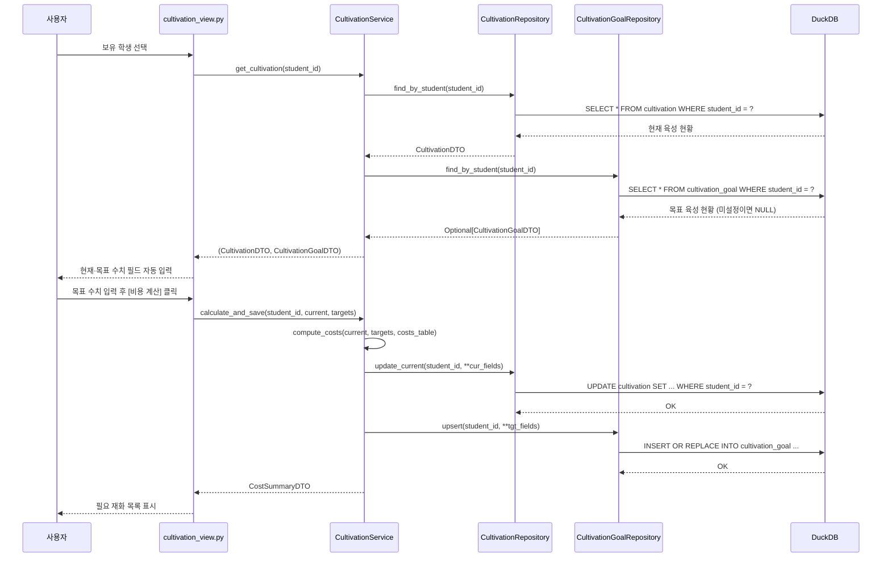

# 데이터베이스 Term Project 설계서

> **[작성 안내]**
>
> - `TODO:` 표시 = 직접 수정 필요한 부분
> - 5절 ERD는 VSCode ERD Editor에서 직접 그린 뒤 이미지 삽입
> - 10절 결론은 구현 완료 후 작성

---

## 설계서

# 블루아카이브 가챠 & 육성 시뮬레이터

---

## 1. 개요

블루아카이브(Blue Archive)는 Nexon Games에서 서비스하는 모바일 RPG로, 다양한 학생 캐릭터를 수집하고 육성하는 것이 핵심 콘텐츠이다. 학생은 가챠(확률형 뽑기) 시스템을 통해 획득하며, 획득한 학생은 레벨·스킬·고유 무기·애용품 등의 요소를 강화하여 전투력을 높일 수 있다.

그러나 실제 게임에서는 가챠 결과가 즉시 저장되지 않아 통계를 확인하기 어렵고, 육성에 드는 재화를 사전에 계산하는 공식 도구가 없다. 이에 본 프로젝트는 다음 세 가지 기능을 제공하는 데스크탑 애플리케이션을 설계한다.

1. **학생 도감**: SchaleDB(블루아카이브 비공식 데이터베이스)에서 수집한 260명의 학생 정보를 탐색하고, 스킬·고유 무기·애용품 등 상세 정보를 조회한다.
2. **가챠 시뮬레이터**: 실제 게임과 동일한 확률 구조(3성 3%, 200회 천장)를 적용한 뽑기 시뮬레이션을 제공하고, 결과를 DuckDB에 누적 저장한다.
3. **육성 시뮬레이터**: 보유한 학생의 현재 육성 수치와 목표 수치를 입력하면, 필요한 재화(크레딧·활동 보고서·스킬 재료·무기 강화 재료·선물)를 자동으로 계산한다.

데이터는 SchaleDB API(schaledb.com)에서 Python 스크립트로 사전 수집하며, Flet 기반 GUI와 DuckDB를 연동하여 구현한다.

---

## 2. 전체 구성도

```
┌─────────────────────────────────────────────────────────────┐
│                        사용자 (User)                         │
└──────────────────────────┬──────────────────────────────────┘
                           │ Flet GUI (main.py)
         ┌─────────────────┼─────────────────┐
         ▼                 ▼                 ▼
┌──────────────┐  ┌──────────────┐  ┌──────────────────┐
│  학생 도감   │  │ 가챠 시뮬레  │  │  육성 시뮬레이터 │
│student_view  │  │ gacha_view   │  │cultivation_view  │
└──────┬───────┘  └──────┬───────┘  └────────┬─────────┘
       │                 │                   │
       └─────────────────┼───────────────────┘
                         │ Service Layer
         ┌───────────────┼───────────────┐
         ▼               ▼               ▼
┌──────────────┐ ┌──────────────┐ ┌──────────────────┐
│StudentService│ │GachaService  │ │CultivationService│
└──────┬───────┘ └──────┬───────┘ └────────┬─────────┘
       │                │                  │
       └────────────────┼──────────────────┘
                        │ Repository Layer
    ┌───────────────────┼───────────────────────┐
    ▼           ▼       ▼       ▼               ▼
┌────────┐ ┌───────┐ ┌──────┐ ┌──────────┐ ┌──────────┐
│Student │ │Skill  │ │Banner│ │GachaPull │ │Cultivati-│
│Repo    │ │Repo   │ │Repo  │ │Repo      │ │onRepo    │
└────┬───┘ └───┬───┘ └──┬───┘ └────┬─────┘ └────┬─────┘
     └─────────┴─────────┴──────────┴─────────────┘
                              │
                     ┌────────▼────────┐
                     │    DuckDB       │
                     │  (local file)   │
                     └─────────────────┘

┌──────────────────────────────────────────────────┐
│  사전 수집 데이터 (data/ 폴더)                    │
│  - students.json  : SchaleDB 260명 학생 정보      │
│  - items.json     : 아이템 이름·EXP값             │
│  - gacha_config.json : 가챠 확률 설정             │
│  - costs.json     : 육성 비용 테이블              │
└──────────────────────────────────────────────────┘
```

### 구성 요소 설명

| 구성 요소        | 설명                                                                    |
| ---------------- | ----------------------------------------------------------------------- |
| Flet GUI         | Python Flet 라이브러리로 구현한 데스크탑 GUI. 탭 기반 3개 화면으로 구성 |
| Service Layer    | 비즈니스 로직 처리 (가챠 확률 계산, 육성 비용 계산 등)                  |
| Repository Layer | DuckDB 접근을 추상화한 레이어. 테이블별로 분리                          |
| DuckDB           | 로컬 파일 기반 인메모리 DB. 학생·배너·뽑기 기록·육성 현황 저장          |
| data/ 폴더       | SchaleDB API에서 사전 수집한 JSON 파일. 앱 최초 실행 시 DuckDB에 로드   |

---

## 3. Use Case (요구 사항 분석)

### 3.1 학생 정보 조회

- 학생 도감 탭을 클릭하면 학생 목록이 표시된다.
- 또는 육성 시뮬레이터에서 보유 학생을 선택할 때 학생 이름이 표시된다.
- 검색 혹은 필터를 통해 학교, 성급, 전술 역할, 공격 속성 등의 조건에 해당하는 학생만 출력할 수 있다.

#### 3.1.1 학생 상세 정보 조회

- 학생 목록에서 학생을 클릭하면 해당 학생의 상세 정보(프로필·전투 정보·지형 적응도)가 표시된다.
- 스킬 버튼(EX스킬·기본스킬·강화스킬·서브스킬)을 클릭하면 해당 스킬의 이름·설명·아이콘이 팝업으로 표시된다.
- 고유 무기 또는 애용품 상세 버튼을 클릭하면 해당 아이템의 이름과 설명이 팝업으로 표시된다.

### 3.2 가챠 뽑기

- 가챠 시뮬레이터 탭을 클릭하면 3성 학생별 배너 목록과 현재 모집 카운트가 표시된다.
- 배너는 3성 학생 1명당 1개씩 앱 초기화 시 자동 생성되며, 사용자가 직접 추가하지 않는다.
- 배너를 선택하고 1회 또는 10회 뽑기 버튼을 클릭하여 뽑기를 실행할 수 있다.
- 뽑기 결과는 성급별로 구분되어 표시되며, 모집 카운트가 자동으로 갱신된다.
- 학생은 최초 1회만 보유할 수 있으며, 이미 보유한 학생이 뽑히면 해당 학생의 엘레프로 지급된다.

#### 3.2.1 가챠 결과 저장

- 뽑기 결과는 자동으로 DB에 저장되어 보유 학생 목록 및 모집 카운트에 반영된다.
- 3성 학생을 해당 학생의 배너에서 처음 획득하면 학생과 함께 엘레프 100개가 지급되어 즉시 4성으로 시작한다.
- 이미 보유한 학생이 뽑히면 학생 대신 엘레프가 지급된다. 픽업 학생 중복 시 100개, 그 외 학생 중복 시 30개가 지급된다.
- 모집 카운트가 200회에 도달하면 픽업 학생 확정 수령 버튼이 활성화된다.
- 사용자가 버튼을 클릭하여 픽업 학생을 수령하면 모집 카운트에서 200회가 차감된다.

### 3.3 보유 학생 현황 조회

- 육성 시뮬레이터 탭을 클릭하면 가챠로 획득한 학생 목록이 표시된다.
- 각 학생의 최초 획득 배너, 획득일, 현재 성급(전무 포함), 보유 엘레프 수, 현재 육성 레벨이 함께 표시된다.
- 아직 육성 정보가 입력되지 않은 학생도 목록에 표시된다.

#### 3.3.1 육성 목표 설정

- 보유 학생을 클릭하면 육성 목표 설정 화면이 표시된다.
- 레벨, EX스킬, 기본/강화/서브스킬, 고유 무기, 인연 랭크의 현재 수치와 목표 수치를 입력할 수 있다.
- 현재/목표 성급(1~5성, 전무1~4성)을 설정할 수 있다.

#### 3.3.2 육성 비용 계산

- 육성 목표 설정 후 비용 계산 버튼을 클릭하면 목표 달성에 필요한 재화가 항목별로 표시된다.
- 계산 결과는 크레딧, 활동 보고서(등급별), 스킬 재료(아이템별), 무기 강화 재료, 선호 선물 수를 포함한다.
- 성급 목표가 설정된 경우 필요 엘레프 수와, 부족한 엘레프를 엘리그마로 구매할 때 드는 엘리그마 수도 함께 표시된다. (엘리그마 구매 비용은 구매 20회마다 1 → 2 → 3 → 4 → 5 엘리그마로 단계적으로 증가)
- 설정한 육성 목표는 DB에 저장되어 다음 실행 시에도 유지된다.

---

## 4. UI Design

### 4.1 전체 화면 구조 (탭 기반)

```
┌─────────────────────────────────────────────────────────────┐
│  블루아카이브 가챠 & 육성 시뮬레이터                          │  ← 제목바
├──────────────┬──────────────────┬───────────────────────────┤
│  학생 도감   │  가챠 시뮬레이터  │     육성 시뮬레이터         │  ← ft.Tabs
└──────────────┴──────────────────┴───────────────────────────┘
│                       (탭 콘텐츠 영역)                        │
└─────────────────────────────────────────────────────────────┘
```

**사용 Flet 컨트롤**: `ft.Tabs`, `ft.Tab`, `ft.AppBar`

---

### 4.2 학생 도감 화면

```
┌────────────────────────────────────────────────────────────┐
│ [검색: 이름 입력        🔍] [학교▼] [역할▼] [성급▼]        │  ← 필터 바
├──────────────┬─────────────────────────────────────────────┤
│              │                                             │
│  ★★★ 아루   │  리쿠하치마 아루  ★★★                       │
│  ★★★ 에이미 │  게헨나 학원 / 흥신소 68 / 2학년            │
│  ★★★ 하루나 │  저격소총 · 경장갑 · 딜러 · 후열            │
│  ★★★ 시로코 │  시가지 A  야외 C  실내 D                   │
│  ★★★ 슌    │                                             │
│  ★★★ 스미레 │  ┌──────┐ ┌──────┐ ┌──────┐ ┌──────┐      │
│  ★★ 아카네  │  │EX스킬│ │기본  │ │강화  │ │서브  │      │  ← 클릭 → 팝업
│  ★★ 치세   │  └──────┘ └──────┘ └──────┘ └──────┘      │
│  ★★ 아카리  │                                             │
│  ★★ 하스미  │  고유무기: 와인레드・어드마이어       [상세▶] │  ← 클릭 → 팝업
│  ...         │  애용품: 아루의 엄청 귀중한 지갑    [상세▶] │
│  (스크롤)    │                                             │
│              │  성우: 近藤玲奈  생일: 3월 12일             │
│              │  나이: 16세  키: 160cm                     │
│              │  취미: 경영 공부                            │
└──────────────┴─────────────────────────────────────────────┘
```

**사용 Flet 컨트롤**: `ft.ListView`, `ft.Card`, `ft.TextField`, `ft.Dropdown`, `ft.Row`, `ft.Column`, `ft.AlertDialog`

**화면 전환 시나리오**

- 학생 카드 클릭 → 우측 패널에 상세 정보 표시
- 스킬 버튼 클릭 → `ft.AlertDialog`로 스킬 이름·설명 팝업
- 고유 무기 / 애용품 [상세▶] 클릭 → `ft.AlertDialog`로 설명 팝업

---

### 4.3 가챠 시뮬레이터 화면

```
┌────────────────────────────────────────────────────────────┐
│  배너 선택:  [ 아루 ▼ ]  (3성 학생 목록)                    │  ← ft.Dropdown
├────────────────────────────────────────────────────────────┤
│  모집 진행도                                               │
│  ████████████████████░░░░░░░░░  126 / 200                 │  ← ft.ProgressBar
│  200회 모집 시 픽업 학생 확정 수령 가능                      │
│                                                            │
│            [ 1회 뽑기 ]       [ 10회 뽑기 ]               │  ← ft.ElevatedButton
│         [ 픽업 학생 수령 ] (200회 도달 시 활성화)            │  ← ft.ElevatedButton
│                                                            │
├────────────────────────────────────────────────────────────┤
│  ─── 최근 뽑기 결과 ──────────────────────────────────── │
│  ★★★ 아루!  ★★ 아야네  ★★ 모모이  ★ 치나츠  ...       │  ← ft.Row (가로 스크롤)
├────────────────────────────────────────────────────────────┤
│  총 뽑기 횟수: 324회  │  ★★★ 획득: 12명  │  픽업까지: 74회│
└────────────────────────────────────────────────────────────┘
```

**사용 Flet 컨트롤**: `ft.Dropdown`, `ft.ProgressBar`, `ft.ElevatedButton`, `ft.Row`, `ft.Text`, `ft.Card`

**화면 전환 시나리오**

- 배너 선택 → 픽업 학생 정보 및 모집 카운트 갱신
- 뽑기 버튼 클릭 → 결과 표시 + DB 저장 + 진행도 바 갱신

---

### 4.4 육성 시뮬레이터 화면

```
┌────────────────────────────────────────────────────────────┐
│  내 학생 (보유 12명)                                        │
│  [ 아루 ★4 ] [ 에이미 ★4 ] [ 시로코 ★전무2 ] ...           │  ← ft.Row (가로 스크롤)
├────────────────────────────────────────────────────────────┤
│  [ 아루 ]  현재 성급: ★4  엘레프: 35개  육성 목표 설정      │
│                                                            │
│  성급      현재 [★4 ↕]  →  목표 [★5    ↕]                │
│  전무 성급  현재 [ 미장착]  →  목표 [ 전무2성 ↕]            │
│  레벨      현재 [ 1  ↕]  →  목표 [ 80 ↕]                 │
│  EX 스킬   현재 [ 1  ↕]  →  목표 [  5 ↕]                 │
│  기본 스킬  현재 [ 1  ↕]  →  목표 [ 10 ↕]                 │
│  강화 스킬  현재 [ 1  ↕]  →  목표 [ 10 ↕]                 │  ← ft.TextField
│  서브 스킬  현재 [ 1  ↕]  →  목표 [ 10 ↕]                 │    (숫자 입력)
│  고유 무기  현재 [ 1  ↕]  →  목표 [ 50 ↕]                 │
│  애용품    현재 [미장착↕]  →  목표 [ T2  ↕]              │
│  인연 랭크  현재 [ 1  ↕]  →  목표 [ 20 ↕]                 │
│                                                            │
│                    [ 비용 계산하기 ]                        │  ← ft.ElevatedButton
│                                                            │
├────────────────────────────────────────────────────────────┤
│  ─── 필요 재화 ─────────────────────────────────────────  │
│  크레딧                    23,450,000                      │
│  초급 활동 보고서           150개                           │
│  상급 활동 보고서           200개                           │  ← ft.DataTable
│  기초 기술 노트 (게헨나)    300개                           │
│  일반 기술 노트 (게헨나)    180개                           │
│  상급 기술 노트 (게헨나)     90개                           │
│  선물 (SR급 기준)           380개                           │
│  ─── 성급 육성 ─────────────────────────────────────────  │
│  필요 엘레프               220개 (보유 35개, 부족 185개)    │
│  엘리그마 (엘레프 구매)      198개                          │
└────────────────────────────────────────────────────────────┘
```

**사용 Flet 컨트롤**: `ft.Row`, `ft.Column`, `ft.TextField`, `ft.ElevatedButton`, `ft.DataTable`, `ft.Card`, `ft.Text`

**화면 전환 시나리오**

- 보유 학생 버튼 클릭 → 해당 학생의 현재 육성 현황 로드
- 비용 계산 버튼 클릭 → 필요 재화 테이블 갱신 + cultivation DB 저장

---

## 5. Conceptual Design

> **[TODO]** 아래 테이블/관계 명세를 참고하여 VSCode ERD Editor에서 **Crow's Feet Diagram**을 직접 작성한 뒤 이미지로 캡처하여 삽입할 것.

### 엔티티 및 관계 명세

#### Entity 1: student (학생)

| 컬럼명                 | 타입    | 설명                                         |
| ---------------------- | ------- | -------------------------------------------- |
| id (PK)                | INTEGER | SchaleDB 학생 고유 ID                        |
| path_name              | VARCHAR | 영문 식별자                                  |
| full_name              | VARCHAR | 전체 이름 (한국어)                           |
| star_grade             | INTEGER | 성급 (1·2·3)                                 |
| is_limited             | VARCHAR | 통상/한정/배포/페스/아카이브 모집            |
| weapon_type_code       | VARCHAR | 무기 종류 코드 (SR/SG/AR 등)                 |
| armor_type             | VARCHAR | 장갑 종류                                    |
| tactic_role            | VARCHAR | 전술 역할                                    |
| position               | VARCHAR | 포지션                                       |
| bullet_type            | VARCHAR | 공격 속성                                    |
| terrain_street         | VARCHAR | 시가지 적응도                                |
| terrain_outdoor        | VARCHAR | 야외 적응도                                  |
| terrain_indoor         | VARCHAR | 실내 적응도                                  |
| weapon_name (UNIQUE)   | VARCHAR | 고유 무기 이름 (학생마다 유일 → 후보키)      |
| weapon_desc            | TEXT    | 고유 무기 설명                               |
| weapon_stat_level_type | VARCHAR | 무기 성장 타입                               |
| gear_name (UNIQUE)     | VARCHAR | 애용품 이름 (NULL이면 미보유, 유일 → 후보키) |
| gear_desc              | TEXT    | 애용품 설명                                  |
| school                 | VARCHAR | 소속 학원명                                  |
| club                   | VARCHAR | 소속 동아리                                  |
| school_year            | VARCHAR | 학년                                         |
| voice                  | VARCHAR | 성우                                         |
| birthday               | VARCHAR | 생일                                         |
| age                    | VARCHAR | 나이                                         |
| height                 | VARCHAR | 키                                           |
| hobby                  | TEXT    | 취미                                         |

#### 약한 엔티티: skill (스킬) — student에 종속

| 컬럼명                  | 타입    | 설명                                 |
| ----------------------- | ------- | ------------------------------------ |
| id (PK)                 | INTEGER | 스킬 고유 ID                         |
| student_id (FK→student) | INTEGER | 소속 학생 ID                         |
| skill_type              | VARCHAR | EX스킬/기본스킬/강화스킬/서브스킬 등 |
| skill_name              | VARCHAR | 스킬 이름                            |
| skill_desc              | TEXT    | 스킬 설명                            |
| skill_icon              | VARCHAR | 스킬 아이콘 URL                      |

- 후보키: {id}, {student_id, skill_type} — UNIQUE(student_id, skill_type) 복합 후보키

#### 약한 엔티티: student_image (학생 이미지) — student에 종속

학생 1명당 여러 이미지 타입을 가질 수 있음. 이미지가 없는 타입은 레코드 미존재 → LEFT JOIN 필요.

| 컬럼명                  | 타입    | 설명                                           |
| ----------------------- | ------- | ---------------------------------------------- |
| id (PK)                 | INTEGER | 이미지 고유 ID                                 |
| student_id (FK→student) | INTEGER | 소속 학생 ID                                   |
| image_type              | VARCHAR | 이미지 종류 ('collection' / 'icon' / 'weapon') |
| image_url               | VARCHAR | SchaleDB 이미지 URL                            |

- 후보키: {id}, {student_id, image_type}
- student 테이블에 image_url을 직접 저장하면 path_name(비키) → image_url FD가 발생해 BCNF를 위반하므로, 별도 테이블로 분리하여 해소
- 이미지가 없는 학생도 목록에 표시해야 하므로 조회 시 **LEFT JOIN** 사용

#### Entity 2: banner (배너)

3성 학생 1명당 배너 1개. 앱 초기화 시 student 테이블의 3성 학생을 기준으로 자동 생성.

| 컬럼명                                | 타입    | 설명                                                                   |
| ------------------------------------- | ------- | ---------------------------------------------------------------------- |
| id (PK)                               | INTEGER | 배너 고유 ID                                                           |
| pickup_student_id (UNIQUE FK→student) | INTEGER | 픽업 학생 ID (3성 학생, NOT NULL)                                      |
| is_active                             | BOOLEAN | 현재 활성 여부                                                         |
| claimed_count                         | INTEGER | 픽업 확정 수령 횟수 (모집 카운트 = 전체 뽑기 수 − claimed_count × 200) |

#### Relationship 1: gacha_pull (가챠 뽑기 기록) — banner ↔ student

| 컬럼명                  | 타입      | 설명                     |
| ----------------------- | --------- | ------------------------ |
| id (PK)                 | INTEGER   | 뽑기 고유 ID             |
| banner_id (FK→banner)   | INTEGER   | 뽑은 배너                |
| student_id (FK→student) | INTEGER   | 획득한 학생              |
| pulled_at               | TIMESTAMP | 뽑기 일시                |
| pull_count              | INTEGER   | 뽑기 시점의 모집 누적 수 |

#### Relationship 2: cultivation (현재 육성 현황) — student와 1:0..1

학생 최초 획득 시 자동 생성. `acquired_at`으로 보유 학생 목록을 획득 순서대로 정렬.

| 컬럼명                         | 타입      | 설명                                                              |
| ------------------------------ | --------- | ----------------------------------------------------------------- |
| id (PK)                        | INTEGER   | 고유 ID                                                           |
| student_id (UNIQUE FK→student) | INTEGER   | 대상 학생                                                         |
| star                           | INTEGER   | 현재 성급 (1~5)                                                   |
| weapon_star                    | INTEGER   | 현재 전무 성급 (0~4, 0=미장착, 5성 달성 후에만 가능)              |
| eleph_count                    | INTEGER   | 현재 보유 엘레프 수                                               |
| level                          | INTEGER   | 현재 레벨 (1~90)                                                  |
| ex_skill                       | INTEGER   | EX 스킬 현재 레벨 (1~5)                                           |
| normal_skill                   | INTEGER   | 기본 스킬 현재 레벨 (1~10)                                        |
| enhance_skill                  | INTEGER   | 강화 스킬 현재 레벨 (1~10)                                        |
| sub_skill                      | INTEGER   | 서브 스킬 현재 레벨 (1~10)                                        |
| weapon_level                   | INTEGER   | 고유 무기 현재 레벨 (1~50)                                        |
| gear_level                     | INTEGER   | 애용품 현재 티어 (0=미장착, 1=T1, 2=T2)                           |
| bond_rank                      | INTEGER   | 인연 랭크 현재 (1~100)                                            |
| acquired_at                    | TIMESTAMP | 최초 획득 일시 — 가챠 뽑기 시 자동 설정, 보유 학생 목록 정렬 기준 |
| updated_at                     | TIMESTAMP | 마지막 수정 일시                                                  |

#### Relationship 3: cultivation_goal (목표 육성 현황) — student와 1:0..1

목표를 설정한 경우에만 레코드 생성. 미설정 학생도 보유 목록에 표시해야 하므로 `cultivation LEFT JOIN cultivation_goal` 사용.

| 컬럼명                         | 타입      | 설명                                                 |
| ------------------------------ | --------- | ---------------------------------------------------- |
| id (PK)                        | INTEGER   | 고유 ID                                              |
| student_id (UNIQUE FK→student) | INTEGER   | 대상 학생                                            |
| star                           | INTEGER   | 목표 성급 (1~5)                                      |
| weapon_star                    | INTEGER   | 목표 전무 성급 (0~4, 0=미장착, 5성 달성 후에만 가능) |
| level                          | INTEGER   | 목표 레벨 (1~90)                                     |
| ex_skill                       | INTEGER   | EX 스킬 목표 레벨 (1~5)                              |
| normal_skill                   | INTEGER   | 기본 스킬 목표 레벨 (1~10)                           |
| enhance_skill                  | INTEGER   | 강화 스킬 목표 레벨 (1~10)                           |
| sub_skill                      | INTEGER   | 서브 스킬 목표 레벨 (1~10)                           |
| weapon_level                   | INTEGER   | 고유 무기 목표 레벨 (1~50)                           |
| gear_level                     | INTEGER   | 애용품 목표 티어 (0=미장착, 1=T1, 2=T2)              |
| bond_rank                      | INTEGER   | 인연 랭크 목표 (1~100)                               |
| updated_at                     | TIMESTAMP | 마지막 수정 일시                                     |

### 관계 카디널리티

- **student** 1 ──< **skill** N : 한 학생은 여러 스킬을 보유
- **student** 1 ──< **student_image** N : 한 학생은 여러 이미지 타입을 가짐 (없을 수 있음 → LEFT JOIN)
- **student** 1 ──── **banner** 0..1 : 3성 학생에게만 배너 1개씩 존재 (ERD ZeroOne), 1성·2성 학생은 배너 없음
- **student** N >──< **banner** M via **gacha_pull** : 한 학생이 여러 배너의 결과로 뽑힐 수 있음
- **student** 1 ──── **cultivation** 0..1 : 학생 최초 획득 시 자동 생성, acquired_at 포함
- **student** 1 ──── **cultivation_goal** 0..1 : 목표 설정 시에만 생성 → cultivation LEFT JOIN cultivation_goal

> **(ERD 이미지 삽입 위치)**

---

## 6. Logical Design

```sql
-- ================================================
-- DuckDB DDL
-- 블루아카이브 가챠 & 육성 시뮬레이터
-- ================================================

-- Entity 1: 학생 기본 정보
CREATE TABLE student (
    id                     INTEGER PRIMARY KEY,
    path_name              VARCHAR,
    full_name              VARCHAR NOT NULL,
    star_grade             INTEGER NOT NULL CHECK (star_grade IN (1, 2, 3)),
    is_limited             VARCHAR NOT NULL,
    weapon_type_code       VARCHAR,
    armor_type             VARCHAR,
    tactic_role            VARCHAR,
    position               VARCHAR,
    bullet_type            VARCHAR,
    terrain_street         VARCHAR,
    terrain_outdoor        VARCHAR,
    terrain_indoor         VARCHAR,
    weapon_name            VARCHAR NOT NULL UNIQUE,  -- 고유 무기명은 학생마다 유일 → 후보키
    weapon_desc            TEXT,
    weapon_stat_level_type VARCHAR DEFAULT 'Standard',
    gear_name              VARCHAR UNIQUE,     -- 애용품명도 학생마다 유일 (NULL 허용)
    gear_desc              TEXT,
    school                 VARCHAR,
    club                   VARCHAR,
    school_year            VARCHAR,
    voice                  VARCHAR,
    birthday               VARCHAR,
    age                    VARCHAR,
    height                 VARCHAR,
    hobby                  TEXT
);

-- 약한 엔티티: 학생 이미지 (student 종속)
-- image_type: 'collection'(초상화) / 'icon'(아이콘) / 'weapon'(전용무기)
CREATE SEQUENCE seq_student_image START 1;
CREATE TABLE student_image (
    id          INTEGER PRIMARY KEY DEFAULT nextval('seq_student_image'),
    student_id  INTEGER NOT NULL REFERENCES student(id),
    image_type  VARCHAR NOT NULL CHECK (image_type IN ('collection', 'icon', 'weapon')),
    image_url   VARCHAR NOT NULL,
    UNIQUE (student_id, image_type)
);

-- 약한 엔티티: 스킬 (student 종속)
CREATE SEQUENCE seq_skill START 1;
CREATE TABLE skill (
    id          INTEGER PRIMARY KEY DEFAULT nextval('seq_skill'),
    student_id  INTEGER NOT NULL REFERENCES student(id),
    skill_type  VARCHAR NOT NULL,
    skill_name  VARCHAR,
    skill_desc  TEXT,
    skill_icon  VARCHAR,
    UNIQUE (student_id, skill_type)
);

-- Entity 2: 배너 (3성 학생 1명당 1개, 앱 초기화 시 자동 생성)
CREATE SEQUENCE seq_banner START 1;
CREATE TABLE banner (
    id                INTEGER PRIMARY KEY DEFAULT nextval('seq_banner'),
    pickup_student_id INTEGER NOT NULL UNIQUE REFERENCES student(id),
    is_active         BOOLEAN DEFAULT TRUE,
    claimed_count     INTEGER DEFAULT 0 CHECK (claimed_count >= 0)
);

-- Relationship 1: 가챠 뽑기 기록 (banner ↔ student N:M 관계 테이블)
CREATE SEQUENCE seq_gacha_pull START 1;
CREATE TABLE gacha_pull (
    id          INTEGER PRIMARY KEY DEFAULT nextval('seq_gacha_pull'),
    banner_id   INTEGER NOT NULL REFERENCES banner(id),
    student_id  INTEGER NOT NULL REFERENCES student(id),
    pulled_at   TIMESTAMP DEFAULT CURRENT_TIMESTAMP,
    pull_count  INTEGER NOT NULL
    -- is_pickup 제거: banner.pickup_student_id = gacha_pull.student_id 로 도출 가능
);

-- Relationship 2: 현재 육성 현황 (student 1:0..1, 학생 획득 시 자동 생성)
CREATE SEQUENCE seq_cultivation START 1;
CREATE TABLE cultivation (
    id                 INTEGER PRIMARY KEY DEFAULT nextval('seq_cultivation'),
    student_id         INTEGER UNIQUE NOT NULL REFERENCES student(id),
    star               INTEGER DEFAULT 1  CHECK (star            BETWEEN 1 AND 5),
    weapon_star        INTEGER DEFAULT 0  CHECK (weapon_star     BETWEEN 0 AND 4
                                               AND (weapon_star = 0 OR star = 5)),
    eleph_count        INTEGER DEFAULT 0  CHECK (eleph_count >= 0),
    level              INTEGER DEFAULT 1  CHECK (level           BETWEEN 1 AND 90),
    ex_skill           INTEGER DEFAULT 1  CHECK (ex_skill        BETWEEN 1 AND 5),
    normal_skill       INTEGER DEFAULT 1  CHECK (normal_skill    BETWEEN 1 AND 10),
    enhance_skill      INTEGER DEFAULT 1  CHECK (enhance_skill   BETWEEN 1 AND 10),
    sub_skill          INTEGER DEFAULT 1  CHECK (sub_skill       BETWEEN 1 AND 10),
    weapon_level       INTEGER DEFAULT 1  CHECK (weapon_level    BETWEEN 1 AND 50),
    gear_level         INTEGER DEFAULT 0  CHECK (gear_level      BETWEEN 0 AND 2),
    bond_rank          INTEGER DEFAULT 1  CHECK (bond_rank       BETWEEN 1 AND 100),
    acquired_at        TIMESTAMP NOT NULL,                         -- 최초 획득 일시 (가챠 뽑기 시 자동 설정)
    updated_at         TIMESTAMP DEFAULT CURRENT_TIMESTAMP
);

-- Relationship 3: 목표 육성 현황 (student 1:0..1, 목표 설정 시에만 생성)
CREATE SEQUENCE seq_cultivation_goal START 1;
CREATE TABLE cultivation_goal (
    id                 INTEGER PRIMARY KEY DEFAULT nextval('seq_cultivation_goal'),
    student_id         INTEGER UNIQUE NOT NULL REFERENCES student(id),
    star               INTEGER DEFAULT 1  CHECK (star            BETWEEN 1 AND 5),
    weapon_star        INTEGER DEFAULT 0  CHECK (weapon_star     BETWEEN 0 AND 4
                                               AND (weapon_star = 0 OR star = 5)),
    level              INTEGER DEFAULT 1  CHECK (level           BETWEEN 1 AND 90),
    ex_skill           INTEGER DEFAULT 1  CHECK (ex_skill        BETWEEN 1 AND 5),
    normal_skill       INTEGER DEFAULT 1  CHECK (normal_skill    BETWEEN 1 AND 10),
    enhance_skill      INTEGER DEFAULT 1  CHECK (enhance_skill   BETWEEN 1 AND 10),
    sub_skill          INTEGER DEFAULT 1  CHECK (sub_skill       BETWEEN 1 AND 10),
    weapon_level       INTEGER DEFAULT 1  CHECK (weapon_level    BETWEEN 1 AND 50),
    gear_level         INTEGER DEFAULT 0  CHECK (gear_level      BETWEEN 0 AND 2),
    bond_rank          INTEGER DEFAULT 1  CHECK (bond_rank       BETWEEN 1 AND 100),
    updated_at         TIMESTAMP DEFAULT CURRENT_TIMESTAMP
);
```

### BCNF 정규화 확인

| 테이블           | 후보키                           | 함수 종속 검토                                                                                                                       | BCNF |
| ---------------- | -------------------------------- | ------------------------------------------------------------------------------------------------------------------------------------ | ---- |
| student          | {id}, {weapon_name}, {gear_name} | weapon_name·gear_name에 UNIQUE 추가로 후보키 승격. weapon_name → weapon_desc·weapon_stat_level_type, gear_name → gear_desc 위반 해소 | ✓    |
| student_image    | {id}, {student_id, image_type}   | image_url은 후보키 {student_id, image_type}에 종속                                                                                   | ✓    |
| skill            | {id}, {student_id, skill_type}   | 모든 속성이 두 후보키 중 하나에 종속                                                                                                 | ✓    |
| banner           | {id}, {pickup_student_id}        | pickup_student_id UNIQUE → 후보키. is_active·claimed_count 모두 배너에만 종속                                                        | ✓    |
| gacha_pull       | {id}                             | is_pickup 제거(banner JOIN으로 도출). pull_count는 뽑기 사건(id)에만 종속                                                            | ✓    |
| cultivation      | {id}, {student_id}               | student_id가 후보키. star, weapon_star, level, skill, weapon_level, gear_level, bond_rank, acquired_at, updated_at 모두 student_id에 종속 | ✓    |
| cultivation_goal | {id}, {student_id}               | student_id가 후보키. star, weapon_star, level, skill, weapon_level, gear_level, bond_rank, updated_at 모두 student_id에 종속             | ✓    |

---

## 7. Sequence Diagram

> 참고: 사용자-Flet View-Service-Repository-DuckDB 계층 구조로 작성. 각 다이어그램은 3절 Use Case와 1:1 대응한다.

### 7.1 학생 목록 조회 및 필터링 (3.1)



### 7.2 학생 상세 정보 및 스킬 조회 (3.1.1)



### 7.3 가챠 뽑기 실행 및 결과 저장 (3.2 / 3.2.1)



### 7.4 보유 학생 현황 조회 (3.3)



### 7.5 육성 목표 설정 및 비용 계산 (3.3.1 / 3.3.2)



---

## 8. Repository Interface 설계

```python
from abc import ABC, abstractmethod
from typing import Optional
import pandas as pd


# ── 1. 학생 테이블 ──────────────────────────────────────────
class IStudentRepository(ABC):

    @abstractmethod
    def create_table(self) -> None:
        """student 테이블 생성 (없으면)"""
        ...

    @abstractmethod
    def bulk_insert(self, students: list[dict]) -> None:
        """JSON에서 로드한 260명 일괄 삽입"""
        ...

    @abstractmethod
    def find_all(self,
                 star_grade: Optional[int] = None,
                 school: Optional[str] = None,
                 tactic_role: Optional[str] = None,
                 keyword: Optional[str] = None) -> pd.DataFrame:
        """조건 필터링 후 학생 목록 반환"""
        ...

    @abstractmethod
    def find_by_id(self, student_id: int) -> Optional[pd.Series]:
        """단일 학생 조회"""
        ...


# ── 2. 스킬 테이블 ──────────────────────────────────────────
class ISkillRepository(ABC):

    @abstractmethod
    def create_table(self) -> None: ...

    @abstractmethod
    def bulk_insert(self, student_id: int, skills: list[dict]) -> None:
        """한 학생의 스킬 목록 일괄 삽입"""
        ...

    @abstractmethod
    def find_by_student(self, student_id: int) -> pd.DataFrame:
        """학생 ID로 스킬 목록 조회"""
        ...


# ── 3. 배너 테이블 ──────────────────────────────────────────
class IBannerRepository(ABC):

    @abstractmethod
    def create_table(self) -> None: ...

    @abstractmethod
    def find_all_active(self) -> pd.DataFrame:
        """활성 배너 목록 조회"""
        ...

    @abstractmethod
    def find_by_id(self, banner_id: int) -> Optional[pd.Series]: ...


# ── 4. 가챠 뽑기 기록 테이블 ───────────────────────────────
class IGachaPullRepository(ABC):

    @abstractmethod
    def create_table(self) -> None: ...

    @abstractmethod
    def insert(self,
               banner_id: int,
               student_id: int,
               pull_count: int) -> None:
        """뽑기 결과 1건 저장"""
        ...

    @abstractmethod
    def get_pull_count(self, banner_id: int) -> int:
        """해당 배너의 현재 모집 누적 수 반환"""
        ...

    @abstractmethod
    def find_by_banner(self, banner_id: int) -> pd.DataFrame:
        """배너별 뽑기 기록 조회"""
        ...


# ── 5. 현재 육성 현황 테이블 ────────────────────────────────
class ICultivationRepository(ABC):

    @abstractmethod
    def create_table(self) -> None: ...

    @abstractmethod
    def insert_on_acquire(self, student_id: int, acquired_at) -> None:
        """학생 최초 획득 시 cultivation 레코드 생성 (acquired_at 자동 설정)"""
        ...

    @abstractmethod
    def update_current(self, student_id: int, **cur_fields) -> None:
        """현재 육성 수치 갱신 (cur_* 필드 및 eleph_count)"""
        ...

    @abstractmethod
    def find_by_student(self, student_id: int) -> Optional[pd.Series]:
        """학생 ID로 현재 육성 현황 조회"""
        ...


# ── 6. 목표 육성 현황 테이블 ────────────────────────────────
class ICultivationGoalRepository(ABC):

    @abstractmethod
    def create_table(self) -> None: ...

    @abstractmethod
    def upsert(self, student_id: int, **tgt_fields) -> None:
        """목표 육성 수치 삽입 또는 갱신 (tgt_* 필드)"""
        ...

    @abstractmethod
    def find_by_student(self, student_id: int) -> Optional[pd.Series]:
        """학생 ID로 목표 육성 현황 조회 (미설정이면 None)"""
        ...


# ── 7. JOIN 전용 쿼리 Repository ────────────────────────────
class IQueryRepository(ABC):

    @abstractmethod
    def get_student_with_skills(self, student_id: int) -> pd.DataFrame:
        """student JOIN skill — 학생 상세 + 스킬 목록"""
        ...

    @abstractmethod
    def get_owned_students_with_detail(self) -> pd.DataFrame:
        """
        cultivation
        JOIN  student           ON student.id = cultivation.student_id
        LEFT JOIN cultivation_goal ON cultivation_goal.student_id = cultivation.student_id
        보유 학생 현황 + 목표 통합 조회 — 3개 이상 테이블 JOIN + LEFT JOIN
        """
        ...
```

---

## 9. 설계 구성 요소 및 제한 요소 충족 여부

| 설계 구성요소 |      |      |           |           |          | 설계 제한요소 |           |        |      |        |               |      |
| :-----------: | :--: | :--: | :-------: | :-------: | :------: | :-----------: | :-------: | :----: | :--: | :----: | :-----------: | :--: |
|   목표설정    | 합성 | 분석 | 구현/제작 | 시험/평가 | 결과도출 |     성능      | 규격/표준 | 경제성 | 미학 | 신뢰성 | 안정성/내구성 | 환경 |
|       ○       |      |  ○   |     ○     |           |    ○     |               |     ○     |        |  ○   |   ○    |               |  ○   |

### 9.1 설계 구성 요소

#### (1) 목표 설정

- 블루아카이브 게임의 학생 정보를 조회하고, 가챠 시뮬레이션 결과를 DB에 누적 저장하며, 육성에 드는 재화 비용을 사전에 계산할 수 있는 데스크탑 애플리케이션을 개발한다.

#### (2) 분석

- SchaleDB(schaledb.com) API에서 260명의 학생 데이터(이름·성급·공격타입·방어타입·스킬·고유 무기·애용품·프로필)를 Python 스크립트로 수집·분석하였다.
- 실제 게임의 가챠 확률표(3성 3%, 픽업 0.7%, 200회 천장)를 분석하여 시뮬레이터에 반영하였다.
- 인게임 육성 비용(레벨업 EXP·크레딧, 스킬 재료, 무기 강화 재료, 선물 수)을 분석하여 비용 계산 테이블을 구성하였다.

#### (3) 구현/제작

- Python 언어로 개발하며, Flet 라이브러리로 GUI를 구현한다.
- DuckDB를 로컬 파일 기반 데이터베이스로 사용한다.
- SchaleDB API에서 사전 수집한 JSON 데이터를 앱 최초 실행 시 DuckDB에 로드한다.

---

### 9.2 설계 제한 요소

#### (1) 규격/표준

- SQL DDL CREATE 문을 사용하여 테이블을 정의하고, DuckDB에서 실행한다.
- 사용 테이블 (총 7개):
  1. **student**: 학생 기본 정보 저장
  2. **student_image**: 학생별 이미지 URL 저장 (student 종속 엔티티, LEFT JOIN 활용)
  3. **skill**: 학생별 스킬 정보 저장 (student 종속 엔티티)
  4. **banner**: 가챠 배너 정보 저장 (3성 학생 1명당 1개)
  5. **gacha_pull**: 가챠 뽑기 기록 저장 (banner ↔ student 관계 테이블)
  6. **cultivation**: 보유 학생의 현재 육성 현황 저장 (student와 1:0..1, 획득 시 자동 생성)
  7. **cultivation_goal**: 목표 육성 현황 저장 (student와 1:0..1, 목표 설정 시 생성)

- JOIN 사용 내역:
  - `student JOIN skill` : 학생 상세 정보 + 스킬 목록 조회 (Use Case 3.1.1)
  - `student LEFT JOIN student_image` : 학생 도감 목록 — 이미지 없는 학생도 표시 (Use Case 3.1)
  - `cultivation JOIN student LEFT JOIN cultivation_goal` : 보유 학생 현황 + 목표 통합 조회 — **3개 이상 테이블 JOIN + LEFT JOIN** (Use Case 3.3)

#### (2) 미학

- Flet의 `ft.Card`, `ft.ListView`, `ft.DataTable` 등을 활용하여 직관적인 UI를 구성한다.
- 학생 이미지는 SchaleDB의 이미지 URL(`https://schaledb.com/images/student/collection/{path_name}.webp`)을 DB의 `path_name` 컬럼에서 조합하여 동적으로 로드한다.
- 가챠 결과는 성급별로 색상을 달리하여 시각적으로 구분한다.

#### (3) 신뢰성

- 가챠 뽑기 결과는 `gacha_pull` 테이블에 즉시 INSERT되어 앱 재시작 후에도 기록이 유지된다.
- 육성 목표 설정 후 [비용 계산] 버튼 클릭 시 `cultivation` 테이블이 UPSERT되어 설정이 보존된다.
- 모집 카운트는 `gacha_pull` 테이블의 레코드 수를 집계하여 계산하므로, 항상 실제 뽑기 기록과 일치한다.

#### (4) 환경

- Python 언어로 DuckDB에 접근하고, Flet을 사용하여 데스크탑 GUI 애플리케이션을 개발한다.
- 개발 환경: macOS / Python 3.11 이상 / DuckDB 0.10 이상 / Flet 0.21 이상

---

## 10. 결론 및 자체 평가

평소 즐겨하는 블루아카이브를 주제로 선정하여, SchaleDB API에서 학생 데이터 260여 명을 Python 스크립트로 자동 수집하고 DuckDB에 저장하는 구조를 설계하였다. 핵심 기능인 가챠 시뮬레이터와 육성 비용 계산기를 중심으로 7개 테이블을 설계하였으며, ERD는 VSCode ERD Editor로 Crow's Feet 표기법에 따라 작성하고 Flet 기반 3탭 GUI와의 연동 구조를 Sequence Diagram으로 명세하였다.

설계 결과에 대해 전반적으로 요구사항을 충족하였다고 생각한다. 특히 학생의 현재 육성 수치와 목표 수치를 처음에는 하나의 테이블에 담으려 했으나, 컬럼 수가 지나치게 많아진다는 점을 인식하고 cultivation(현재 상태)과 cultivation_goal(목표 상태)로 분리한 결정이 유효했다. 이 구조 덕분에 과제 요구사항인 3개 이상 테이블 JOIN과 LEFT JOIN을 별도로 의식하지 않아도 자연스럽게 충족할 수 있었다. 다만 처음부터 이를 고려했다면 중간에 발생한 연쇄 수정 작업을 줄일 수 있었을 것이라는 아쉬움이 남는다.

어려웠던 점으로는 크게 세 가지가 있었다. 첫째, 스킬 컬럼명을 짓는 과정에서 영문 API 코드(Passive, Public)와 인게임 한국어 명칭(서브스킬, 강화스킬)을 혼용하다 보니 passive_skill과 sub_skill이 둘 다 서브스킬을 가리키는 것처럼 보이는 혼란이 생겼고, 실제 게임 내 스킬 표시 순서(EX → 기본 → 강화 → 서브)와 초기 설계 순서도 달랐다. 한국어 인게임 명칭 기준으로 컬럼명과 순서를 통일하여 해결하였다. 둘째, cultivation 테이블을 두 개로 분리하면서 기존에 cur_, tgt_ 접두사로 구분하던 컬럼명이 불필요해졌는데, 접두사를 제거하자 ERD 명세, DDL, BCNF 분석표, Sequence Diagram SQL 등 여러 곳에서 연쇄적으로 수정이 필요해졌다. 각 항목을 하나씩 점검하며 일관성을 맞추었다. 셋째, gacha_pull 테이블에 처음에는 해당 뽑기 결과가 픽업 학생인지 여부를 나타내는 is_pickup 컬럼을 포함시켰으나, 이 값이 banner.pickup_student_id와 gacha_pull.student_id를 비교하면 언제든지 도출할 수 있는 중복 정보임을 인식하여 제거하였다. 단순히 컬럼을 추가하는 것보다 JOIN으로 도출 가능한 정보는 저장하지 않는 것이 정규화 원칙에 부합한다는 점을 설계 과정에서 직접 체감하였다.
