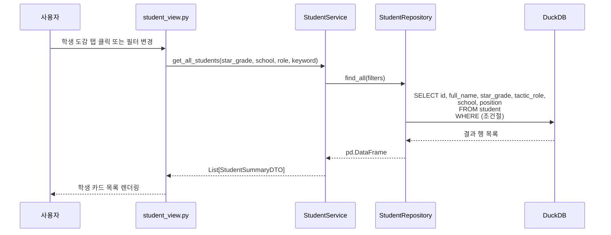
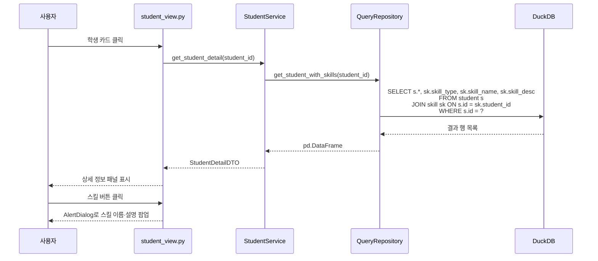
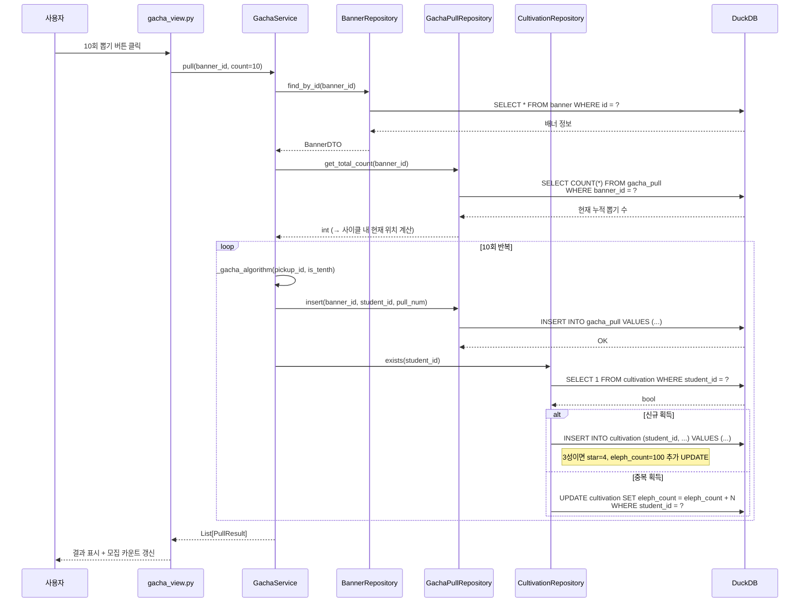
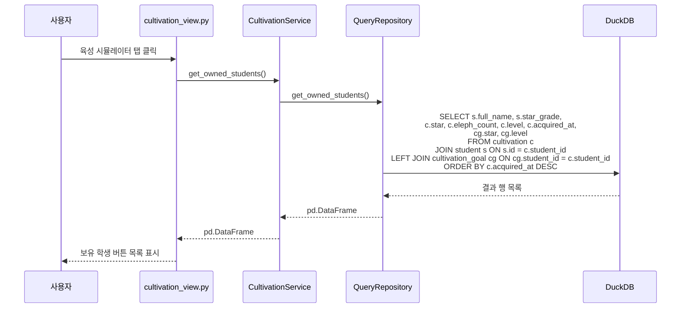
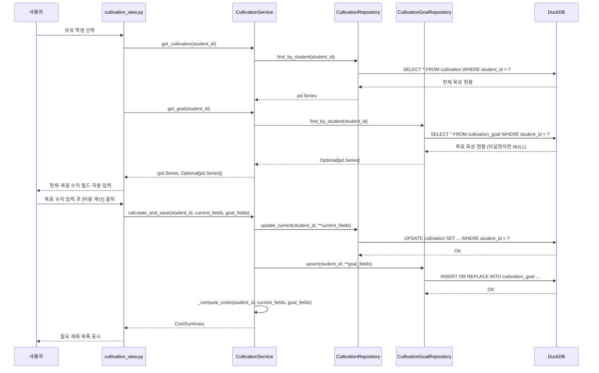

# 최종 결과 보고서

## 블루아카이브 가챠 & 육성 시뮬레이터

> **표지 정보 (양식 1페이지에 옮겨 적을 것)**
>
> | 항목 | 내용 |
> |---|---|
> | 분반 | 2분반 |
> | 작품명 | 블루아카이브 가챠 & 육성 시뮬레이터 |
> | 개발기간 | 2026년 5월 1일 ~ 2026년 6월 19일 |
> | 지도교수 | 컴퓨터공학과 오병우 |
> | 학년 / 학번 / 성명 | 4학년 / 20210262 / 김우혁 |

---

## 0. 결과 요약

### (1) SQL을 사용하여 3개 이상의 테이블 생성 및 데이터 삽입

**○ 구현 완료**

총 **8개 테이블** 생성 (Entity 2개 + 약한 엔티티 3개 + Relationship 3개):

| 테이블           | 유형                                   | 레코드 수             |
| ---------------- | -------------------------------------- | --------------------- |
| student          | Entity 1                               | 260건                 |
| student_image    | 약한 엔티티 (student 종속)             | 780건                 |
| student_stat     | 약한 엔티티 (student 종속, 1:1 능력치) | 260건                 |
| skill            | 약한 엔티티 (student 종속)             | 1,300건+              |
| banner           | Entity 2                               | 199건                 |
| gacha_pull       | Relationship 1 (banner↔student)        | 뽑기 수만큼           |
| cultivation      | Relationship 2 (보유 학생 현황)        | 보유 학생 수만큼      |
| cultivation_goal | Relationship 3 (목표 육성)             | 목표 설정 학생 수만큼 |

**증빙 (DuckDB SQL CREATE 코드):**

```sql
-- Entity 1: 학생 기본 정보
CREATE TABLE IF NOT EXISTS student (
    id                     INTEGER PRIMARY KEY,
    path_name              VARCHAR,
    full_name              VARCHAR NOT NULL,
    star_grade             INTEGER NOT NULL CHECK (star_grade IN (1, 2, 3)),
    is_limited             VARCHAR NOT NULL,
    weapon_type_code       VARCHAR,
    armor_type             VARCHAR,
    tactic_role            VARCHAR,
    position               VARCHAR,
    bullet_type            VARCHAR,
    terrain_street         VARCHAR,
    terrain_outdoor        VARCHAR,
    terrain_indoor         VARCHAR,
    weapon_name            VARCHAR,
    weapon_desc            TEXT,
    weapon_stat_level_type VARCHAR DEFAULT 'Standard',
    gear_name              VARCHAR,
    gear_desc              TEXT,
    school                 VARCHAR,
    club                   VARCHAR,
    school_year            VARCHAR,
    voice                  VARCHAR,
    birthday               VARCHAR,
    age                    VARCHAR,
    height                 VARCHAR,
    hobby                  TEXT
);

-- 약한 엔티티: 학생 이미지 (image_url을 DB에 저장 → Flet에서 출력)
CREATE SEQUENCE IF NOT EXISTS seq_student_image START 1;
CREATE TABLE IF NOT EXISTS student_image (
    id          INTEGER PRIMARY KEY DEFAULT nextval('seq_student_image'),
    student_id  INTEGER NOT NULL REFERENCES student(id),
    image_type  VARCHAR NOT NULL CHECK (image_type IN ('collection', 'icon', 'weapon')),
    image_url   VARCHAR NOT NULL,
    UNIQUE (student_id, image_type)
);

-- 약한 엔티티: 학생 기본 능력치 Lv.1/MAX (student_stat) - student와 1:1
CREATE TABLE IF NOT EXISTS student_stat (
    student_id  INTEGER PRIMARY KEY REFERENCES student(id),
    max_hp_1    INTEGER DEFAULT 0,
    max_hp_max  INTEGER DEFAULT 0,
    atk_1       INTEGER DEFAULT 0,
    atk_max     INTEGER DEFAULT 0,
    def_1       INTEGER DEFAULT 0,
    def_max     INTEGER DEFAULT 0,
    heal_1      INTEGER DEFAULT 0,
    heal_max    INTEGER DEFAULT 0
);

-- 약한 엔티티: 스킬 (params_lv1/max: <?N> 플레이스홀더 실제 수치 저장)
CREATE SEQUENCE IF NOT EXISTS seq_skill START 1;
CREATE TABLE IF NOT EXISTS skill (
    id          INTEGER PRIMARY KEY DEFAULT nextval('seq_skill'),
    student_id  INTEGER NOT NULL REFERENCES student(id),
    skill_type  VARCHAR NOT NULL,
    skill_name  VARCHAR,
    skill_desc  TEXT,
    skill_icon  VARCHAR,
    params_lv1  TEXT,
    params_max  TEXT,
    UNIQUE (student_id, skill_type)
);

-- Entity 2: 배너
CREATE SEQUENCE IF NOT EXISTS seq_banner START 1;
CREATE TABLE IF NOT EXISTS banner (
    id                INTEGER PRIMARY KEY DEFAULT nextval('seq_banner'),
    pickup_student_id INTEGER NOT NULL UNIQUE REFERENCES student(id),
    is_active         BOOLEAN DEFAULT TRUE,
    claimed_count     INTEGER DEFAULT 0 CHECK (claimed_count >= 0)
);

-- Relationship 1: 가챠 뽑기 기록 (banner ↔ student)
CREATE SEQUENCE IF NOT EXISTS seq_gacha_pull START 1;
CREATE TABLE IF NOT EXISTS gacha_pull (
    id          INTEGER PRIMARY KEY DEFAULT nextval('seq_gacha_pull'),
    banner_id   INTEGER NOT NULL REFERENCES banner(id),
    student_id  INTEGER NOT NULL REFERENCES student(id),
    pulled_at   TIMESTAMP DEFAULT CURRENT_TIMESTAMP,
    pull_count  INTEGER NOT NULL
);

-- Relationship 2: 현재 육성 현황 (student 1:0..1)
CREATE SEQUENCE IF NOT EXISTS seq_cultivation START 1;
CREATE TABLE IF NOT EXISTS cultivation (
    id            INTEGER PRIMARY KEY DEFAULT nextval('seq_cultivation'),
    student_id    INTEGER UNIQUE NOT NULL REFERENCES student(id),
    star          INTEGER DEFAULT 1  CHECK (star          BETWEEN 1 AND 5),
    weapon_star   INTEGER DEFAULT 0  CHECK (weapon_star   BETWEEN 0 AND 4),
    eleph_count   INTEGER DEFAULT 0  CHECK (eleph_count  >= 0),
    level         INTEGER DEFAULT 1  CHECK (level         BETWEEN 1 AND 90),
    ex_skill      INTEGER DEFAULT 1  CHECK (ex_skill      BETWEEN 1 AND 5),
    normal_skill  INTEGER DEFAULT 1  CHECK (normal_skill  BETWEEN 1 AND 10),
    enhance_skill INTEGER DEFAULT 1  CHECK (enhance_skill BETWEEN 1 AND 10),
    sub_skill     INTEGER DEFAULT 1  CHECK (sub_skill     BETWEEN 1 AND 10),
    weapon_level  INTEGER DEFAULT 1  CHECK (weapon_level  BETWEEN 1 AND 50),
    gear_level    INTEGER DEFAULT 0  CHECK (gear_level    BETWEEN 0 AND 2),
    bond_rank     INTEGER DEFAULT 1  CHECK (bond_rank     BETWEEN 1 AND 50),
    acquired_at   TIMESTAMP NOT NULL,
    updated_at    TIMESTAMP DEFAULT CURRENT_TIMESTAMP
);

-- Relationship 3: 목표 육성 현황 (student 1:0..1)
CREATE SEQUENCE IF NOT EXISTS seq_cultivation_goal START 1;
CREATE TABLE IF NOT EXISTS cultivation_goal (
    id            INTEGER PRIMARY KEY DEFAULT nextval('seq_cultivation_goal'),
    student_id    INTEGER UNIQUE NOT NULL REFERENCES student(id),
    star          INTEGER DEFAULT 1,
    weapon_star   INTEGER DEFAULT 0,
    level         INTEGER DEFAULT 1,
    ex_skill      INTEGER DEFAULT 1,
    normal_skill  INTEGER DEFAULT 1,
    enhance_skill INTEGER DEFAULT 1,
    sub_skill     INTEGER DEFAULT 1,
    weapon_level  INTEGER DEFAULT 1,
    gear_level    INTEGER DEFAULT 0,
    bond_rank     INTEGER DEFAULT 1,
    updated_at    TIMESTAMP DEFAULT CURRENT_TIMESTAMP
);
```

---

### (2) 세 개 이상의 테이블 JOIN

**○ 구현 완료 (4개 테이블 JOIN + LEFT JOIN)**

```sql
-- 보유 학생 현황 + 목표 + 아이콘 통합 조회 (4테이블 JOIN)
SELECT
    s.full_name, s.star_grade,
    c.star AS current_star, c.level AS current_level,
    c.eleph_count, c.acquired_at,
    cg.star AS goal_star, cg.level AS goal_level,
    si.image_url AS icon_url
FROM cultivation c
JOIN student s
    ON s.id = c.student_id
LEFT JOIN cultivation_goal cg
    ON cg.student_id = c.student_id
LEFT JOIN student_image si
    ON si.student_id = c.student_id
    AND si.image_type = 'icon'
ORDER BY c.acquired_at DESC;
```

> cultivation(보유 학생) JOIN student(기본 정보) LEFT JOIN cultivation_goal(목표, 없으면 NULL) LEFT JOIN student_image(아이콘, 없으면 NULL) → **4개 테이블 JOIN + LEFT JOIN** 충족


---

### (3) Flet으로 GUI 구현

**○ 구현 완료**

Flet 0.85.3으로 3탭 데스크탑 GUI 구현:

- 탭 1: 학생 도감 (학생 목록 + 필터링 + 상세 정보 + 이미지 출력)
- 탭 2: 가챠 시뮬레이터 (배너 선택 + 뽑기 + 결과 표시)
- 탭 3: 육성 시뮬레이터 (보유 학생 + 목표 설정 + 비용 계산)


---

### (4) Image 저장 및 출력

**○ 구현 완료**

- `student_image` 테이블에 SchaleDB 이미지 URL 저장 (image_url 컬럼)
- `image_type`: 'collection'(초상화), 'icon'(아이콘), 'weapon'(무기) 3종
- `skill` 테이블의 `skill_icon` 컬럼에도 별도 이미지 URL 저장 — 스킬 버튼과
  스킬 설명 팝업(AlertDialog)에 텍스트와 함께 아이콘 이미지를 출력한다
- Flet `ft.Image(src=image_url)` 로 화면에 출력

```sql
-- image_url을 DB에 저장하는 DDL (학생 ID 기반 URL)
CREATE TABLE IF NOT EXISTS student_image (
    id          INTEGER PRIMARY KEY DEFAULT nextval('seq_student_image'),
    student_id  INTEGER NOT NULL REFERENCES student(id),
    image_type  VARCHAR NOT NULL CHECK (image_type IN ('collection', 'icon', 'weapon')),
    image_url   VARCHAR NOT NULL,   -- SchaleDB 이미지 URL (ID 기반)
    UNIQUE (student_id, image_type)
);

-- 데이터 예시 (student_id=10000 아루)
-- image_type='collection', image_url='https://schaledb.com/images/student/collection/10000.webp'
-- image_type='icon',       image_url='https://schaledb.com/images/student/icon/10000.webp'
```


---

### (5) GitHub Public Repository

**○ 구현 완료**

- GitHub Repository: https://github.com/dngur521/blue-archive-db-project
- Public 설정 완료


---

## 1. 서론

### 1.1 개발 동기 및 목표

블루아카이브(Blue Archive)는 Nexon Games에서 서비스하는 모바일 RPG로, 다양한 학생 캐릭터를 수집하고 육성하는 것이 핵심 콘텐츠이다. 학생은 가챠(확률형 뽑기) 시스템을 통해 획득하며, 획득한 학생은 레벨·스킬·고유 무기·인연 랭크 등의 요소를 강화하여 전투력을 높일 수 있다.

그러나 실제 게임에서는 가챠 결과가 체계적으로 기록되지 않아 통계를 파악하기 어렵고, 육성에 드는 재화를 사전에 계산하는 공식 도구가 없다. 이러한 불편함을 해결하기 위해 본 프로젝트를 개발하였다.

**개발 목표:**

1. 학생 도감: SchaleDB에서 수집한 260명의 학생 정보를 필터링·탐색하고 상세 정보 및 스킬을 확인
2. 가챠 시뮬레이터: Nexon 공개 확률 기반(픽업 0.700000%, 비픽업 캐릭터당 0.022772%, 200회 천장)의 뽑기 시뮬레이션 및 결과 누적 저장
3. 육성 시뮬레이터: 현재 육성 수치와 목표 수치를 비교하여 필요 재화를 자동 계산

---

## 2. 작품 개요

### 2.1 전체 구성도


```
┌─────────────────────────────────────────────────────────────┐
│                        사용자 (User)                         │
└──────────────────────────┬──────────────────────────────────┘
                           │ Flet GUI (main.py)
         ┌─────────────────┼─────────────────┐
         ▼                 ▼                 ▼
┌──────────────┐  ┌──────────────┐  ┌──────────────────┐
│  학생 도감   │  │ 가챠 시뮬레  │  │  육성 시뮬레이터 │
│student_view  │  │ gacha_view   │  │cultivation_view  │
└──────┬───────┘  └──────┬───────┘  └────────┬─────────┘
       │                 │                   │
       └─────────────────┼───────────────────┘
                         │ Service Layer (비즈니스 로직)
         ┌───────────────┼───────────────┐
         ▼               ▼               ▼
┌──────────────┐ ┌──────────────┐ ┌──────────────────┐
│StudentService│ │GachaService  │ │CultivationService│
└──────┬───────┘ └──────┬───────┘ └────────┬─────────┘
       │                │                  │
       └────────────────┼──────────────────┘
                        │ Repository Layer (DIP: 인터페이스)
    ┌─────────┬──────────┼──────────┬────────┬─────────┐
    ▼         ▼          ▼          ▼        ▼         ▼
Student   Skill    Banner    GachaPull  Cultivation  Goal
Repo      Repo     Repo      Repo       Repo         Repo
    └─────────┴──────────┴──────────┴────────┴─────────┘
                              │
                   ┌──────────▼──────────┐
                   │    DuckDB           │
                   │ (data/bluearchive.db)│
                   └─────────────────────┘
```

**구성 요소 설명:**

| 구성 요소        | 설명                                                                  |
| ---------------- | --------------------------------------------------------------------- |
| Flet GUI         | Python Flet 0.85.3으로 구현한 데스크탑 GUI. 탭 기반 3화면             |
| Service Layer    | 비즈니스 로직 처리 (가챠 확률 계산, 육성 비용 계산 등)                |
| Repository Layer | DuckDB 접근 추상화. 인터페이스(DIP)로 DBMS 독립성 확보                |
| DuckDB           | 로컬 파일 기반 데이터베이스 (data/bluearchive.db)                     |
| data/ 폴더       | SchaleDB API에서 사전 수집한 JSON 파일. 앱 최초 실행 시 DuckDB에 로드 |

---

### 2.2 설계 구성 요소 및 설계 제한 요소

| 설계 구성요소 |      |      |           |           |          | 설계 제한요소 |           |        |      |        |               |      |
| :-----------: | :--: | :--: | :-------: | :-------: | :------: | :-----------: | :-------: | :----: | :--: | :----: | :-----------: | :--: |
|   목표설정    | 합성 | 분석 | 구현/제작 | 시험/평가 | 결과도출 |     성능      | 규격/표준 | 경제성 | 미학 | 신뢰성 | 안정성/내구성 | 환경 |
|       ○       |      |  ○   |     ○     |           |    ○     |               |     ○     |        |  ○   |   ○    |               |  ○   |

#### 2.2.1 설계 구성 요소

**(1) 목표 설정**

자신이 좋아하는 취미에 대한 애플리케이션을 개발한다. 블루아카이브 게임의 학생 정보를 조회하고, 가챠 시뮬레이션 결과를 DB에 누적 저장하며, 육성 재화 비용을 사전에 계산할 수 있는 데스크탑 애플리케이션을 개발한다.

**(2) 분석**

- SchaleDB(schaledb.com) API에서 260명의 학생 데이터를 Python 스크립트로 수집·분석하였다.
- Nexon 공개 확률표(픽업 3성 0.700000%, 비픽업 3성 캐릭터당 0.022772%, 10회 보장, 200회 천장)를 분석하여 반영하였다.
- 인게임 육성 비용(레벨업 크레딧, 스킬 재료, 인연 선물) 데이터를 JSON으로 정리하였다.

**(3) 구현/제작**

- Python 언어로 개발하며, Flet 0.85.3 라이브러리로 GUI를 구현한다.
- DuckDB 1.5.3을 로컬 파일 기반 데이터베이스로 사용한다.
- 사전 수집한 JSON 데이터를 앱 최초 실행 시 DuckDB에 로드한다.

#### 2.2.2 설계 제한 요소

**(1) 규격/표준**

- SQL DDL CREATE 문을 사용하여 8개 테이블을 정의하고 DuckDB에서 실행한다.
- JOIN 사용:
  - `cultivation JOIN student LEFT JOIN cultivation_goal LEFT JOIN student_image` (4테이블 JOIN + LEFT JOIN)
  - `student JOIN skill` (학생 상세 + 스킬)
  - `student LEFT JOIN student_image` (학생 목록 + 아이콘)

**(2) 미학**

- Flet의 `ft.Card`, `ft.ListView`, `ft.Image` 등을 활용하여 직관적인 UI를 구성한다.
- 학생 이미지는 SchaleDB URL을 `student_image` 테이블에 저장하고 `ft.Image(src=url)`로 출력한다.
- 가챠 결과는 성급별로 배경색을 달리하여 시각적으로 구분한다.

**(3) 신뢰성**

- 가챠 뽑기 결과는 `gacha_pull` 테이블에 즉시 INSERT되어 앱 재시작 후에도 기록이 유지된다.
- 육성 목표 설정 시 `cultivation_goal` 테이블에 UPSERT되어 설정이 보존된다.

**(4) 환경**

- Python 언어로 DuckDB에 접근하고, Flet을 사용하여 데스크탑 GUI 애플리케이션을 개발한다.
- 개발 환경: macOS / Python 3.14 / DuckDB 1.5.3 / Flet 0.85.3 / uv 패키지 매니저

---

## 3. 설계

### 3.1 Use Case

#### 3.1.1 학생 목록 조회 및 필터링

- 학생 도감 탭을 클릭하면 260명 학생 카드 목록이 표시된다.
- 이름 검색, 학교·역할·성급 드롭다운 필터로 결과를 좁힐 수 있다.
- `student LEFT JOIN student_image (icon)` 쿼리로 아이콘 URL을 함께 조회한다.

#### 3.1.2 학생 상세 정보 및 스킬 조회

- 학생 카드를 클릭하면 우측 패널에 초상화 이미지, 기본 정보, 지형 적응도가 표시된다.
- EX / 기본 / 강화 / 서브 스킬 버튼 클릭 시 `ft.AlertDialog`로 스킬 이름과 설명이 팝업된다.
- `student JOIN skill` 쿼리로 학생 기본 정보와 스킬 4종을 한 번에 조회한다.

#### 3.1.3 가챠 뽑기 실행 및 결과 저장

- 배너(픽업 학생)를 선택하고 1회 또는 10회 뽑기 버튼을 클릭한다.
- 가챠 알고리즘 (픽업 0.7%, 비픽업 캐릭터당 0.022772%, 10회 2성 보장, 200회 천장)을 실행한다.
- 뽑기 결과는 `gacha_pull` 테이블에 INSERT되며, 신규 학생이면 `cultivation` 레코드가 자동 생성된다.

#### 3.1.4 보유 학생 현황 조회

- 육성 시뮬레이터 탭에서 가챠로 획득한 학생 목록을 아이콘·이름·성급과 함께 표시한다.
- `cultivation JOIN student LEFT JOIN cultivation_goal LEFT JOIN student_image` 4테이블 JOIN으로 조회한다.

#### 3.1.5 육성 목표 설정 및 비용 계산

- 보유 학생 선택 시 현재·목표 육성 수치 입력 폼이 자동 채워진다.
- [비용 계산하기] 클릭 시 현재/목표 수치를 DB에 저장하고, 레벨업 크레딧·스킬 재료·인연 선물 수를 계산하여 표시한다.

---

### 3.2 UI Design

#### 3.2.1 학생 목록 조회 및 필터링 & 학생 상세 정보 및 스킬 조회


- 상단: 검색 바 (이름) + 드롭다운 필터 (학교/역할/성급)
- 좌측: 스크롤 가능한 학생 카드 목록 (아이콘 + 이름 + 성급)
- 우측: 선택 학생 상세 패널 (초상화 이미지 + 기본 정보 + 스킬 버튼)
- 스킬 버튼 누르면 그 스킬에 대한 상세 정보 확인 모달 등장

#### 3.2.2 가챠 뽑기 실행 및 결과 저장


- 배너 선택 드롭다운 (픽업 학생 이름 목록)
- 진행도 바 (현재 사이클 뽑기 수 / 200) + 픽업 학생 아이콘 표시
- 1회 / 10회 뽑기 버튼, 픽업 확정 수령 버튼, 초기화 버튼
- 최근 뽑기 결과 카드 목록 (성급별 색상 구분)

#### 3.2.3 보유 학생 현황 조회 & 육성 목표 설정 및 비용 계산


- 보유 학생 버튼 목록 (아이콘 + 이름 + 성급) + 전체 초기화 버튼
- 현재/목표 수치 입력 폼 (레벨, 스킬, 무기, 인연 랭크, 성급)
- 비용 계산 결과 패널 (크레딧, 스킬 재료, 인연 선물)

---

### 3.3 Conceptual Design (ERD)

> ERD Editor로 작성한 Crow's Feet Diagram


**엔티티 및 관계 요약:**

- **student** 1 ──< **skill** N : 한 학생은 4~5가지 스킬 보유
- **student** 1 ──< **student_image** N : 한 학생은 3가지 이미지 타입 보유 (없으면 LEFT JOIN)
- **student** 1 ──── **student_stat** 1 : 학생마다 기본 능력치 1개 (PK=FK, 1:1)
- **student** 1 ──── **banner** 0..1 : 3성 학생에게만 배너 1개씩 존재
- **student** N >──< **banner** M via **gacha_pull** : 뽑기 기록 관계 테이블
- **student** 1 ──── **cultivation** 0..1 : 학생 획득 시 자동 생성
- **student** 1 ──── **cultivation_goal** 0..1 : 목표 설정 시에만 생성 → LEFT JOIN

---

### 3.4 Logical Design (DuckDB DDL)

> 0절 결과 요약의 SQL 코드 참조 (동일 내용)

**BCNF 정규화 확인:**

| 테이블           | 후보키                         | BCNF |
| ---------------- | ------------------------------ | ---- |
| student          | {id}                           | ✓    |
| student_image    | {id}, {student_id, image_type} | ✓    |
| student_stat     | {student_id}                   | ✓    |
| skill            | {id}, {student_id, skill_type} | ✓    |
| banner           | {id}, {pickup_student_id}      | ✓    |
| gacha_pull       | {id}                           | ✓    |
| cultivation      | {id}, {student_id}             | ✓    |
| cultivation_goal | {id}, {student_id}             | ✓    |

**설계서 대비 변경 사항:**

- `weapon_name`, `gear_name`의 UNIQUE 제약 제거: 코스튬 학생이 원본 학생과 동일한 무기명을 공유하므로 실제 데이터 확인 후 제거함
- `bond_rank` 최대값: 설계서에서 100으로 설계했으나, costs.json의 실제 데이터가 50까지만 지원하므로 50으로 수정
- `student_stat` 테이블 추가: SchaleDB `student_extras.json`에서 수집한 능력치를 별도 테이블로 분리

---

### 3.5 Sequence Diagram

> 참고: 사용자-Flet View-Service-Repository-DuckDB 계층 구조로 작성. 각 다이어그램은 3절 Use Case와 1:1 대응한다.

#### 3.5.1 학생 목록 조회 및 필터링 (Use Case 3.1)



#### 3.5.2 학생 상세 정보 및 스킬 조회 (Use Case 3.1.1)



#### 3.5.3 가챠 뽑기 실행 및 결과 저장 (Use Case 3.2 / 3.2.1)



#### 3.5.4 보유 학생 현황 조회 (Use Case 3.3)



#### 3.5.5 육성 목표 설정 및 비용 계산 (Use Case 3.3.1 / 3.3.2)



---

### 3.6 Repository Interface 설계

**아키텍처 원칙 (강의 노션 자료 기반):**

- **DIP (의존성 역전 원칙)**: Service는 구현체(DuckDB)가 아닌 인터페이스(IRepository)에 의존
- **Strategy Pattern**: 환경 변수의 `DB_TYPE` 설정으로 런타임에 DB 구현체 교체 가능
- **Adapter Pattern**: 각 DB 구현체가 공통 인터페이스로 변환

```
repository/
├── __init__.py          ← DB_TYPE에 따른 구현체 동적 로드
├── interfaces.py        ← IDatabaseManager, IRepository, 테이블별 인터페이스
└── duckdb/
    ├── connection.py    ← DuckDBManager (IDatabaseManager 구현)
    ├── student.py       ← DuckDBStudentRepository
    ├── skill.py         ← DuckDBSkillRepository
    ├── student_image.py ← DuckDBStudentImageRepository
    ├── student_stat.py  ← DuckDBStudentStatRepository
    ├── banner.py        ← DuckDBBannerRepository
    ├── gacha_pull.py    ← DuckDBGachaPullRepository
    ├── cultivation.py   ← DuckDBCultivationRepository
    ├── cultivation_goal.py ← DuckDBCultivationGoalRepository
    └── join.py          ← DuckDBQueryRepository (JOIN 전용)
```

**`repository/interfaces.py` 전체 코드:**

```python
"""
repository/interfaces.py
레포지토리 인터페이스 정의 모듈

SOLID 원칙 중 DIP(의존성 역전 원칙) 적용:
- 상위 모듈(Service)이 하위 구현체(DuckDB)에 직접 의존하지 않고
  이 추상 인터페이스에 의존하도록 설계
- 어떤 DBMS를 사용하더라도 Service 코드 변경 없이 Repository만 교체 가능
"""

from abc import ABC, abstractmethod
from typing import Optional
import pandas as pd


# =============================================================================
# 데이터베이스 연결 인터페이스
# =============================================================================

class IDatabaseManager(ABC):
    """데이터베이스 연결 관리 인터페이스 (Adapter Pattern 적용)"""

    @abstractmethod
    def get_connection(self):
        """데이터베이스 커넥션 객체 반환"""
        ...

    @abstractmethod
    def close(self) -> None:
        """현재 활성화된 데이터베이스 커넥션 닫기"""
        ...


# =============================================================================
# 공통 레포지토리 인터페이스
# =============================================================================

class IRepository(ABC):
    """
    모든 Repository의 공통 기반 인터페이스
    DI(의존성 주입): __init__에서 IDatabaseManager를 받아 커넥션 저장
    """

    def __init__(self, db: IDatabaseManager):
        # IDatabaseManager 인터페이스를 통해 커넥션 획득 → DIP 준수
        self._con = db.get_connection()

    @abstractmethod
    def create_table(self) -> None:
        """테이블 생성 (없으면 CREATE, 있으면 SKIP)"""
        ...

    @abstractmethod
    def count(self) -> int:
        """테이블의 레코드 수(Cardinality) 반환"""
        ...


# =============================================================================
# 학생(student) 테이블 인터페이스
# =============================================================================

class IStudentRepository(IRepository):
    """학생 기본 정보 테이블 접근 인터페이스"""

    @abstractmethod
    def bulk_insert(self, students: list[dict]) -> None:
        """JSON에서 로드한 학생 데이터 일괄 삽입"""
        ...

    @abstractmethod
    def find_all(
        self,
        star_grade: Optional[int] = None,
        school: Optional[str] = None,
        tactic_role: Optional[str] = None,
        keyword: Optional[str] = None,
    ) -> pd.DataFrame:
        """조건 필터링 후 학생 목록 반환"""
        ...

    @abstractmethod
    def find_by_id(self, student_id: int) -> Optional[pd.Series]:
        """ID로 단일 학생 조회"""
        ...

    @abstractmethod
    def find_distinct_schools(self) -> list[str]:
        """학교 목록 조회 (필터 드롭다운용)"""
        ...

    @abstractmethod
    def find_distinct_roles(self) -> list[str]:
        """전술 역할 목록 조회 (필터 드롭다운용)"""
        ...


# =============================================================================
# 스킬(skill) 테이블 인터페이스
# =============================================================================

class ISkillRepository(IRepository):
    """학생 스킬 정보 테이블 접근 인터페이스"""

    @abstractmethod
    def bulk_insert(self, student_id: int, skills: list[dict]) -> None:
        """한 학생의 스킬 목록 일괄 삽입"""
        ...

    @abstractmethod
    def find_by_student(self, student_id: int) -> pd.DataFrame:
        """학생 ID로 스킬 목록 조회"""
        ...


# =============================================================================
# 학생 이미지(student_image) 테이블 인터페이스
# =============================================================================

class IStudentImageRepository(IRepository):
    """학생 이미지 URL 저장 테이블 접근 인터페이스"""

    @abstractmethod
    def bulk_insert(self, student_id: int, images: list[dict]) -> None:
        """한 학생의 이미지 목록 일괄 삽입"""
        ...

    @abstractmethod
    def find_by_student(self, student_id: int) -> pd.DataFrame:
        """학생 ID로 이미지 목록 조회"""
        ...

    @abstractmethod
    def find_url(self, student_id: int, image_type: str) -> Optional[str]:
        """특정 타입의 이미지 URL 반환"""
        ...


# =============================================================================
# 배너(banner) 테이블 인터페이스
# =============================================================================

class IBannerRepository(IRepository):
    """가챠 배너 테이블 접근 인터페이스"""

    @abstractmethod
    def init_banners(self, student_ids: list[int]) -> None:
        """3성 학생 목록으로 배너 자동 생성 (앱 초기화 시 1회)"""
        ...

    @abstractmethod
    def find_all_active(self) -> pd.DataFrame:
        """활성 배너 목록 조회"""
        ...

    @abstractmethod
    def find_by_id(self, banner_id: int) -> Optional[pd.Series]:
        """배너 ID로 단일 배너 조회"""
        ...

    @abstractmethod
    def increment_claimed(self, banner_id: int) -> None:
        """픽업 확정 수령 시 claimed_count 증가"""
        ...

    @abstractmethod
    def reset_claimed(self, banner_id: int) -> None:
        """뽑기 초기화 시 claimed_count를 0으로 리셋"""
        ...


# =============================================================================
# 가챠 뽑기 기록(gacha_pull) 테이블 인터페이스
# =============================================================================

class IGachaPullRepository(IRepository):
    """가챠 뽑기 기록 테이블 접근 인터페이스"""

    @abstractmethod
    def insert(self, banner_id: int, student_id: int, pull_count: int) -> None:
        """뽑기 결과 1건 저장"""
        ...

    @abstractmethod
    def get_total_count(self, banner_id: int) -> int:
        """해당 배너의 총 누적 뽑기 수 반환"""
        ...

    @abstractmethod
    def find_recent(self, banner_id: int, limit: int = 10) -> pd.DataFrame:
        """최근 뽑기 기록 조회"""
        ...

    @abstractmethod
    def delete_by_banner(self, banner_id: int) -> None:
        """해당 배너의 뽑기 기록 전체 삭제"""
        ...


# =============================================================================
# 현재 육성 현황(cultivation) 테이블 인터페이스
# =============================================================================

class ICultivationRepository(IRepository):
    """보유 학생의 현재 육성 현황 테이블 접근 인터페이스"""

    @abstractmethod
    def insert_on_acquire(self, student_id: int) -> None:
        """학생 최초 획득 시 cultivation 레코드 생성"""
        ...

    @abstractmethod
    def update_current(self, student_id: int, **fields) -> None:
        """현재 육성 수치 갱신"""
        ...

    @abstractmethod
    def update_eleph(self, student_id: int, delta: int) -> None:
        """엘레프 수량 증감 (뽑기 결과 반영)"""
        ...

    @abstractmethod
    def find_by_student(self, student_id: int) -> Optional[pd.Series]:
        """학생 ID로 현재 육성 현황 조회"""
        ...

    @abstractmethod
    def exists(self, student_id: int) -> bool:
        """보유 여부 확인"""
        ...

    @abstractmethod
    def delete_all(self) -> None:
        """보유 학생 전체 삭제 (초기화)"""
        ...


# =============================================================================
# 목표 육성 현황(cultivation_goal) 테이블 인터페이스
# =============================================================================

class ICultivationGoalRepository(IRepository):
    """목표 육성 현황 테이블 접근 인터페이스"""

    @abstractmethod
    def upsert(self, student_id: int, **fields) -> None:
        """목표 육성 수치 삽입 또는 갱신 (UPSERT)"""
        ...

    @abstractmethod
    def find_by_student(self, student_id: int) -> Optional[pd.Series]:
        """학생 ID로 목표 육성 현황 조회 (미설정이면 None)"""
        ...

    @abstractmethod
    def delete_all(self) -> None:
        """목표 육성 수치 전체 삭제 (초기화)"""
        ...


# =============================================================================
# JOIN 전용 쿼리 레포지토리 인터페이스
# =============================================================================

class IQueryRepository(ABC):
    """
    여러 테이블을 JOIN하는 복합 쿼리 전담 레포지토리
    - cultivation JOIN student LEFT JOIN cultivation_goal :
      보유 학생 현황 + 목표 통합 조회 (3개 이상 테이블 JOIN + LEFT JOIN)
    - student JOIN skill : 학생 상세 + 스킬 목록
    """

    def __init__(self, db: IDatabaseManager):
        self._con = db.get_connection()

    @abstractmethod
    def get_student_with_skills(self, student_id: int) -> pd.DataFrame:
        """
        student JOIN skill
        학생 상세 정보 + 스킬 목록 한 번에 조회
        """
        ...

    @abstractmethod
    def get_owned_students(self) -> pd.DataFrame:
        """
        cultivation
          JOIN student ON student.id = cultivation.student_id
          LEFT JOIN cultivation_goal ON cultivation_goal.student_id = cultivation.student_id
          LEFT JOIN student_image ON student_image.student_id = cultivation.student_id
                                  AND student_image.image_type = 'icon'
        보유 학생 현황 + 목표 + 아이콘 통합 조회
        """
        ...

    @abstractmethod
    def get_students_with_icons(
        self,
        star_grade: Optional[int] = None,
        school: Optional[str] = None,
        tactic_role: Optional[str] = None,
        keyword: Optional[str] = None,
    ) -> pd.DataFrame:
        """
        student LEFT JOIN student_image (icon)
        학생 도감 목록 + 아이콘 URL
        """
        ...


# =============================================================================
# 학생 능력치(student_stat) 테이블 인터페이스
# =============================================================================

class IStudentStatRepository(IRepository):
    """학생 능력치 테이블 접근 인터페이스 (Lv.1 / MAX 스탯)"""

    @abstractmethod
    def bulk_insert(self, stats: list[dict]) -> None:
        """학생 스탯 데이터 일괄 삽입"""
        ...

    @abstractmethod
    def find_by_student(self, student_id: int) -> Optional[pd.Series]:
        """학생 ID로 능력치 조회"""
        ...
```

---

## 4. 구현

### 4.1 학생 목록 조회 및 필터링 (Use Case 3.1.1)

**구현 화면:**


**핵심 소스 코드 - repository/duckdb/join.py (get_students_with_icons 메서드):**

```python
def get_students_with_icons(
    self,
    star_grade: Optional[int] = None,
    school: Optional[str] = None,
    tactic_role: Optional[str] = None,
    keyword: Optional[str] = None,
) -> pd.DataFrame:
    """
    학생 도감 목록 + 아이콘 URL (student LEFT JOIN student_image)

    Use Case 3.1: 학생 목록 조회 및 필터링
    - LEFT JOIN: 이미지 없는 학생도 목록에 표시
    - WHERE 조건: 필터 적용
    """
    query = """
        SELECT
            s.id, s.full_name, s.star_grade, s.school,
            s.tactic_role, s.position, s.bullet_type,
            s.is_limited, s.path_name,
            si.image_url AS icon_url
        FROM student s
        LEFT JOIN student_image si
            ON si.student_id = s.id
            AND si.image_type = 'icon'
        WHERE 1=1
    """
    params = []

    if star_grade is not None:
        query += " AND s.star_grade = ?"
        params.append(star_grade)
    if school:
        query += " AND s.school = ?"
        params.append(school)
    if tactic_role:
        query += " AND s.tactic_role = ?"
        params.append(tactic_role)
    if keyword:
        query += " AND s.full_name LIKE ?"
        params.append(f"%{keyword}%")

    query += " ORDER BY s.star_grade DESC, s.full_name"
    return self._con.execute(query, params).df()
```

**설명:** `student LEFT JOIN student_image` 쿼리로 학생 목록과 아이콘 URL을 동시에 조회한다. LEFT JOIN을 사용하여 이미지가 등록되지 않은 학생도 목록에 포함시킨다. WHERE 절은 필터 조건에 따라 동적으로 생성된다.

---

### 4.2 학생 상세 정보 및 스킬 조회 (Use Case 3.1.2)

**구현 화면:**


**핵심 소스 코드 - repository/duckdb/join.py (get_student_with_skills 메서드):**

```python
def get_student_with_skills(self, student_id: int) -> pd.DataFrame:
    """
    student JOIN skill — 학생 상세 정보 + 스킬 목록

    Use Case 3.1.1: 학생 상세 정보 및 스킬 조회
    한 번의 JOIN 쿼리로 학생 정보와 스킬 4종을 동시에 조회
    """
    return self._con.execute("""
        SELECT
            s.id, s.full_name, s.star_grade, s.school, s.club,
            s.tactic_role, s.position, s.bullet_type,
            s.armor_type, s.weapon_type_code,
            s.terrain_street, s.terrain_outdoor, s.terrain_indoor,
            s.weapon_name, s.weapon_desc,
            s.gear_name, s.gear_desc,
            s.school_year, s.voice, s.birthday, s.age, s.height, s.hobby,
            sk.skill_type, sk.skill_name, sk.skill_desc, sk.skill_icon,
            sk.params_lv1, sk.params_max
        FROM student s
        JOIN skill sk ON sk.student_id = s.id
        WHERE s.id = ?
        ORDER BY sk.id
    """, [student_id]).df()
```

**핵심 소스 코드 - views/student_view.py (영문 게임 태그 → 한국어 번역):**

```python
def _resolve_params(desc: str, params_json: str | None) -> str:
    """영문 태그 번역 + <?N> 수치 치환
    순서: ①<?N> 치환 → ②<prefix:Tag> 번역 → ③나머지 태그 제거
    <?N>을 먼저 치환해야 <[^>]+> 정리 시 사라지지 않음
    """
    if not desc:
        return desc
    # ① <?N> 수치 치환 (params 있을 때만)
    if params_json:
        try:
            params = _json.loads(params_json)
            for i, val in enumerate(params):
                desc = desc.replace(f"<?{i + 1}>", str(val))
        except Exception:
            pass
    # ② <prefix:TagName> → 한국어 (b/d=스탯, s=상태, c=군중제어, kb=넉백)
    desc = _re.sub(
        r"<([a-zA-Z]+):([^>]+)>",
        lambda m: _translate_tag(m.group(1), m.group(2)),
        desc,
    )
    # ③ 남아있는 미해석 태그 제거
    desc = _re.sub(r"<[^>]+>", "", desc)
    return desc
```

**핵심 소스 코드 - views/student_view.py (스킬 버튼 — 아이콘 + 텍스트, AlertDialog Lv.1/MAX 토글):**

```python
def make_skill_handler(label, name, d1, dm, icon_url):
    def handler(e):
        state_mode = {"v": 0}  # 0=Lv.1, 1=MAX

        content_text = ft.Text(
            d1 if d1 else "(설명 없음)", size=12,
        )
        has_toggle = bool(d1 and dm and d1 != dm)

        btn_lv1 = ft.TextButton(
            "Lv.1",
            style=ft.ButtonStyle(color=ft.Colors.BLUE_700),
        )
        btn_max = ft.TextButton(
            "MAX",
            style=ft.ButtonStyle(color=ft.Colors.GREY_400),
        )

        def _switch(mode: int):
            state_mode["v"] = mode
            content_text.value = (d1 if mode == 0 else dm) or "(설명 없음)"
            btn_lv1.style = ft.ButtonStyle(
                color=ft.Colors.BLUE_700 if mode == 0 else ft.Colors.GREY_400
            )
            btn_max.style = ft.ButtonStyle(
                color=ft.Colors.AMBER_800 if mode == 1 else ft.Colors.GREY_400
            )
            safe_update(content_text, btn_lv1, btn_max)

        btn_lv1.on_click = lambda e: _switch(0)
        btn_max.on_click = lambda e: _switch(1)

        toggle_row = (
            ft.Row([btn_lv1, btn_max], spacing=0)
            if has_toggle
            else ft.Row([ft.Text(
                "Lv.1", size=11, color=ft.Colors.GREY_700,
                weight=ft.FontWeight.BOLD,
            )])
        )

        title_items = []
        if icon_url:
            title_items.append(ft.Image(
                src=icon_url, width=24, height=24,
                error_content=ft.Container(width=24, height=24),
            ))
        title_items.append(ft.Text(
            f"[{label}] {name}", weight=ft.FontWeight.BOLD,
        ))

        dlg = ft.AlertDialog(
            title=ft.Row(title_items, spacing=6, tight=True),
            content=ft.Container(
                content=ft.Column(
                    [toggle_row, ft.Divider(height=6), content_text],
                    spacing=4,
                    scroll=ft.ScrollMode.AUTO,
                ),
                width=320,
                height=160,
            ),
            actions=[
                ft.TextButton(
                    "닫기",
                    on_click=lambda e: close_dlg(e, dlg, page),
                )
            ],
        )
        page.overlay.append(dlg)
        dlg.open = True
        page.update()

    return handler
```

**설명:** `student JOIN skill` 쿼리 결과로 받은 `params_lv1`/`params_max` JSON 수치를 스킬 설명문의 `<?N>` 플레이스홀더에 치환하여 Lv.1과 MAX 두 가지 설명을 미리 계산해 둔다. SchaleDB 원본 데이터의 스킬 설명에는 `<b:ATK>`, `<d:MAXHP>`, `<s:Fury>`, `<c:Stunned>` 같은 영문 태그가 섞여 있는데, `_resolve_params()`가 프리픽스(b=버프/d=디버프/s=상태/c=군중제어/kb=넉백)별로 약 70여 개의 한국어 매핑 테이블을 조회해 전부 한국어로 변환한다. 스킬 버튼 클릭 시 `ft.AlertDialog`가 열리며, 버튼과 다이얼로그 제목 모두에 `skill_icon` 컬럼의 실제 아이콘 이미지가 텍스트와 함께 표시되고, Lv.1/MAX 토글 버튼으로 두 수치 버전의 설명을 전환해서 볼 수 있다.

---

### 4.3 가챠 뽑기 실행 및 결과 저장 (Use Case 3.1.3)

**구현 화면:**


**핵심 소스 코드 - service/gacha_service.py (가챠 알고리즘):**

```python
def _gacha_algorithm(self, pickup_id: int, guarantee_2star: bool) -> int:
    """
    가챠 알고리즘 — 소프트 파티 없음, 매 뽑기 확률 고정

    공식 확률 (Nexon 확률표 기준):
      픽업 3성:    0.7%       (1명 × 0.700000%)
      비픽업 3성:  캐릭터 수 × 0.022772% (풀 크기에 따라 동적 계산)
      2성:         캐릭터 수 × 0.804348%
      1성:         나머지
      ※ 10회차: 2성 이상 확정 (guarantee_2star=True)
      ※ 200회차: 픽업 확정 (pull()에서 직접 처리)
    """
    PICKUP_RATE          = 0.7
    PER_NONPICKUP_3STAR  = 0.022772  # 비픽업 3성 1명당 확률 (Nexon 확률표)
    PER_2STAR            = 0.804348  # 2성 1명당 확률 (Nexon 확률표)

    pool_3 = self._pool_ids.get("3성", [])
    pool_2 = self._pool_ids.get("2성", [])
    nonpickup_count = max(len(pool_3) - 1, 0)  # 픽업 1명 제외

    NONPICKUP_3STAR_RATE = nonpickup_count * PER_NONPICKUP_3STAR
    BASE_2STAR           = len(pool_2) * PER_2STAR

    roll = random.uniform(0, 100)

    if roll < PICKUP_RATE:
        return pickup_id
    elif roll < PICKUP_RATE + NONPICKUP_3STAR_RATE:
        pool = self._pool_ids.get("3성", [])
        return random.choice(pool) if pool else pickup_id
    elif roll < PICKUP_RATE + NONPICKUP_3STAR_RATE + BASE_2STAR or guarantee_2star:
        pool = self._pool_ids.get("2성", [])
        return random.choice(pool) if pool else pickup_id
    else:
        pool = self._pool_ids.get("1성", [])
        return random.choice(pool) if pool else pickup_id
```

**핵심 소스 코드 - repository/duckdb/gacha_pull.py (결과 저장):**

```python
def insert(self, banner_id: int, student_id: int, pull_count: int) -> None:
    """
    뽑기 결과 1건 DB 저장
    - pulled_at은 DEFAULT CURRENT_TIMESTAMP로 자동 설정
    """
    self._con.execute("""
        INSERT INTO gacha_pull (banner_id, student_id, pull_count)
        VALUES (?, ?, ?)
    """, [banner_id, student_id, pull_count])
```

**설명:** 가챠 알고리즘은 Nexon 공개 확률표의 캐릭터당 확률을 풀 크기에 따라 동적으로 합산한다. 뽑기 1건마다 `gacha_pull` 테이블에 INSERT되어 영구 저장된다. 신규 학생 획득 시 `cultivation` 테이블에 레코드가 자동 생성된다.

---

### 4.4 보유 학생 현황 조회 (Use Case 3.1.4)

**구현 화면:**


**핵심 소스 코드 - repository/duckdb/join.py (get_owned_students 메서드):**

```python
def get_owned_students(self) -> pd.DataFrame:
    """
    보유 학생 현황 + 목표 + 아이콘 통합 조회

    [핵심 JOIN 쿼리] - 설계 제한요소 (세 개 이상 테이블 JOIN) 충족:
      cultivation          (보유 학생 목록 기준)
      JOIN  student        (학생 기본 정보)
      LEFT JOIN cultivation_goal (목표 미설정 학생도 포함)
      LEFT JOIN student_image    (아이콘 없는 학생도 포함)

    Use Case 3.3: 보유 학생 현황 조회
    - cultivation이 있으면 반드시 포함 (LEFT JOIN으로 nullable 처리)
    - 육성 목표 미설정 학생 → goal_* 컬럼이 NULL
    - 아이콘 이미지 미등록 학생 → icon_url이 NULL
    """
    return self._con.execute("""
        SELECT
            c.student_id,
            s.full_name,
            s.star_grade        AS base_star,
            s.path_name,
            c.star              AS current_star,
            c.weapon_star,
            c.eleph_count,
            c.level             AS current_level,
            c.ex_skill, c.normal_skill, c.enhance_skill, c.sub_skill,
            c.weapon_level, c.gear_level, c.bond_rank,
            c.acquired_at, c.updated_at,
            cg.star             AS goal_star,
            cg.level            AS goal_level,
            cg.ex_skill         AS goal_ex_skill,
            cg.normal_skill     AS goal_normal_skill,
            cg.enhance_skill    AS goal_enhance_skill,
            cg.sub_skill        AS goal_sub_skill,
            cg.weapon_level     AS goal_weapon_level,
            cg.bond_rank        AS goal_bond_rank,
            si.image_url        AS icon_url
        FROM cultivation c
        JOIN student s
            ON s.id = c.student_id
        LEFT JOIN cultivation_goal cg
            ON cg.student_id = c.student_id
        LEFT JOIN student_image si
            ON si.student_id = c.student_id
            AND si.image_type = 'icon'
        ORDER BY c.acquired_at DESC
    """).df()
```

**설명:** 4개 테이블을 JOIN하여 보유 학생의 현황, 목표, 아이콘 이미지를 한 번에 조회한다. LEFT JOIN으로 목표 미설정 학생과 이미지 없는 학생도 목록에 포함된다.

---

### 4.5 육성 목표 설정 및 비용 계산 (Use Case 3.1.5)

**구현 화면:**


**핵심 소스 코드 - repository/duckdb/cultivation_goal.py (UPSERT):**

```python
def upsert(self, student_id: int, **fields) -> None:
    """
    목표 육성 수치 삽입 또는 갱신 (UPSERT)
    - 처음 설정이면 INSERT, 이미 있으면 UPDATE
    - DuckDB의 ON CONFLICT DO UPDATE 문법 사용
    """
    if not fields:
        return

    # 삽입할 컬럼 목록 (student_id + 전달된 필드)
    columns = ["student_id"] + list(fields.keys()) + ["updated_at"]
    placeholders = ", ".join(["?"] * len(columns))
    values = [student_id] + list(fields.values()) + [datetime.now()]

    # 업데이트할 컬럼 목록 (student_id 제외)
    update_clause = ", ".join(
        f"{k} = excluded.{k}" for k in list(fields.keys()) + ["updated_at"]
    )

    self._con.execute(f"""
        INSERT INTO cultivation_goal ({', '.join(columns)})
        VALUES ({placeholders})
        ON CONFLICT (student_id) DO UPDATE SET {update_clause}
    """, values)
```

**핵심 소스 코드 - service/cultivation_service.py (비용 계산):**

```python
def _compute_costs(
    self,
    student_id: int,
    current: dict,
    goal: dict,
) -> CostSummary:
    """
    육성 비용 계산
    - 레벨업: char_level 비용 테이블 기반
    - 스킬: skill 크레딧 + 학생별 재료 비용 (일반/강화/서브 + EX 스킬)
    - 성급 상승: 필요 엘레프 vs 현재 보유 엘레프 비교
    - 인연: gift 수량 계산 (SR/R/N급 선물 그리디 환산)
    각 항목은 "목표 > 현재"일 때만 계산하고, 아니면 0/빈 값으로 남는다.
    """
    summary = CostSummary()

    # ── 레벨업 비용 계산 ─────────────────────────────────────────────────
    cur_level = int(current.get("level", 1))
    goal_level = int(goal.get("level", cur_level))
    if goal_level > cur_level:
        summary.credit += self._calc_level_credit(cur_level, goal_level)

    # ── 스킬 강화 비용 계산 ──────────────────────────────────────────────
    skill_costs = self._costs.get("skill", {})
    normal_credits = skill_costs.get("normal_credit_per_level", [])
    ex_credits = skill_costs.get("ex_credit_per_level", [])

    # 일반/강화/서브 스킬 (최대 레벨 10)
    for skill_key in ["normal_skill", "enhance_skill", "sub_skill"]:
        cur_lv = int(current.get(skill_key, 1))
        goal_lv = int(goal.get(skill_key, cur_lv))
        if goal_lv > cur_lv and normal_credits:
            for i in range(cur_lv - 1, min(goal_lv - 1, len(normal_credits))):
                summary.skill_credits += normal_credits[i]

    # EX 스킬 (최대 레벨 5)
    cur_ex = int(current.get("ex_skill", 1))
    goal_ex = int(goal.get("ex_skill", cur_ex))
    if goal_ex > cur_ex and ex_credits:
        for i in range(cur_ex - 1, min(goal_ex - 1, len(ex_credits))):
            summary.skill_credits += ex_credits[i]

    # 학생별 스킬 재료 계산 (기본/강화/서브 + EX)
    summary.skill_items = self._calc_skill_items(
        student_id,
        current.get("normal_skill",  1), goal.get("normal_skill",  1),
        current.get("enhance_skill", 1), goal.get("enhance_skill", 1),
        current.get("sub_skill",     1), goal.get("sub_skill",     1),
        current.get("ex_skill",      1), goal.get("ex_skill",      1),
    )

    summary.credit += summary.skill_credits

    # ── 성급 상승 엘레프 계산 ────────────────────────────────────────────
    cur_star = int(current.get("star", 1))
    goal_star = int(goal.get("star", cur_star))
    cultivation = self._cultivation_repo.find_by_student(student_id)
    eleph_now = int(cultivation["eleph_count"]) if cultivation is not None else 0

    if goal_star > cur_star:
        # 1성 → 5성까지 각 성급별 필요 엘레프: 20, 40, 60, 80개
        eleph_per_star = [20, 40, 60, 80]
        needed = sum(eleph_per_star[i] for i in range(cur_star - 1, goal_star - 1))
        summary.eleph_needed = needed
        summary.eleph_current = eleph_now

    # ── 인연 랭크 선물 계산 ──────────────────────────────────────────────
    cur_bond = int(current.get("bond_rank", 1))
    goal_bond = int(goal.get("bond_rank", cur_bond))
    if goal_bond > cur_bond:
        summary.bond_gifts = self._calc_bond_gifts(cur_bond, goal_bond)

    return summary
```

**설명:** 사용자가 현재·목표 수치를 입력하고 [비용 계산]을 누르면 `calculate_and_save()`가 호출된다. 현재 수치는 `cultivation` 테이블에 UPDATE, 목표 수치는 `cultivation_goal` 테이블에 `ON CONFLICT DO UPDATE` 방식으로 UPSERT된다. 이후 `_compute_costs()`가 레벨업 크레딧, 스킬 재료, 성급 상승에 필요한 엘레프, 인연 랭크 선물 수량을 항목별로 계산하여 `CostSummary` 객체로 반환한다. 비용 계산 데이터(레벨·스킬·선물 테이블)는 서비스 초기화 시 `data/costs.json`에서 한 번만 읽어 `self._items`에 캐싱되므로, 비용 계산 버튼을 연속으로 눌러도 파일 I/O가 반복되지 않는다.

---

### 4.6 프로젝트 구조 및 소스 코드

**프로젝트 디렉토리 구조:**

```
bluearchive-simulator/
├── main.py                        # Entry Point, 의존성 주입, Flet 탭 구성
│
├── service/                       # 비즈니스 로직 레이어
│   ├── student_service.py
│   ├── gacha_service.py
│   ├── cultivation_service.py
│   └── image_cache.py             # SchaleDB 이미지 로컬 캐시 유틸 (현재 미사용, 예비)
│
├── repository/                    # 데이터 저장소 레이어 (DIP 적용)
│   ├── interfaces.py
│   └── duckdb/
│       ├── connection.py
│       ├── student.py
│       ├── skill.py
│       ├── student_image.py
│       ├── student_stat.py
│       ├── banner.py
│       ├── gacha_pull.py
│       ├── cultivation.py
│       ├── cultivation_goal.py
│       └── join.py               # JOIN 전용 쿼리 (3+ 테이블 JOIN)
│
├── views/                         # Flet GUI 레이어
│   ├── _helpers.py                # 3개 뷰 공통 유틸 (safe_update, show_confirm_dialog)
│   ├── student_view.py
│   ├── gacha_view.py
│   └── cultivation_view.py
│
├── data/                          # 사전 수집 데이터
│   ├── students.json
│   ├── student_extras.json        # 학생 능력치·스킬 파라미터
│   ├── items.json
│   ├── gacha_config.json
│   ├── costs.json
│   └── bluearchive.db             # DuckDB 데이터베이스 파일
│
├── fetch_students.py              # SchaleDB 학생 데이터 수집
├── fetch_extras.py                # SchaleDB 능력치·스킬 파라미터 수집
├── fetch_config.py                # 가챠 설정·비용 데이터 생성
└── pyproject.toml                 # uv 프로젝트 설정
```

- 전체 소스 코드(.py 파일 27개)는 부록에 첨부

---

## 5. 결론

### 5.1 개발 내용 및 결과 요약

본 프로젝트에서는 블루아카이브를 주제로 가챠 & 육성 시뮬레이터 데스크탑 애플리케이션을 개발하였다.

1. **학생 도감**: SchaleDB API에서 사전 수집한 260명 학생 데이터를 DuckDB에 저장하고, 이름·학교·역할·성급 필터링과 상세 정보 조회 기능을 구현하였다. `student_image` 테이블에 URL을 저장하고 `ft.Image`로 출력하는 이미지 기능을 구현하였다.

2. **가챠 시뮬레이터**: Nexon 공개 확률표 기반(픽업 0.700000%, 비픽업 캐릭터당 0.022772%, 10회 보장, 200회 천장)의 가챠 알고리즘을 Python으로 구현하고, 결과를 `gacha_pull` 테이블에 영구 저장하였다.

3. **육성 시뮬레이터**: 보유 학생의 현재·목표 육성 수치를 입력하면 레벨업 크레딧, 스킬 강화 재료, 인연 선물 수를 자동으로 계산하는 기능을 구현하였다.

4. **과제 요구사항 충족**: SQL DDL로 8개 테이블 생성, `cultivation JOIN student LEFT JOIN cultivation_goal LEFT JOIN student_image`로 4개 테이블 JOIN, Flet GUI, 이미지 저장/출력, GitHub Public Repository를 모두 구현하였다.

### 5.2 향후 개선 과제

- **무기 강화 비용 계산 미구현**: 학생별 무기 타입에 따른 강화 재료 계산 기능을 구현하지 못하였다.
- **성급 상승 엘리그마 계산**: 엘레프 부족 시 엘리그마로 구매하는 비용 계산 기능이 구현되지 않았다.
- **가챠 통계 고도화**: 배너별 3성 확률, 평균 파티 소요 횟수 등 통계 기능을 추가할 수 있다.

---

## 6. 자체 분석과 평가

### 6.1 수행 과정 및 결과 평가

Repository-Service-View 계층 구조를 처음 적용해보았는데, 처음에는 파일 수가 늘어나서 오히려 더 복잡해지는 것 아닌가 하는 걱정이 있었다. 그런데 실제로 구현을 진행하다 보니 생각이 바뀌었다. 예를 들어 DuckDB의 `SEQUENCE` 문법을 잘못 작성해 PK 자동 증가가 동작하지 않는 문제가 있었는데, 수정 범위가 `connection.py`와 해당 테이블의 Repository 파일 두 개로 끝났다. Service나 View 코드는 한 줄도 건드릴 필요가 없었던 것이다. 계층을 나누는 일이 단순히 "교과서적으로 옳은 설계"가 아니라 실제로 유지보수 시간을 줄여준다는 것을 직접 체감한 경험이었다.

또한 본 프로젝트는 8개 테이블과 Service 3종, View 3종으로 구성된 적지 않은 규모였는데도, 인터페이스(`IRepository` 계열)를 먼저 정의하고 그 뒤에 DuckDB 구현체를 채워나가는 순서로 작업하니 전체 구조를 먼저 그려놓고 세부를 채우는 방식으로 진행할 수 있어 작업 순서를 정하기가 수월했다.

수행 수준 자체 평가: **A- (우수)**. 8개 테이블 설계, 4테이블 JOIN, Flet GUI, 이미지 저장/출력 등 과제의 핵심 요구사항은 모두 충족하였으나, 무기 강화 비용 계산과 엘리그마 계산 등 일부 세부 기능이 미완성으로 남아있어 A 등급까지는 미치지 못한다고 판단하였다.

### 6.2 설계서 대비 미구현 기능

- **무기 강화 비용 계산**: costs.json의 무기 강화 데이터 구조가 복잡하여 구현 시간 부족으로 생략
- **엘리그마 계산**: 엘레프 부족분을 엘리그마로 구매하는 단계적 비용 계산 미구현

### 6.3 어려웠던 점과 해결 방법

1. **DuckDB 문법 차이**: 처음에는 MySQL에서 쓰던 습관대로 `GENERATED BY DEFAULT AS IDENTITY` 문법으로 PK 자동 증가를 시도했는데, DuckDB 1.5.3에서는 해당 문법이 지원되지 않아 테이블 생성 자체가 실패하였다. DuckDB 공식 문서를 확인한 결과 `SEQUENCE` 객체를 별도로 만들고 `DEFAULT nextval('seq_xxx')`로 PK 값을 받아오는 방식을 사용해야 함을 알게 되어, 8개 테이블 중 자동 증가가 필요한 테이블 전부를 이 방식으로 통일하였다.

2. **데이터 중복 제약 오류**: 설계 단계에서는 `weapon_name`에 UNIQUE 제약을 걸어두었는데, 실제 SchaleDB 데이터를 적재하는 과정에서 INSERT가 중간에 실패하였다. 원인을 추적해보니 코스튬(의상) 버전 학생이 원본 학생과 동일한 고유 무기 이름을 그대로 공유하고 있었다. 설계서를 그대로 따랐다면 발견하지 못했을 문제였는데, 실제 데이터를 적재해보며 검증하는 과정에서 발견하여 UNIQUE 제약을 제거하고 설계서 대비 변경 사항으로 별도 기록하였다.

3. **이미지 URL 형식**: SchaleDB의 이미지는 학생 이름 기반 URL(`/aru.webp`)로도 접근이 가능해 보였으나, 실제로는 SPA 라우터가 해당 경로를 가로채 HTML 페이지를 반환하였다. 네트워크 탭으로 실제 요청을 추적한 끝에 학생 ID 기반 URL(`/10000.webp`)만 정적 이미지 파일을 직접 반환한다는 것을 확인하여, `student_image` 테이블에 저장하는 URL을 ID 기반으로 전부 수정하였다.

4. **가챠 확률 설계 재검토**: 가챠 알고리즘 초안을 AI의 도움을 받아 작성했는데, AI가 별다른 근거 제시 없이 70회 이후부터 3성 확률이 매 뽑기마다 누적되어 올라가는 "소프트 파티" 구조를 멋대로 끼워 넣었다. 처음에는 그럴듯해 보여 그대로 두었으나, 직접 여러 번 시뮬레이션을 돌려보면서 뽑기 횟수가 늘어날수록 3성이 점점 더 잘 나오는 것이 이상하다고 느꼈고, Nexon이 공개한 실제 확률표를 다시 찾아 직접 대조해본 결과 블루아카이브에는 그런 소프트 파티가 존재하지 않는다는 것을 확인하였다. 실제로는 10연차에 2성 이상 보장, 200회차에 픽업 확정이라는 두 가지 예외만 있을 뿐, 나머지 뽑기는 매번 동일하고 독립적인 확률을 적용해야 했다. 이 문제를 발견한 뒤 알고리즘을 픽업 0.7% + 캐릭터당 고정 확률(비픽업 3성 0.022772%, 2성 0.804348%)이 매 뽑기마다 독립적으로 적용되는 방식으로 다시 작성하였다. 이후 `gacha_config.json`을 생성하는 `fetch_config.py`를 다시 살펴보니, AI가 만들어 둔 옛 소프트 파티 설계의 흔적(`soft_pity_start`, `tenth_pull` 확률표 등)이 실제로는 알고리즘에서 쓰이지도 않으면서 설정 파일에 그대로 남아 있어 추후 혼란을 줄 수 있다고 판단하였다. 뽑기 횟수 구간별로 3성 적중률을 직접 시뮬레이션해 확률이 일정하게 유지되는지 검증한 뒤, 쓰지 않는 잔재 값들을 설정 파일에서 모두 제거하여 정리하였다. AI가 만든 코드라도 실제 동작을 검증 없이 그대로 믿으면 안 된다는 것을 느낀 부분이었다.

5. **마무리 단계 전체 코드 재검토**: 제출 직전 코드 전체를 다시 훑어보면서 몇 가지 실수를 추가로 발견하였다. 첫째, `views/cultivation_view.py`의 인연 랭크 입력 폼이 최댓값 100으로 남아 있었는데, 실제 `cultivation` 테이블의 CHECK 제약은 1~50이라 91 이상을 입력하면 비용 계산 시 DB 오류가 났을 것이다(폼 최댓값을 50으로 수정). 둘째, `fetch_config.py`의 실행 로그 출력 코드가 이전에 정리하면서 삭제한 `1star_per_student` 키를 여전히 참조하고 있어 다시 실행하면 `KeyError`가 났을 것이다. 셋째, `repository/duckdb/student.py`의 주석이 "weapon_name/gear_name은 UNIQUE 제약으로 후보키 역할을 한다"고 적혀 있었는데, 실제로는 코스튬 학생 중복 문제로 이미 제거한 제약이라 주석과 코드가 어긋나 있었다. 이런 사소한 불일치들은 기능이 정상 동작하는 것처럼 보여도 나중에 다른 사람(또는 미래의 나)이 코드를 읽을 때 혼란을 준다는 것을 느꼈다. 또한 세 개의 화면 파일(`student_view.py`, `gacha_view.py`, `cultivation_view.py`)에 컨트롤이 아직 화면에 붙기 전에 `.update()`를 호출하면 발생하는 `RuntimeError`를 막기 위한 try/except 코드가 거의 동일한 형태로 10곳 넘게 중복되어 있었고, "취소/확인" 2버튼 확인 모달 코드도 3곳에 거의 똑같이 복사되어 있었다. 이를 `views/_helpers.py`라는 공통 모듈로 묶어 `safe_update()`, `show_confirm_dialog()` 두 함수로 정리하니 중복 코드가 크게 줄었다. `student_view.py`에서는 학생 카드를 클릭할 때마다 70여 개 항목의 영문 태그 번역 딕셔너리를 매번 새로 만들고 있던 부분도 발견하여 모듈 최상단으로 끌어올렸다.

Service 레이어도 다시 살펴보니 비슷한 문제가 있었다. `gacha_service.py`의 `pull()`과 `claim_pickup()` 메서드에 "신규 획득 시 3성을 즉시 4성으로 승급시키고 엘레프 100개를 지급, 중복 획득이면 엘레프만 적립"하는 로직이 거의 그대로 두 번 복사되어 있어서 `_process_acquisition()`이라는 메서드로 합쳤다. `cultivation_service.py`에서는 비용 계산을 한 번 할 때마다(`비용 계산하기` 버튼을 누를 때마다) `items.json` 파일을 매번 다시 읽고 있던 것을 발견하여 `initialize()` 시점에 한 번만 읽어 캐시해 두도록 고쳤고, 인연 선물 개수를 계산하는 `_calc_bond_gifts()`에서는 `n_value`(N급 선물 환산값) 변수를 가져오기만 하고 실제 계산식에는 쓰지 않고 있던 것을 발견해 올림 나눗셈으로 제대로 사용하도록 수정하였다(현재 데이터에서는 N급 선물이 정확히 1 EXP라 결과가 똑같이 나오지만, 그 값이 바뀌면 예전 코드는 틀린 값을 낼 뻔했다). 또한 `CostSummary`에 `exp_items` 필드가 선언만 되어 있고 어디서도 채워지거나 읽히지 않는 죽은 필드인 것을 발견해 제거하였고, `repository/duckdb/skill.py`에도 비슷하게 정의만 되어 있고 실제로는 안 쓰이는 `SKILL_TYPE_MAP` 딕셔너리(진짜 매핑은 `student_service.py`의 `SKILL_KEY_MAP`)가 있어 정리하였다. 이런 죽은 코드나 안 쓰는 변수는 당장 동작에는 영향이 없지만, 나중에 누군가 "이게 어디서 쓰이지?"라고 찾아보다가 시간을 낭비하게 만든다는 것을 알게 되었다.

### 6.4 AI 활용 내역

| 작업                     | 본인 직접 작성                             | AI 활용              |
| ------------------------ | ------------------------------------------ | -------------------- |
| 데이터베이스 스키마 설계 | ✓ (직접 설계 및 AI 활용)                   | ✓                    |
| 전체적인 코드 구조 설계  |                                            | ✓ (AI 적극 활용)     |
| 가챠 알고리즘 로직       | ✓ (Nexon 확률표 분석)                      | ✓ (코드 초안 작성)   |
| SQL DDL 작성             | ✓ (본인 생각과 비교해서 검토 및 수정)      | ✓ (초안 작성)        |
| Flet UI 구성             |                                            | ✓ (AI 적극 활용)     |
| 필요 재화 비용 계산 로직 | ✓ (실제 게임 로직과 맞는지 검토 및 수정)  |                      |
| 기타 필요 코드 작성      |                                            | ✓                    |
| 중복코드 제거 및 주석 작성 |                                          | ✓ (AI 적극 활용)     |
| 보고서 작성              | ✓ (AI와 협업하여 작성)                     | ✓                    |

---

## 7. 부록

### 참고문헌

[1] Flet 공식 문서, https://flet.dev/docs/  
[2] DuckDB Python API, https://duckdb.org/docs/api/python/overview  
[3] SchaleDB API, https://schaledb.com  
[4] 아키텍처 설계 강의 노션, https://nano5.notion.site/355daf211d42807e8f60ca7eca521f69  

---

### 전체 소스 코드

> 소스 코드는 Ctrl+F로 검색 가능하도록 텍스트 형태로 첨부

#### main.py

```python
"""
main.py
블루아카이브 가챠 & 육성 시뮬레이터 — Entry Point

아키텍처:
  Flet View (main.py + views/)
      ↓ 의존성 주입 (DI)
  Service Layer (service/)
      ↓ 인터페이스 (DIP)
  Repository Layer (repository/)
      ↓
  DuckDB (data/bluearchive.db)

실행 방법:
  uv run flet run main.py
  또는
  flet run main.py
"""

import flet as ft

# 의존성 주입: DB_TYPE에 따른 구현체 자동 선택 (.env 기반)
from repository import (
    StudentStatRepository,
    DatabaseManager,
    StudentRepository,
    SkillRepository,
    StudentImageRepository,
    BannerRepository,
    GachaPullRepository,
    CultivationRepository,
    CultivationGoalRepository,
    QueryRepository,
)

# 서비스 레이어
from service import StudentService, GachaService, CultivationService

# 뷰 레이어
from views import (
    create_student_view,
    create_gacha_view,
    create_cultivation_view,
)


def main(page: ft.Page) -> None:
    """
    Flet 앱 메인 함수 (Controller 역할)
    - 페이지 기본 설정
    - 의존성 주입 및 서비스 초기화
    - NavigationBar + 탭 콘텐츠 기반 3-화면 레이아웃
    """

    # ── 페이지 기본 설정 ─────────────────────────────────────────────────────
    page.title = "블루아카이브 가챠 & 육성 시뮬레이터"
    page.padding = 12
    page.window.width = 1000
    page.window.height = 700
    page.window.min_width = 800
    page.window.min_height = 600
    page.theme_mode = ft.ThemeMode.LIGHT
    page.scroll = None

    # 로딩 화면 표시
    page.add(ft.Column([
        ft.ProgressRing(),
        ft.Text("데이터 로드 중... 잠시만 기다려주세요.", size=14),
    ], alignment=ft.MainAxisAlignment.CENTER,
       horizontal_alignment=ft.CrossAxisAlignment.CENTER,
       expand=True))
    page.update()

    # ── 의존성 주입 (Dependency Injection) ──────────────────────────────────
    # .env의 DB_TYPE 설정에 맞는 구현체 자동 선택 (Strategy Pattern)
    db_manager = DatabaseManager()

    # 각 Repository에 DB 매니저 주입 (DIP: 인터페이스에 의존)
    student_repo   = StudentRepository(db_manager)
    skill_repo     = SkillRepository(db_manager)
    image_repo     = StudentImageRepository(db_manager)
    stat_repo      = StudentStatRepository(db_manager)
    banner_repo    = BannerRepository(db_manager)
    gacha_repo     = GachaPullRepository(db_manager)
    cultiv_repo    = CultivationRepository(db_manager)
    goal_repo      = CultivationGoalRepository(db_manager)
    query_repo     = QueryRepository(db_manager)

    # Service에 Repository 주입
    student_service = StudentService(
        student_repo=student_repo,
        skill_repo=skill_repo,
        image_repo=image_repo,
        stat_repo=stat_repo,
        query_repo=query_repo,
    )
    gacha_service = GachaService(
        banner_repo=banner_repo,
        gacha_repo=gacha_repo,
        cultivation_repo=cultiv_repo,
        student_repo=student_repo,
    )
    cultivation_service = CultivationService(
        cultivation_repo=cultiv_repo,
        goal_repo=goal_repo,
        query_repo=query_repo,
    )

    # ── 서비스 초기화 (DB 테이블 생성 + 데이터 로드) ─────────────────────────
    student_service.initialize()      # student, skill, student_image 테이블 + JSON 로드
    gacha_service.initialize()        # banner, gacha_pull 테이블 + 배너 자동 생성
    cultivation_service.initialize()  # cultivation, cultivation_goal 테이블

    # ── 뷰 빌더 생성 (page 객체 전달) ────────────────────────────────────────
    student_build   = create_student_view(student_service)
    gacha_build     = create_gacha_view(gacha_service)
    cultiv_build    = create_cultivation_view(cultivation_service)

    # 컨트롤 생성 (페이지에 추가 전이므로 .update() 호출 없음)
    student_content   = student_build(page)
    gacha_content     = gacha_build(page)
    cultiv_content    = cultiv_build(page)

    # ── NavigationBar + 콘텐츠 스와핑 방식 (Flet 0.85 호환) ─────────────────
    contents = [
        ft.Container(content=student_content, expand=True, padding=ft.Padding(top=8)),
        ft.Container(content=gacha_content,   expand=True, padding=ft.Padding(top=8)),
        ft.Container(content=cultiv_content,  expand=True, padding=ft.Padding(top=8)),
    ]

    # 콘텐츠 영역 (현재 탭 내용 표시)
    content_area = ft.Container(content=contents[0], expand=True)

    def on_nav_change(e) -> None:
        """NavigationBar 탭 변경 시 콘텐츠 교체"""
        idx = e.control.selected_index
        content_area.content = contents[idx]
        page.update()

    # NavigationBar 설정
    page.navigation_bar = ft.NavigationBar(
        destinations=[
            ft.NavigationBarDestination(
                label="학생 도감",
                icon=ft.Icons.MENU_BOOK_OUTLINED,
                selected_icon=ft.Icons.MENU_BOOK,
            ),
            ft.NavigationBarDestination(
                label="가챠 시뮬",
                icon=ft.Icons.CASINO_OUTLINED,
                selected_icon=ft.Icons.CASINO,
            ),
            ft.NavigationBarDestination(
                label="육성 시뮬",
                icon=ft.Icons.FITNESS_CENTER_OUTLINED,
                selected_icon=ft.Icons.FITNESS_CENTER,
            ),
        ],
        selected_index=0,
        on_change=on_nav_change,
    )

    # 로딩 화면 제거 후 메인 UI 표시
    page.controls.clear()
    page.add(content_area)
    page.update()


# 앱 실행 진입점 (Flet 0.80+: ft.run() 사용)
ft.run(main)
```

#### repository/interfaces.py

```python
"""
repository/interfaces.py
레포지토리 인터페이스 정의 모듈

SOLID 원칙 중 DIP(의존성 역전 원칙) 적용:
- 상위 모듈(Service)이 하위 구현체(DuckDB)에 직접 의존하지 않고
  이 추상 인터페이스에 의존하도록 설계
- 어떤 DBMS를 사용하더라도 Service 코드 변경 없이 Repository만 교체 가능
"""

from abc import ABC, abstractmethod
from typing import Optional
import pandas as pd


# =============================================================================
# 데이터베이스 연결 인터페이스
# =============================================================================

class IDatabaseManager(ABC):
    """데이터베이스 연결 관리 인터페이스 (Adapter Pattern 적용)"""

    @abstractmethod
    def get_connection(self):
        """데이터베이스 커넥션 객체 반환"""
        ...

    @abstractmethod
    def close(self) -> None:
        """현재 활성화된 데이터베이스 커넥션 닫기"""
        ...


# =============================================================================
# 공통 레포지토리 인터페이스
# =============================================================================

class IRepository(ABC):
    """
    모든 Repository의 공통 기반 인터페이스
    DI(의존성 주입): __init__에서 IDatabaseManager를 받아 커넥션 저장
    """

    def __init__(self, db: IDatabaseManager):
        # IDatabaseManager 인터페이스를 통해 커넥션 획득 → DIP 준수
        self._con = db.get_connection()

    @abstractmethod
    def create_table(self) -> None:
        """테이블 생성 (없으면 CREATE, 있으면 SKIP)"""
        ...

    @abstractmethod
    def count(self) -> int:
        """테이블의 레코드 수(Cardinality) 반환"""
        ...


# =============================================================================
# 학생(student) 테이블 인터페이스
# =============================================================================

class IStudentRepository(IRepository):
    """학생 기본 정보 테이블 접근 인터페이스"""

    @abstractmethod
    def bulk_insert(self, students: list[dict]) -> None:
        """JSON에서 로드한 학생 데이터 일괄 삽입"""
        ...

    @abstractmethod
    def find_all(
        self,
        star_grade: Optional[int] = None,
        school: Optional[str] = None,
        tactic_role: Optional[str] = None,
        keyword: Optional[str] = None,
    ) -> pd.DataFrame:
        """조건 필터링 후 학생 목록 반환"""
        ...

    @abstractmethod
    def find_by_id(self, student_id: int) -> Optional[pd.Series]:
        """ID로 단일 학생 조회"""
        ...

    @abstractmethod
    def find_distinct_schools(self) -> list[str]:
        """학교 목록 조회 (필터 드롭다운용)"""
        ...

    @abstractmethod
    def find_distinct_roles(self) -> list[str]:
        """전술 역할 목록 조회 (필터 드롭다운용)"""
        ...


# =============================================================================
# 스킬(skill) 테이블 인터페이스
# =============================================================================

class ISkillRepository(IRepository):
    """학생 스킬 정보 테이블 접근 인터페이스"""

    @abstractmethod
    def bulk_insert(self, student_id: int, skills: list[dict]) -> None:
        """한 학생의 스킬 목록 일괄 삽입"""
        ...

    @abstractmethod
    def find_by_student(self, student_id: int) -> pd.DataFrame:
        """학생 ID로 스킬 목록 조회"""
        ...


# =============================================================================
# 학생 이미지(student_image) 테이블 인터페이스
# =============================================================================

class IStudentImageRepository(IRepository):
    """학생 이미지 URL 저장 테이블 접근 인터페이스"""

    @abstractmethod
    def bulk_insert(self, student_id: int, images: list[dict]) -> None:
        """한 학생의 이미지 목록 일괄 삽입"""
        ...

    @abstractmethod
    def find_by_student(self, student_id: int) -> pd.DataFrame:
        """학생 ID로 이미지 목록 조회"""
        ...

    @abstractmethod
    def find_url(self, student_id: int, image_type: str) -> Optional[str]:
        """특정 타입의 이미지 URL 반환"""
        ...


# =============================================================================
# 배너(banner) 테이블 인터페이스
# =============================================================================

class IBannerRepository(IRepository):
    """가챠 배너 테이블 접근 인터페이스"""

    @abstractmethod
    def init_banners(self, student_ids: list[int]) -> None:
        """3성 학생 목록으로 배너 자동 생성 (앱 초기화 시 1회)"""
        ...

    @abstractmethod
    def find_all_active(self) -> pd.DataFrame:
        """활성 배너 목록 조회"""
        ...

    @abstractmethod
    def find_by_id(self, banner_id: int) -> Optional[pd.Series]:
        """배너 ID로 단일 배너 조회"""
        ...

    @abstractmethod
    def increment_claimed(self, banner_id: int) -> None:
        """픽업 확정 수령 시 claimed_count 증가"""
        ...

    @abstractmethod
    def reset_claimed(self, banner_id: int) -> None:
        """뽑기 초기화 시 claimed_count를 0으로 리셋"""
        ...


# =============================================================================
# 가챠 뽑기 기록(gacha_pull) 테이블 인터페이스
# =============================================================================

class IGachaPullRepository(IRepository):
    """가챠 뽑기 기록 테이블 접근 인터페이스"""

    @abstractmethod
    def insert(self, banner_id: int, student_id: int, pull_count: int) -> None:
        """뽑기 결과 1건 저장"""
        ...

    @abstractmethod
    def get_total_count(self, banner_id: int) -> int:
        """해당 배너의 총 누적 뽑기 수 반환"""
        ...

    @abstractmethod
    def find_recent(self, banner_id: int, limit: int = 10) -> pd.DataFrame:
        """최근 뽑기 기록 조회"""
        ...

    @abstractmethod
    def delete_by_banner(self, banner_id: int) -> None:
        """해당 배너의 뽑기 기록 전체 삭제"""
        ...


# =============================================================================
# 현재 육성 현황(cultivation) 테이블 인터페이스
# =============================================================================

class ICultivationRepository(IRepository):
    """보유 학생의 현재 육성 현황 테이블 접근 인터페이스"""

    @abstractmethod
    def insert_on_acquire(self, student_id: int) -> None:
        """학생 최초 획득 시 cultivation 레코드 생성"""
        ...

    @abstractmethod
    def update_current(self, student_id: int, **fields) -> None:
        """현재 육성 수치 갱신"""
        ...

    @abstractmethod
    def update_eleph(self, student_id: int, delta: int) -> None:
        """엘레프 수량 증감 (뽑기 결과 반영)"""
        ...

    @abstractmethod
    def find_by_student(self, student_id: int) -> Optional[pd.Series]:
        """학생 ID로 현재 육성 현황 조회"""
        ...

    @abstractmethod
    def exists(self, student_id: int) -> bool:
        """보유 여부 확인"""
        ...

    @abstractmethod
    def delete_all(self) -> None:
        """보유 학생 전체 삭제 (초기화)"""
        ...


# =============================================================================
# 목표 육성 현황(cultivation_goal) 테이블 인터페이스
# =============================================================================

class ICultivationGoalRepository(IRepository):
    """목표 육성 현황 테이블 접근 인터페이스"""

    @abstractmethod
    def upsert(self, student_id: int, **fields) -> None:
        """목표 육성 수치 삽입 또는 갱신 (UPSERT)"""
        ...

    @abstractmethod
    def find_by_student(self, student_id: int) -> Optional[pd.Series]:
        """학생 ID로 목표 육성 현황 조회 (미설정이면 None)"""
        ...

    @abstractmethod
    def delete_all(self) -> None:
        """목표 육성 수치 전체 삭제 (초기화)"""
        ...


# =============================================================================
# JOIN 전용 쿼리 레포지토리 인터페이스
# =============================================================================

class IQueryRepository(ABC):
    """
    여러 테이블을 JOIN하는 복합 쿼리 전담 레포지토리
    - cultivation JOIN student LEFT JOIN cultivation_goal :
      보유 학생 현황 + 목표 통합 조회 (3개 이상 테이블 JOIN + LEFT JOIN)
    - student JOIN skill : 학생 상세 + 스킬 목록
    """

    def __init__(self, db: IDatabaseManager):
        self._con = db.get_connection()

    @abstractmethod
    def get_student_with_skills(self, student_id: int) -> pd.DataFrame:
        """
        student JOIN skill
        학생 상세 정보 + 스킬 목록 한 번에 조회
        """
        ...

    @abstractmethod
    def get_owned_students(self) -> pd.DataFrame:
        """
        cultivation
          JOIN student ON student.id = cultivation.student_id
          LEFT JOIN cultivation_goal ON cultivation_goal.student_id = cultivation.student_id
          LEFT JOIN student_image ON student_image.student_id = cultivation.student_id
                                  AND student_image.image_type = 'icon'
        보유 학생 현황 + 목표 + 아이콘 통합 조회
        """
        ...

    @abstractmethod
    def get_students_with_icons(
        self,
        star_grade: Optional[int] = None,
        school: Optional[str] = None,
        tactic_role: Optional[str] = None,
        keyword: Optional[str] = None,
    ) -> pd.DataFrame:
        """
        student LEFT JOIN student_image (icon)
        학생 도감 목록 + 아이콘 URL
        """
        ...


# =============================================================================
# 학생 능력치(student_stat) 테이블 인터페이스
# =============================================================================

class IStudentStatRepository(IRepository):
    """학생 능력치 테이블 접근 인터페이스 (Lv.1 / MAX 스탯)"""

    @abstractmethod
    def bulk_insert(self, stats: list[dict]) -> None:
        """학생 스탯 데이터 일괄 삽입"""
        ...

    @abstractmethod
    def find_by_student(self, student_id: int) -> Optional[pd.Series]:
        """학생 ID로 능력치 조회"""
        ...
```

#### repository/__init__.py

```python
"""
repository/__init__.py
DB_TYPE 환경 변수에 따른 Repository 구현체 동적 할당 (Strategy Pattern)

.env의 DB_TYPE 설정:
  - DUCKDB: DuckDB 로컬 파일 기반 (기본값)

확장 예시 (현재 미구현):
  - MYSQL, POSTGRESQL 등 추가 시 이 파일만 수정하면 됨
  - Service/View 코드 변경 불필요 (DIP 원칙 준수)
"""

import os
from dotenv import load_dotenv

# .env 환경 변수 로드
load_dotenv()

DB_TYPE = os.getenv("DB_TYPE", "DUCKDB").upper()

# =============================================================================
# DB_TYPE에 따른 구현체 매핑
# =============================================================================

if DB_TYPE == "DUCKDB":
    from .duckdb.connection import DuckDBManager as DatabaseManager
    from .duckdb.student import DuckDBStudentRepository as StudentRepository
    from .duckdb.skill import DuckDBSkillRepository as SkillRepository
    from .duckdb.student_image import DuckDBStudentImageRepository as StudentImageRepository
    from .duckdb.student_stat import DuckDBStudentStatRepository as StudentStatRepository
    from .duckdb.banner import DuckDBBannerRepository as BannerRepository
    from .duckdb.gacha_pull import DuckDBGachaPullRepository as GachaPullRepository
    from .duckdb.cultivation import DuckDBCultivationRepository as CultivationRepository
    from .duckdb.cultivation_goal import DuckDBCultivationGoalRepository as CultivationGoalRepository
    from .duckdb.join import DuckDBQueryRepository as QueryRepository
else:
    raise ValueError(f"지원하지 않는 DB_TYPE 설정입니다: {DB_TYPE}")

print(f"[INFO] Database: {DB_TYPE}")

# =============================================================================
# 패키지 외부 노출
# =============================================================================
__all__ = [
    "DatabaseManager",
    "StudentRepository",
    "SkillRepository",
    "StudentImageRepository",
    "StudentStatRepository",
    "BannerRepository",
    "GachaPullRepository",
    "CultivationRepository",
    "CultivationGoalRepository",
    "QueryRepository",
]
```

#### repository/duckdb/__init__.py

```python
# repository/duckdb 패키지 초기화
```

#### repository/duckdb/connection.py

```python
"""
repository/duckdb/connection.py
DuckDB 연결 관리 구현체

IDatabaseManager 인터페이스를 DuckDB로 구현 (Adapter Pattern)
- .env의 DUCKDB_PATH를 읽어 파일 기반 DuckDB에 연결
- 싱글 커넥션을 모든 Repository가 공유
"""

import os
import time
import duckdb
from dotenv import load_dotenv
from repository.interfaces import IDatabaseManager

# .env 파일에서 환경 변수 로드
load_dotenv()


class DuckDBManager(IDatabaseManager):
    """DuckDB 연결 관리 클래스 (IDatabaseManager 구현체)"""

    def __init__(self):
        # .env에서 DB 경로 읽기 (기본값: data/bluearchive.db)
        db_path = os.getenv("DUCKDB_PATH", "data/bluearchive.db")

        # DB 파일 저장 디렉토리가 없으면 자동 생성
        os.makedirs(os.path.dirname(db_path), exist_ok=True)

        # DuckDB 파일 기반 연결 (파일이 없으면 자동 생성)
        # 잠금 충돌(IOException) 시 1.5초 간격으로 최대 3회 재시도.
        # (이전에 종료되지 않은 Flet 프로세스가 같은 DB 파일을 잡고 있는 경우가
        #  자주 있어서 — 3회 모두 실패하면 RuntimeError로 명확한 안내 메시지를 띄운다)
        last_err = None
        for attempt in range(3):
            try:
                self._con = duckdb.connect(db_path)
                print(f"[DuckDB] 연결 완료: {db_path}")
                return
            except duckdb.IOException as e:
                last_err = e
                print(f"[DuckDB] 연결 재시도 {attempt + 1}/3 (이전 프로세스 종료 대기)...")
                time.sleep(1.5)

        # 3회 모두 실패 → 에러 메시지 출력 후 예외
        print(
            "\n[DuckDB] 연결 실패: DB 파일이 다른 프로세스에 의해 잠겨있습니다.\n"
            f"  파일: {db_path}\n"
            "  해결: 이전 앱 창을 닫거나, 터미널에서 실행 중인 Python 프로세스를 종료하세요.\n"
        )
        raise RuntimeError(
            f"DuckDB 파일 잠금 오류: {db_path}\n"
            "이전 앱 창을 닫고 다시 실행하세요."
        ) from last_err

    def get_connection(self) -> duckdb.DuckDBPyConnection:
        """현재 DuckDB 커넥션 반환"""
        return self._con

    def close(self) -> None:
        """DuckDB 연결 종료"""
        self._con.close()
        print("[DuckDB] 연결 종료")
```

#### repository/duckdb/student.py

```python
"""
repository/duckdb/student.py
DuckDB student 테이블 구현체

Entity 1: student (학생 기본 정보)
- SchaleDB API에서 사전 수집한 260명의 학생 정보 저장
- star_grade: 1성/2성/3성 (3성만 배너 생성 대상)
- weapon_name, gear_name: UNIQUE 제약 없음 (의상/코스튬 버전 학생이 원본
  학생과 동일한 고유 무기·애용품 이름을 그대로 공유하기 때문에, 실제
  SchaleDB 데이터 적재 중 UNIQUE 위반이 발생하여 설계서 대비 제거함)
"""

from typing import Optional
import pandas as pd
from repository.interfaces import IStudentRepository, IDatabaseManager


class DuckDBStudentRepository(IStudentRepository):
    """student 테이블 DuckDB 구현체"""

    def __init__(self, db: IDatabaseManager):
        # 부모 클래스 __init__ 호출로 self._con 설정 (DIP 준수)
        super().__init__(db)

    def create_table(self) -> None:
        """
        student 테이블 생성 (DDL)
        - id: SchaleDB 학생 고유 ID를 그대로 PK로 사용 (별도 SEQUENCE 불필요)
        - star_grade: CHECK 제약으로 1~3 성급만 허용
        - weapon_name/gear_name: UNIQUE 제약 없음 (코스튬 학생 공유 가능 → 위 모듈
          docstring 참고)
        - IF NOT EXISTS이므로 앱을 여러 번 실행해도 안전 (중복 생성 안 됨)
        """
        self._con.execute("""
            CREATE TABLE IF NOT EXISTS student (
                id                     INTEGER PRIMARY KEY,
                path_name              VARCHAR,
                full_name              VARCHAR NOT NULL,
                star_grade             INTEGER NOT NULL CHECK (star_grade IN (1, 2, 3)),
                is_limited             VARCHAR NOT NULL,
                weapon_type_code       VARCHAR,
                armor_type             VARCHAR,
                tactic_role            VARCHAR,
                position               VARCHAR,
                bullet_type            VARCHAR,
                terrain_street         VARCHAR,
                terrain_outdoor        VARCHAR,
                terrain_indoor         VARCHAR,
                weapon_name            VARCHAR,
                weapon_desc            TEXT,
                weapon_stat_level_type VARCHAR DEFAULT 'Standard',
                gear_name              VARCHAR,
                gear_desc              TEXT,
                school                 VARCHAR,
                club                   VARCHAR,
                school_year            VARCHAR,
                voice                  VARCHAR,
                birthday               VARCHAR,
                age                    VARCHAR,
                height                 VARCHAR,
                hobby                  TEXT
            )
        """)

    def count(self) -> int:
        """student 테이블 레코드 수 반환"""
        result = self._con.execute("SELECT COUNT(*) FROM student").fetchone()
        return result[0] if result else 0

    def bulk_insert(self, students: list[dict]) -> None:
        """
        students.json에서 로드한 학생 데이터 260명 일괄 삽입
        이미 존재하는 데이터는 스킵 (INSERT OR IGNORE 효과)
        """
        for s in students:
            profile = s.get("profile", {})
            terrain = s.get("terrain", {})
            weapon = s.get("weapon", {})

            self._con.execute("""
                INSERT INTO student VALUES (?, ?, ?, ?, ?, ?, ?, ?, ?, ?, ?, ?, ?,
                                            ?, ?, ?, ?, ?, ?, ?, ?, ?, ?, ?, ?, ?)
                ON CONFLICT (id) DO NOTHING
            """, [
                s["id"],
                s.get("path_name"),
                s.get("full_name", ""),
                s.get("star_grade", 1),
                s.get("is_limited", "통상 모집"),
                s.get("weapon_type_code"),
                s.get("armor_type"),
                s.get("tactic_role"),
                s.get("position"),
                s.get("bullet_type"),
                terrain.get("시가지"),
                terrain.get("야외"),
                terrain.get("실내"),
                weapon.get("name"),
                weapon.get("desc"),
                weapon.get("stat_level_type", "Standard"),
                s.get("gear_name") if s.get("has_gear") else None,
                s.get("gear_desc") if s.get("has_gear") else None,
                profile.get("school"),
                profile.get("club"),
                profile.get("school_year"),
                profile.get("voice"),
                profile.get("birthday"),
                profile.get("age"),
                profile.get("height"),
                profile.get("hobby"),
            ])

    def find_all(
        self,
        star_grade: Optional[int] = None,
        school: Optional[str] = None,
        tactic_role: Optional[str] = None,
        keyword: Optional[str] = None,
    ) -> pd.DataFrame:
        """
        조건 필터링 후 학생 목록 반환
        - star_grade: 성급 필터 (1/2/3)
        - school: 학교 이름 필터
        - tactic_role: 전술 역할 필터
        - keyword: 이름 검색 (LIKE)
        """
        # 기본 쿼리: 모든 학생
        query = "SELECT * FROM student WHERE 1=1"
        params = []

        # 조건별 WHERE 절 동적 추가
        if star_grade is not None:
            query += " AND star_grade = ?"
            params.append(star_grade)
        if school:
            query += " AND school = ?"
            params.append(school)
        if tactic_role:
            query += " AND tactic_role = ?"
            params.append(tactic_role)
        if keyword:
            query += " AND full_name LIKE ?"
            params.append(f"%{keyword}%")

        query += " ORDER BY star_grade DESC, full_name"
        return self._con.execute(query, params).df()

    def find_by_id(self, student_id: int) -> Optional[pd.Series]:
        """ID로 단일 학생 조회, 없으면 None"""
        df = self._con.execute(
            "SELECT * FROM student WHERE id = ?", [student_id]
        ).df()
        return df.iloc[0] if not df.empty else None

    def find_distinct_schools(self) -> list[str]:
        """학교 목록 반환 (드롭다운 필터용)"""
        result = self._con.execute(
            "SELECT DISTINCT school FROM student WHERE school IS NOT NULL ORDER BY school"
        ).fetchall()
        return [r[0] for r in result]

    def find_distinct_roles(self) -> list[str]:
        """전술 역할 목록 반환 (드롭다운 필터용)"""
        result = self._con.execute(
            "SELECT DISTINCT tactic_role FROM student WHERE tactic_role IS NOT NULL ORDER BY tactic_role"
        ).fetchall()
        return [r[0] for r in result]
```

#### repository/duckdb/student_image.py

```python
"""
repository/duckdb/student_image.py
DuckDB student_image 테이블 구현체

약한 엔티티: student_image (학생 종속)
- image_type: 'collection'(초상화), 'icon'(아이콘), 'weapon'(전용 무기)
- image_url: SchaleDB 이미지 URL 저장 → Flet ft.Image(src=url)로 출력
- 이미지가 없는 학생도 목록에 표시해야 하므로 조회 시 LEFT JOIN 사용

[설계 제한요소 충족]
- 미학: 이미지 경로를 DB에 저장 → Image 출력 (설계 제한요소 (2) 미학 충족)
- student LEFT JOIN student_image → 이미지 없는 학생도 표시 (LEFT JOIN 활용)
"""

from typing import Optional
import pandas as pd
from repository.interfaces import IStudentImageRepository, IDatabaseManager


class DuckDBStudentImageRepository(IStudentImageRepository):
    """student_image 테이블 DuckDB 구현체"""

    def __init__(self, db: IDatabaseManager):
        super().__init__(db)

    def create_table(self) -> None:
        """
        student_image 테이블 생성 (DDL)
        - image_type: CHECK 제약으로 'collection'/'icon'/'weapon' 3종만 허용
        - UNIQUE(student_id, image_type): 중복 이미지 타입 방지
        """
        self._con.execute("CREATE SEQUENCE IF NOT EXISTS seq_student_image START 1")
        self._con.execute("""
            CREATE TABLE IF NOT EXISTS student_image (
                id          INTEGER PRIMARY KEY DEFAULT nextval('seq_student_image'),
                student_id  INTEGER NOT NULL REFERENCES student(id),
                image_type  VARCHAR NOT NULL
                            CHECK (image_type IN ('collection', 'icon', 'weapon')),
                image_url   VARCHAR NOT NULL,
                UNIQUE (student_id, image_type)
            )
        """)

    def count(self) -> int:
        """student_image 테이블 레코드 수 반환"""
        result = self._con.execute("SELECT COUNT(*) FROM student_image").fetchone()
        return result[0] if result else 0

    def bulk_insert(self, student_id: int, images: list[dict]) -> None:
        """
        한 학생의 이미지 목록 일괄 삽입
        - images: [{"image_type": "collection", "image_url": "https://..."}, ...]
        - 이미 존재하면 스킵
        """
        for img in images:
            self._con.execute("""
                INSERT INTO student_image (student_id, image_type, image_url)
                VALUES (?, ?, ?)
                ON CONFLICT (student_id, image_type) DO NOTHING
            """, [student_id, img["image_type"], img["image_url"]])

    def find_by_student(self, student_id: int) -> pd.DataFrame:
        """학생 ID로 이미지 목록 전체 조회"""
        return self._con.execute(
            "SELECT * FROM student_image WHERE student_id = ?",
            [student_id]
        ).df()

    def find_url(self, student_id: int, image_type: str) -> Optional[str]:
        """
        특정 이미지 타입의 URL 반환
        - 없으면 None 반환 (Flet에서 에러 이미지로 대체)
        """
        result = self._con.execute(
            "SELECT image_url FROM student_image WHERE student_id = ? AND image_type = ?",
            [student_id, image_type]
        ).fetchone()
        return result[0] if result else None
```

#### repository/duckdb/student_stat.py

```python
"""
repository/duckdb/student_stat.py
DuckDB student_stat 테이블 구현체

학생 능력치 (Lv.1 / MAX) - student와 1:1 관계
- student_image처럼 student를 슬림하게 유지하고 능력치만 별도 분리
- SchaleDB의 MaxHP1/MaxHP100 등 필드를 그대로 저장
"""

import pandas as pd
from repository.interfaces import IRepository, IDatabaseManager


class DuckDBStudentStatRepository(IRepository):
    """student_stat 테이블 DuckDB 구현체"""

    def __init__(self, db: IDatabaseManager):
        super().__init__(db)

    def create_table(self) -> None:
        """
        student_stat 테이블 생성 (DDL)
        - student와 1:1 (student_id = PRIMARY KEY)
        - Lv.1 수치와 MAX(Lv.100기준) 수치 각각 저장
        """
        self._con.execute("""
            CREATE TABLE IF NOT EXISTS student_stat (
                student_id  INTEGER PRIMARY KEY REFERENCES student(id),
                max_hp_1    INTEGER DEFAULT 0,
                max_hp_max  INTEGER DEFAULT 0,
                atk_1       INTEGER DEFAULT 0,
                atk_max     INTEGER DEFAULT 0,
                def_1       INTEGER DEFAULT 0,
                def_max     INTEGER DEFAULT 0,
                heal_1      INTEGER DEFAULT 0,
                heal_max    INTEGER DEFAULT 0
            )
        """)

    def count(self) -> int:
        """student_stat 테이블 레코드 수 반환"""
        result = self._con.execute("SELECT COUNT(*) FROM student_stat").fetchone()
        return result[0] if result else 0

    def bulk_insert(self, stats: list[dict]) -> None:
        """
        학생 스탯 데이터 일괄 삽입
        stats: [{"student_id": 10000, "max_hp_1": 2236, ...}, ...]
        """
        for s in stats:
            self._con.execute("""
                INSERT INTO student_stat VALUES (?, ?, ?, ?, ?, ?, ?, ?, ?)
                ON CONFLICT (student_id) DO NOTHING
            """, [
                s["student_id"],
                s.get("max_hp_1", 0),
                s.get("max_hp_max", 0),
                s.get("atk_1", 0),
                s.get("atk_max", 0),
                s.get("def_1", 0),
                s.get("def_max", 0),
                s.get("heal_1", 0),
                s.get("heal_max", 0),
            ])

    def find_by_student(self, student_id: int) -> pd.Series | None:
        """학생 ID로 능력치 조회"""
        df = self._con.execute(
            "SELECT * FROM student_stat WHERE student_id = ?", [student_id]
        ).df()
        return df.iloc[0] if not df.empty else None
```

#### repository/duckdb/skill.py

```python
"""
repository/duckdb/skill.py
DuckDB skill 테이블 구현체

약한 엔티티: skill (학생 종속)
- 한 학생은 4가지 스킬 유형(EX/기본/강화/서브)을 보유
- 후보키: {id}, {student_id, skill_type} - UNIQUE 복합 제약
- skill_icon: SchaleDB 아이콘 URL 저장
"""

import pandas as pd
from repository.interfaces import ISkillRepository, IDatabaseManager

# 인게임 한국어 명칭 → DB skill_type 코드 매핑은 이 파일이 아니라
# service/student_service.py의 SKILL_KEY_MAP에서 관리한다 (DB 적재 시점에
# 한 번만 변환하면 되므로, 변환 로직을 Repository보다 한 단계 위인 Service에 둠).


class DuckDBSkillRepository(ISkillRepository):
    """skill 테이블 DuckDB 구현체"""

    def __init__(self, db: IDatabaseManager):
        super().__init__(db)

    def create_table(self) -> None:
        """
        skill 테이블 생성 (DDL)
        - SEQUENCE + nextval(): DuckDB 방식의 자동 증가 PK
        - UNIQUE(student_id, skill_type): 복합 후보키
        """
        self._con.execute("CREATE SEQUENCE IF NOT EXISTS seq_skill START 1")
        self._con.execute("""
            CREATE TABLE IF NOT EXISTS skill (
                id          INTEGER PRIMARY KEY DEFAULT nextval('seq_skill'),
                student_id  INTEGER NOT NULL REFERENCES student(id),
                skill_type  VARCHAR NOT NULL,
                skill_name  VARCHAR,
                skill_desc  TEXT,
                skill_icon  VARCHAR,
                params_lv1  TEXT,  -- JSON 배열: [<?1>_Lv1, <?2>_Lv1, ...] 수치
                params_max  TEXT,  -- JSON 배열: [<?1>_MAX, <?2>_MAX, ...] 수치
                UNIQUE (student_id, skill_type)
            )
        """)

    def count(self) -> int:
        """skill 테이블 레코드 수 반환"""
        result = self._con.execute("SELECT COUNT(*) FROM skill").fetchone()
        return result[0] if result else 0

    def bulk_insert(self, student_id: int, skills: list[dict]) -> None:
        """
        한 학생의 스킬 목록 일괄 삽입
        - skills: [{"skill_type": "ex_skill", "skill_name": ..., ...}, ...]
        - 이미 존재하는 (student_id, skill_type) 조합은 스킵
        """
        for skill in skills:
            self._con.execute("""
                INSERT INTO skill (student_id, skill_type, skill_name, skill_desc, skill_icon, params_lv1, params_max)
                VALUES (?, ?, ?, ?, ?, ?, ?)
                ON CONFLICT (student_id, skill_type) DO NOTHING
            """, [
                student_id,
                skill.get("skill_type"),
                skill.get("skill_name"),
                skill.get("skill_desc"),
                skill.get("skill_icon"),
                skill.get("params_lv1"),  # JSON 텍스트
                skill.get("params_max"),  # JSON 텍스트
            ])

    def find_by_student(self, student_id: int) -> pd.DataFrame:
        """학생 ID로 스킬 목록 조회 (4종 스킬)"""
        return self._con.execute(
            "SELECT * FROM skill WHERE student_id = ? ORDER BY id",
            [student_id]
        ).df()
```

#### repository/duckdb/banner.py

```python
"""
repository/duckdb/banner.py
DuckDB banner 테이블 구현체

Entity 2: banner (가챠 배너)
- 3성 학생 1명당 배너 1개 (pickup_student_id UNIQUE)
- claimed_count: 픽업 확정 수령 횟수 → 현재 사이클 내 뽑기 수 계산에 사용
  현재 사이클 뽑기 수 = 총 뽑기 수 - (claimed_count × 200)
"""

from typing import Optional
import pandas as pd
from repository.interfaces import IBannerRepository, IDatabaseManager


class DuckDBBannerRepository(IBannerRepository):
    """banner 테이블 DuckDB 구현체"""

    def __init__(self, db: IDatabaseManager):
        super().__init__(db)

    def create_table(self) -> None:
        """
        banner 테이블 생성 (DDL)
        - pickup_student_id: UNIQUE → 후보키 (3성 학생마다 배너 1개)
        - is_active: 활성 배너 여부
        - claimed_count: 픽업 확정 수령 횟수
        """
        self._con.execute("CREATE SEQUENCE IF NOT EXISTS seq_banner START 1")
        self._con.execute("""
            CREATE TABLE IF NOT EXISTS banner (
                id                INTEGER PRIMARY KEY DEFAULT nextval('seq_banner'),
                pickup_student_id INTEGER NOT NULL UNIQUE REFERENCES student(id),
                is_active         BOOLEAN DEFAULT TRUE,
                claimed_count     INTEGER DEFAULT 0 CHECK (claimed_count >= 0)
            )
        """)

    def count(self) -> int:
        """banner 테이블 레코드 수 반환"""
        result = self._con.execute("SELECT COUNT(*) FROM banner").fetchone()
        return result[0] if result else 0

    def init_banners(self, student_ids: list[int]) -> None:
        """
        3성 학생 ID 목록으로 배너 자동 생성
        - 이미 배너가 존재하는 학생은 스킵 (ON CONFLICT DO NOTHING)
        - 앱 초기화 시 1회만 실행
        """
        for sid in student_ids:
            self._con.execute("""
                INSERT INTO banner (pickup_student_id, is_active, claimed_count)
                VALUES (?, TRUE, 0)
                ON CONFLICT (pickup_student_id) DO NOTHING
            """, [sid])

    def find_all_active(self) -> pd.DataFrame:
        """활성 배너 목록 조회 (픽업 학생 이름·성급 포함)"""
        return self._con.execute("""
            SELECT b.id, b.pickup_student_id, s.full_name AS pickup_name,
                   s.star_grade, b.is_active, b.claimed_count
            FROM banner b
            JOIN student s ON s.id = b.pickup_student_id
            WHERE b.is_active = TRUE
            ORDER BY s.full_name
        """).df()

    def find_by_id(self, banner_id: int) -> Optional[pd.Series]:
        """배너 ID로 단일 배너 조회 (픽업 학생 이름·성급 포함)"""
        df = self._con.execute("""
            SELECT b.id, b.pickup_student_id, s.full_name AS pickup_name,
                   s.star_grade, b.is_active, b.claimed_count
            FROM banner b
            JOIN student s ON s.id = b.pickup_student_id
            WHERE b.id = ?
        """, [banner_id]).df()
        return df.iloc[0] if not df.empty else None

    def increment_claimed(self, banner_id: int) -> None:
        """픽업 확정 수령 시 claimed_count 1 증가"""
        self._con.execute(
            "UPDATE banner SET claimed_count = claimed_count + 1 WHERE id = ?",
            [banner_id]
        )

    def reset_claimed(self, banner_id: int) -> None:
        """뽑기 초기화 시 claimed_count를 0으로 리셋"""
        self._con.execute(
            "UPDATE banner SET claimed_count = 0 WHERE id = ?",
            [banner_id]
        )
```

#### repository/duckdb/gacha_pull.py

```python
"""
repository/duckdb/gacha_pull.py
DuckDB gacha_pull 테이블 구현체

Relationship 1: gacha_pull (banner ↔ student N:M 관계 테이블)
- 가챠 뽑기 결과 1건당 1레코드
- pull_count: 해당 배너에서 이번 뽑기까지의 누적 뽑기 수
- is_pickup 컬럼 미포함: banner.pickup_student_id = student_id 비교로 도출 가능 (BCNF 준수)
"""

import pandas as pd
from repository.interfaces import IGachaPullRepository, IDatabaseManager


class DuckDBGachaPullRepository(IGachaPullRepository):
    """gacha_pull 테이블 DuckDB 구현체"""

    def __init__(self, db: IDatabaseManager):
        super().__init__(db)

    def create_table(self) -> None:
        """
        gacha_pull 테이블 생성 (DDL)
        - banner_id FK: 어느 배너에서 뽑았는지
        - student_id FK: 뽑힌 학생
        - pull_count: 뽑기 시점의 배너 누적 뽑기 수 (파티 계산용)
        - pulled_at: 뽑기 일시 (기록 보관용)
        """
        self._con.execute("CREATE SEQUENCE IF NOT EXISTS seq_gacha_pull START 1")
        self._con.execute("""
            CREATE TABLE IF NOT EXISTS gacha_pull (
                id          INTEGER PRIMARY KEY DEFAULT nextval('seq_gacha_pull'),
                banner_id   INTEGER NOT NULL REFERENCES banner(id),
                student_id  INTEGER NOT NULL REFERENCES student(id),
                pulled_at   TIMESTAMP DEFAULT CURRENT_TIMESTAMP,
                pull_count  INTEGER NOT NULL
            )
        """)

    def count(self) -> int:
        """gacha_pull 테이블 전체 레코드 수 반환"""
        result = self._con.execute("SELECT COUNT(*) FROM gacha_pull").fetchone()
        return result[0] if result else 0

    def insert(self, banner_id: int, student_id: int, pull_count: int) -> None:
        """
        뽑기 결과 1건 DB 저장
        - pulled_at은 DEFAULT CURRENT_TIMESTAMP로 자동 설정
        """
        self._con.execute("""
            INSERT INTO gacha_pull (banner_id, student_id, pull_count)
            VALUES (?, ?, ?)
        """, [banner_id, student_id, pull_count])

    def get_total_count(self, banner_id: int) -> int:
        """
        해당 배너의 총 누적 뽑기 수 반환
        - 현재 사이클 내 뽑기 수 = total_count - (banner.claimed_count × 200)
        """
        result = self._con.execute(
            "SELECT COUNT(*) FROM gacha_pull WHERE banner_id = ?",
            [banner_id]
        ).fetchone()
        return result[0] if result else 0

    def delete_by_banner(self, banner_id: int) -> None:
        """해당 배너의 뽑기 기록 전체 삭제 (초기화)"""
        self._con.execute(
            "DELETE FROM gacha_pull WHERE banner_id = ?",
            [banner_id]
        )

    def find_recent(self, banner_id: int, limit: int = 10) -> pd.DataFrame:
        """
        최근 뽑기 기록 조회 (가챠 결과 표시용)
        - 학생 이름과 성급도 JOIN해서 반환
        """
        return self._con.execute("""
            SELECT gp.id, gp.pull_count, gp.pulled_at,
                   s.full_name, s.star_grade,
                   (b.pickup_student_id = gp.student_id) AS is_pickup
            FROM gacha_pull gp
            JOIN student s ON s.id = gp.student_id
            JOIN banner b ON b.id = gp.banner_id
            WHERE gp.banner_id = ?
            ORDER BY gp.id DESC
            LIMIT ?
        """, [banner_id, limit]).df()
```

#### repository/duckdb/cultivation.py

```python
"""
repository/duckdb/cultivation.py
DuckDB cultivation 테이블 구현체

Relationship 2: cultivation (현재 육성 현황, student 1:0..1)
- 학생 최초 획득 시 자동 생성 (insert_on_acquire)
- student_id UNIQUE: 학생당 1개 레코드만 존재
- acquired_at: 최초 획득 일시 (보유 학생 목록 정렬 기준)
"""

from typing import Optional
from datetime import datetime
import pandas as pd
from repository.interfaces import ICultivationRepository, IDatabaseManager


class DuckDBCultivationRepository(ICultivationRepository):
    """cultivation 테이블 DuckDB 구현체"""

    def __init__(self, db: IDatabaseManager):
        super().__init__(db)

    def create_table(self) -> None:
        """
        cultivation 테이블 생성 (DDL)
        - student_id UNIQUE: 학생당 1개 (1:0..1 관계)
        - weapon_star CHECK: 전무 성급은 5성 달성 후에만 가능
        - acquired_at: NOT NULL (가챠 뽑기 시 자동 설정)
        """
        self._con.execute("CREATE SEQUENCE IF NOT EXISTS seq_cultivation START 1")
        self._con.execute("""
            CREATE TABLE IF NOT EXISTS cultivation (
                id            INTEGER PRIMARY KEY DEFAULT nextval('seq_cultivation'),
                student_id    INTEGER UNIQUE NOT NULL REFERENCES student(id),
                star          INTEGER DEFAULT 1  CHECK (star         BETWEEN 1 AND 5),
                weapon_star   INTEGER DEFAULT 0  CHECK (weapon_star  BETWEEN 0 AND 4),
                eleph_count   INTEGER DEFAULT 0  CHECK (eleph_count >= 0),
                level         INTEGER DEFAULT 1  CHECK (level        BETWEEN 1 AND 90),
                ex_skill      INTEGER DEFAULT 1  CHECK (ex_skill     BETWEEN 1 AND 5),
                normal_skill  INTEGER DEFAULT 1  CHECK (normal_skill BETWEEN 1 AND 10),
                enhance_skill INTEGER DEFAULT 1  CHECK (enhance_skill BETWEEN 1 AND 10),
                sub_skill     INTEGER DEFAULT 1  CHECK (sub_skill    BETWEEN 1 AND 10),
                weapon_level  INTEGER DEFAULT 1  CHECK (weapon_level BETWEEN 1 AND 50),
                gear_level    INTEGER DEFAULT 0  CHECK (gear_level   BETWEEN 0 AND 2),
                bond_rank     INTEGER DEFAULT 1  CHECK (bond_rank    BETWEEN 1 AND 50),
                acquired_at   TIMESTAMP NOT NULL,
                updated_at    TIMESTAMP DEFAULT CURRENT_TIMESTAMP
            )
        """)

    def count(self) -> int:
        """cultivation 테이블 레코드 수(보유 학생 수) 반환"""
        result = self._con.execute("SELECT COUNT(*) FROM cultivation").fetchone()
        return result[0] if result else 0

    def insert_on_acquire(self, student_id: int) -> None:
        """
        학생 최초 획득 시 cultivation 레코드 생성
        - 이미 존재하면 스킵 (ON CONFLICT DO NOTHING)
        - 모든 육성 수치는 기본값(1 또는 0)으로 초기화
        - acquired_at: 현재 시각 자동 설정
        """
        self._con.execute("""
            INSERT INTO cultivation (student_id, acquired_at)
            VALUES (?, ?)
            ON CONFLICT (student_id) DO NOTHING
        """, [student_id, datetime.now()])

    def update_current(self, student_id: int, **fields) -> None:
        """
        현재 육성 수치 갱신
        - **fields: 변경할 컬럼명 = 값 (예: level=50, ex_skill=3)
        - updated_at 자동 갱신
        """
        if not fields:
            return

        # SET 절 동적 생성
        set_clause = ", ".join(f"{k} = ?" for k in fields)
        params = list(fields.values()) + [datetime.now(), student_id]

        self._con.execute(
            f"UPDATE cultivation SET {set_clause}, updated_at = ? WHERE student_id = ?",
            params
        )

    def update_eleph(self, student_id: int, delta: int) -> None:
        """
        엘레프 수량 증감
        - 가챠 뽑기에서 중복 학생 획득 시 자동 호출
        - delta: 증가량 (픽업 중복 100개, 일반 중복 30개)
        """
        self._con.execute(
            "UPDATE cultivation SET eleph_count = eleph_count + ? WHERE student_id = ?",
            [delta, student_id]
        )

    def find_by_student(self, student_id: int) -> Optional[pd.Series]:
        """학생 ID로 현재 육성 현황 조회, 없으면 None"""
        df = self._con.execute(
            "SELECT * FROM cultivation WHERE student_id = ?",
            [student_id]
        ).df()
        return df.iloc[0] if not df.empty else None

    def exists(self, student_id: int) -> bool:
        """해당 학생을 보유 중인지 확인"""
        result = self._con.execute(
            "SELECT COUNT(*) FROM cultivation WHERE student_id = ?",
            [student_id]
        ).fetchone()
        return result[0] > 0 if result else False

    def delete_all(self) -> None:
        """보유 학생 전체 삭제 (초기화)"""
        self._con.execute("DELETE FROM cultivation")
```

#### repository/duckdb/cultivation_goal.py

```python
"""
repository/duckdb/cultivation_goal.py
DuckDB cultivation_goal 테이블 구현체

Relationship 3: cultivation_goal (목표 육성 현황, student 1:0..1)
- 목표를 설정한 경우에만 레코드 생성
- 미설정 학생도 보유 목록에 표시 → cultivation LEFT JOIN cultivation_goal 사용
- upsert(): 목표 설정/변경 시 INSERT 또는 UPDATE (UPSERT)
"""

from typing import Optional
from datetime import datetime
import pandas as pd
from repository.interfaces import ICultivationGoalRepository, IDatabaseManager


class DuckDBCultivationGoalRepository(ICultivationGoalRepository):
    """cultivation_goal 테이블 DuckDB 구현체"""

    def __init__(self, db: IDatabaseManager):
        super().__init__(db)

    def create_table(self) -> None:
        """
        cultivation_goal 테이블 생성 (DDL)
        - cultivation과 동일한 구조지만 acquired_at 없음
        - student_id UNIQUE: 학생당 목표 1개 (1:0..1 관계)
        """
        self._con.execute("CREATE SEQUENCE IF NOT EXISTS seq_cultivation_goal START 1")
        self._con.execute("""
            CREATE TABLE IF NOT EXISTS cultivation_goal (
                id            INTEGER PRIMARY KEY DEFAULT nextval('seq_cultivation_goal'),
                student_id    INTEGER UNIQUE NOT NULL REFERENCES student(id),
                star          INTEGER DEFAULT 1  CHECK (star         BETWEEN 1 AND 5),
                weapon_star   INTEGER DEFAULT 0  CHECK (weapon_star  BETWEEN 0 AND 4),
                level         INTEGER DEFAULT 1  CHECK (level        BETWEEN 1 AND 90),
                ex_skill      INTEGER DEFAULT 1  CHECK (ex_skill     BETWEEN 1 AND 5),
                normal_skill  INTEGER DEFAULT 1  CHECK (normal_skill BETWEEN 1 AND 10),
                enhance_skill INTEGER DEFAULT 1  CHECK (enhance_skill BETWEEN 1 AND 10),
                sub_skill     INTEGER DEFAULT 1  CHECK (sub_skill    BETWEEN 1 AND 10),
                weapon_level  INTEGER DEFAULT 1  CHECK (weapon_level BETWEEN 1 AND 50),
                gear_level    INTEGER DEFAULT 0  CHECK (gear_level   BETWEEN 0 AND 2),
                bond_rank     INTEGER DEFAULT 1  CHECK (bond_rank    BETWEEN 1 AND 50),
                updated_at    TIMESTAMP DEFAULT CURRENT_TIMESTAMP
            )
        """)

    def count(self) -> int:
        """cultivation_goal 테이블 레코드 수 반환"""
        result = self._con.execute("SELECT COUNT(*) FROM cultivation_goal").fetchone()
        return result[0] if result else 0

    def upsert(self, student_id: int, **fields) -> None:
        """
        목표 육성 수치 삽입 또는 갱신 (UPSERT)
        - 처음 설정이면 INSERT, 이미 있으면 UPDATE
        - DuckDB의 ON CONFLICT DO UPDATE 문법 사용
        """
        if not fields:
            return

        # 삽입할 컬럼 목록 (student_id + 전달된 필드)
        columns = ["student_id"] + list(fields.keys()) + ["updated_at"]
        placeholders = ", ".join(["?"] * len(columns))
        values = [student_id] + list(fields.values()) + [datetime.now()]

        # 업데이트할 컬럼 목록 (student_id 제외)
        update_clause = ", ".join(
            f"{k} = excluded.{k}" for k in list(fields.keys()) + ["updated_at"]
        )

        self._con.execute(f"""
            INSERT INTO cultivation_goal ({', '.join(columns)})
            VALUES ({placeholders})
            ON CONFLICT (student_id) DO UPDATE SET {update_clause}
        """, values)

    def find_by_student(self, student_id: int) -> Optional[pd.Series]:
        """학생 ID로 목표 육성 현황 조회, 미설정이면 None"""
        df = self._con.execute(
            "SELECT * FROM cultivation_goal WHERE student_id = ?",
            [student_id]
        ).df()
        return df.iloc[0] if not df.empty else None

    def delete_all(self) -> None:
        """목표 육성 수치 전체 삭제 (초기화)"""
        self._con.execute("DELETE FROM cultivation_goal")
```

#### repository/duckdb/join.py

```python
"""
repository/duckdb/join.py
DuckDB JOIN 전용 쿼리 레포지토리 구현체

[설계 제한요소 충족]
- 세 개 이상 테이블 JOIN (LEFT JOIN 포함) 필수 조건 충족:

  1) get_owned_students():
     cultivation JOIN student
     LEFT JOIN cultivation_goal
     LEFT JOIN student_image (icon)
     → 4개 테이블 JOIN + LEFT JOIN ✓

  2) get_student_with_skills():
     student JOIN skill
     → 2개 테이블 JOIN (상세 화면용)

  3) get_students_with_icons():
     student LEFT JOIN student_image
     → 2개 테이블 LEFT JOIN (학생 목록용)
"""

from typing import Optional
import pandas as pd
from repository.interfaces import IQueryRepository, IDatabaseManager


class DuckDBQueryRepository(IQueryRepository):
    """JOIN 전용 쿼리 DuckDB 구현체"""

    def __init__(self, db: IDatabaseManager):
        super().__init__(db)

    def get_student_with_skills(self, student_id: int) -> pd.DataFrame:
        """
        student JOIN skill — 학생 상세 정보 + 스킬 목록

        Use Case 3.1.1: 학생 상세 정보 및 스킬 조회
        한 번의 JOIN 쿼리로 학생 정보와 스킬 4종을 동시에 조회
        """
        return self._con.execute("""
            SELECT
                s.id, s.full_name, s.star_grade, s.school, s.club,
                s.tactic_role, s.position, s.bullet_type,
                s.armor_type, s.weapon_type_code,
                s.terrain_street, s.terrain_outdoor, s.terrain_indoor,
                s.weapon_name, s.weapon_desc,
                s.gear_name, s.gear_desc,
                s.school_year, s.voice, s.birthday, s.age, s.height, s.hobby,
                sk.skill_type, sk.skill_name, sk.skill_desc, sk.skill_icon,
                sk.params_lv1, sk.params_max
            FROM student s
            JOIN skill sk ON sk.student_id = s.id
            WHERE s.id = ?
            ORDER BY sk.id
        """, [student_id]).df()

    def get_owned_students(self) -> pd.DataFrame:
        """
        보유 학생 현황 + 목표 + 아이콘 통합 조회

        [핵심 JOIN 쿼리] - 설계 제한요소 (세 개 이상 테이블 JOIN) 충족:
          cultivation          (보유 학생 목록 기준)
          JOIN  student        (학생 기본 정보)
          LEFT JOIN cultivation_goal (목표 미설정 학생도 포함)
          LEFT JOIN student_image    (아이콘 없는 학생도 포함)

        Use Case 3.3: 보유 학생 현황 조회
        - cultivation이 있으면 반드시 포함 (LEFT JOIN으로 nullable 처리)
        - 육성 목표 미설정 학생 → goal_* 컬럼이 NULL
        - 아이콘 이미지 미등록 학생 → icon_url이 NULL
        """
        return self._con.execute("""
            SELECT
                c.student_id,
                s.full_name,
                s.star_grade        AS base_star,
                s.path_name,
                c.star              AS current_star,
                c.weapon_star,
                c.eleph_count,
                c.level             AS current_level,
                c.ex_skill, c.normal_skill, c.enhance_skill, c.sub_skill,
                c.weapon_level, c.gear_level, c.bond_rank,
                c.acquired_at, c.updated_at,
                cg.star             AS goal_star,
                cg.level            AS goal_level,
                cg.ex_skill         AS goal_ex_skill,
                cg.normal_skill     AS goal_normal_skill,
                cg.enhance_skill    AS goal_enhance_skill,
                cg.sub_skill        AS goal_sub_skill,
                cg.weapon_level     AS goal_weapon_level,
                cg.bond_rank        AS goal_bond_rank,
                si.image_url        AS icon_url
            FROM cultivation c
            JOIN student s
                ON s.id = c.student_id
            LEFT JOIN cultivation_goal cg
                ON cg.student_id = c.student_id
            LEFT JOIN student_image si
                ON si.student_id = c.student_id
                AND si.image_type = 'icon'
            ORDER BY c.acquired_at DESC
        """).df()

    def get_students_with_icons(
        self,
        star_grade: Optional[int] = None,
        school: Optional[str] = None,
        tactic_role: Optional[str] = None,
        keyword: Optional[str] = None,
    ) -> pd.DataFrame:
        """
        학생 도감 목록 + 아이콘 URL (student LEFT JOIN student_image)

        Use Case 3.1: 학생 목록 조회 및 필터링
        - LEFT JOIN: 이미지 없는 학생도 목록에 표시
        - WHERE 조건: 필터 적용
        """
        query = """
            SELECT
                s.id, s.full_name, s.star_grade, s.school,
                s.tactic_role, s.position, s.bullet_type,
                s.is_limited, s.path_name,
                si.image_url AS icon_url
            FROM student s
            LEFT JOIN student_image si
                ON si.student_id = s.id
                AND si.image_type = 'icon'
            WHERE 1=1
        """
        params = []

        if star_grade is not None:
            query += " AND s.star_grade = ?"
            params.append(star_grade)
        if school:
            query += " AND s.school = ?"
            params.append(school)
        if tactic_role:
            query += " AND s.tactic_role = ?"
            params.append(tactic_role)
        if keyword:
            query += " AND s.full_name LIKE ?"
            params.append(f"%{keyword}%")

        query += " ORDER BY s.star_grade DESC, s.full_name"
        return self._con.execute(query, params).df()
```

#### service/__init__.py

```python
"""service 패키지 외부 노출"""
from .student_service import StudentService
from .gacha_service import GachaService
from .cultivation_service import CultivationService

__all__ = ["StudentService", "GachaService", "CultivationService"]
```

#### service/student_service.py

```python
"""
service/student_service.py
학생 도감 관련 비즈니스 로직

- JSON 데이터를 읽어 DB 초기화
- 학생 목록 필터링, 상세 조회
- SchaleDB 이미지 URL, 스탯, 스킬 파라미터 저장
"""

import json
import os
from typing import Optional
import pandas as pd

from repository.interfaces import (
    IStudentRepository,
    ISkillRepository,
    IStudentImageRepository,
    IStudentStatRepository,
    IQueryRepository,
)

SCHALEDB_BASE = "https://schaledb.com/images/student"

SKILL_KEY_MAP = {
    "EX스킬":    "ex_skill",
    "기본스킬":  "normal_skill",   # Normal (자동공격) — 뷰에서 숨김
    "강화스킬":  "enhance_skill",  # Public → 인게임 "기본 스킬"
    "서브스킬":  "sub_skill",      # Passive → 인게임 "강화 스킬"
    "서브스킬2": "extra_skill",    # ExtraPassive → 인게임 "서브 스킬"
}


class StudentService:
    """
    학생 도감 서비스 (비즈니스 로직)
    DI: 인터페이스를 통해 Repository 사용 → DIP 준수
    """

    def __init__(
        self,
        student_repo: IStudentRepository,
        skill_repo: ISkillRepository,
        image_repo: IStudentImageRepository,
        stat_repo: IStudentStatRepository,
        query_repo: IQueryRepository,
    ):
        self._student_repo = student_repo
        self._skill_repo = skill_repo
        self._image_repo = image_repo
        self._stat_repo = stat_repo
        self._query_repo = query_repo

    # -------------------------------------------------------------------------
    # 초기화
    # -------------------------------------------------------------------------

    def initialize(self) -> None:
        """테이블 생성 + JSON 데이터 로드"""
        self._student_repo.create_table()
        self._skill_repo.create_table()
        self._image_repo.create_table()
        self._stat_repo.create_table()

        data_path = os.path.join("data", "students.json")

        if self._student_repo.count() > 0:
            print(f"[StudentService] 학생 데이터 이미 로드됨: {self._student_repo.count()}명")
            self._migrate_extra_skill(data_path)
            return
        if not os.path.exists(data_path):
            print(f"[StudentService] 경고: {data_path} 없음")
            return

        with open(data_path, encoding="utf-8") as f:
            data = json.load(f)

        students = data.get("students", [])
        print(f"[StudentService] {len(students)}명 로드 중...")

        self._student_repo.bulk_insert(students)

        for s in students:
            self._load_skills(s)
            self._load_images(s)

        # 스탯 + 스킬 파라미터 로드 (student_extras.json)
        self._load_extras(students)

        print(f"[StudentService] 초기화 완료: {self._student_repo.count()}명")

    def _migrate_extra_skill(self, data_path: str) -> None:
        """extra_skill 레코드 삽입 + NULL params 업데이트 (마이그레이션)"""
        try:
            extra_count = self._skill_repo._con.execute(
                "SELECT COUNT(*) FROM skill WHERE skill_type = 'extra_skill'"
            ).fetchone()[0]
        except Exception:
            return

        # extra_skill 행이 없으면 삽입
        if extra_count == 0:
            if not os.path.exists(data_path):
                return
            with open(data_path, encoding="utf-8") as f:
                data = json.load(f)

            count = 0
            for s in data.get("students", []):
                skill_data = s.get("skills", {}).get("서브스킬2", {})
                if not skill_data:
                    continue
                self._skill_repo.bulk_insert(s["id"], [{
                    "skill_type": "extra_skill",
                    "skill_name": skill_data.get("name", ""),
                    "skill_desc": skill_data.get("desc", ""),
                    "skill_icon": skill_data.get("icon"),
                    "params_lv1": None,
                    "params_max": None,
                }])
                count += 1
            print(f"[StudentService] extra_skill 행 삽입 완료: {count}명")

        # params_lv1 이 NULL인 extra_skill 행을 student_extras.json으로 업데이트
        try:
            null_params = self._skill_repo._con.execute(
                "SELECT COUNT(*) FROM skill WHERE skill_type = 'extra_skill' AND params_lv1 IS NULL"
            ).fetchone()[0]
        except Exception:
            return
        if null_params == 0:
            return

        extras_path = os.path.join("data", "student_extras.json")
        if not os.path.exists(extras_path):
            return
        with open(extras_path, encoding="utf-8") as f:
            extras = json.load(f)

        updated = 0
        for sid_str, entry in extras.items():
            ep = entry.get("skill_params", {}).get("extra_skill")
            if not ep:
                continue
            lv1_json = json.dumps(ep.get("lv1", []), ensure_ascii=False)
            max_json  = json.dumps(ep.get("max", []),  ensure_ascii=False)
            self._skill_repo._con.execute("""
                UPDATE skill SET params_lv1 = ?, params_max = ?
                WHERE student_id = ? AND skill_type = 'extra_skill'
            """, [lv1_json, max_json, int(sid_str)])
            updated += 1
        print(f"[StudentService] extra_skill params 업데이트 완료: {updated}명")

    def _load_skills(self, s: dict) -> None:
        """
        스킬 데이터 삽입 (파라미터 제외 - _load_extras에서 업데이트)
        skill_icon: SchaleDB Skills.{타입}.Icon 코드 기반 실제 아이콘 URL
        (fetch_students.py의 parse_skills()가 students.json에 미리 저장해 둠)
        """
        skills_raw = s.get("skills", {})
        skills_to_insert = []
        for kor_type, db_type in SKILL_KEY_MAP.items():
            skill_data = skills_raw.get(kor_type, {})
            skills_to_insert.append({
                "skill_type": db_type,
                "skill_name": skill_data.get("name", ""),
                "skill_desc": skill_data.get("desc", ""),
                "skill_icon": skill_data.get("icon"),
                "params_lv1": None,
                "params_max": None,
            })
        self._skill_repo.bulk_insert(s["id"], skills_to_insert)

    def _load_images(self, s: dict) -> None:
        """이미지 URL 삽입 (ID 기반 URL)"""
        sid = s.get("id")
        if not sid:
            return
        images = [
            {"image_type": "collection", "image_url": f"{SCHALEDB_BASE}/collection/{sid}.webp"},
            {"image_type": "icon",       "image_url": f"{SCHALEDB_BASE}/icon/{sid}.webp"},
            {"image_type": "weapon",     "image_url": f"{SCHALEDB_BASE}/weapon/{sid}.webp"},
        ]
        self._image_repo.bulk_insert(sid, images)

    def _load_extras(self, students: list[dict]) -> None:
        """
        student_extras.json에서 스탯 + 스킬 파라미터 로드
        - student_stat 테이블: Lv.1 / MAX 능력치 삽입
        - skill 테이블: params_lv1, params_max 업데이트
        """
        extras_path = os.path.join("data", "student_extras.json")
        if not os.path.exists(extras_path):
            print("[StudentService] student_extras.json 없음, fetch_extras.py 실행 필요")
            return

        with open(extras_path, encoding="utf-8") as f:
            extras = json.load(f)

        # 스탯 일괄 삽입
        stat_list = []
        for s in students:
            sid = str(s["id"])
            if sid in extras:
                stat = extras[sid].get("stats", {})
                stat["student_id"] = s["id"]
                stat_list.append(stat)
        if stat_list:
            self._stat_repo.bulk_insert(stat_list)

        # 스킬 파라미터 업데이트
        for s in students:
            sid = str(s["id"])
            if sid not in extras:
                continue
            skill_params = extras[sid].get("skill_params", {})
            for skill_type, params in skill_params.items():
                lv1_json = json.dumps(params.get("lv1", []), ensure_ascii=False)
                max_json  = json.dumps(params.get("max", []), ensure_ascii=False)
                self._skill_repo._con.execute("""
                    UPDATE skill SET params_lv1 = ?, params_max = ?
                    WHERE student_id = ? AND skill_type = ?
                """, [lv1_json, max_json, s["id"], skill_type])

        print(f"[StudentService] 스탯/파라미터 로드 완료: {len(stat_list)}명")

    # -------------------------------------------------------------------------
    # 조회
    # -------------------------------------------------------------------------

    def get_students(
        self,
        star_grade: Optional[int] = None,
        school: Optional[str] = None,
        tactic_role: Optional[str] = None,
        keyword: Optional[str] = None,
    ) -> pd.DataFrame:
        """
        Use Case 3.1: 학생 목록 조회 및 필터링
        student LEFT JOIN student_image(icon)으로 아이콘까지 한 번에 받아온다.
        모든 필터 파라미터는 선택값(None이면 해당 조건 미적용).
        """
        return self._query_repo.get_students_with_icons(
            star_grade=star_grade, school=school,
            tactic_role=tactic_role, keyword=keyword,
        )

    def get_student_detail(self, student_id: int) -> pd.DataFrame:
        """학생 상세 + 스킬 목록 (student JOIN skill)"""
        return self._query_repo.get_student_with_skills(student_id)

    def get_student_stat(self, student_id: int) -> Optional[pd.Series]:
        """Lv.1 / MAX 능력치 조회"""
        return self._stat_repo.find_by_student(student_id)

    def get_collection_image_url(self, student_id: int) -> Optional[str]:
        """학생 상세 패널 상단에 띄울 초상화(collection) 이미지 URL 조회"""
        return self._image_repo.find_url(student_id, "collection")

    def get_schools(self) -> list[str]:
        """필터 드롭다운에 쓸 학교 목록 (DISTINCT)"""
        return self._student_repo.find_distinct_schools()

    def get_roles(self) -> list[str]:
        """필터 드롭다운에 쓸 전술 역할 목록 (DISTINCT)"""
        return self._student_repo.find_distinct_roles()
```

#### service/gacha_service.py

```python
"""
service/gacha_service.py
가챠 시뮬레이터 비즈니스 로직

- 배너 초기화 (3성 학생 목록 기반 자동 생성)
- 가챠 알고리즘 구현 (Nexon 공식 확률표 기반, 소프트 파티 없음)
  - 픽업 3성 0.7%, 비픽업 3성/2성은 풀 크기에 따라 동적 계산
  - 매 뽑기 확률 고정 (누적 횟수에 따라 확률이 오르지 않음)
  - 10회 보장 (2성 이상), 200회 하드 파티 (픽업 확정)
- 뽑기 결과 DB 저장 및 보유 학생 관리
"""

import json
import os
import random
from dataclasses import dataclass
from typing import Optional
import pandas as pd

from repository.interfaces import (
    IBannerRepository,
    IGachaPullRepository,
    ICultivationRepository,
    IStudentRepository,
)


@dataclass
class PullResult:
    """뽑기 1회 결과 데이터 클래스"""
    student_id: int
    student_name: str
    star_grade: int
    is_pickup: bool
    is_new: bool       # 최초 획득 여부
    eleph_gained: int  # 중복 시 지급 엘레프 수 (신규면 0)


class GachaService:
    """
    가챠 시뮬레이터 서비스
    - 실제 블루아카이브 가챠 확률 구조를 Python으로 구현
    - 뽑기 결과를 gacha_pull 테이블에 저장
    - 신규 학생 획득 시 cultivation 테이블에 레코드 생성
    """

    def __init__(
        self,
        banner_repo: IBannerRepository,
        gacha_repo: IGachaPullRepository,
        cultivation_repo: ICultivationRepository,
        student_repo: IStudentRepository,
    ):
        self._banner_repo = banner_repo
        self._gacha_repo = gacha_repo
        self._cultivation_repo = cultivation_repo
        self._student_repo = student_repo
        self._gacha_config: dict = {}
        self._pool_ids: dict = {}

    # -------------------------------------------------------------------------
    # 초기화
    # -------------------------------------------------------------------------

    def initialize(self) -> None:
        """
        배너 테이블 생성 + 3성 학생 배너 자동 생성 + 가챠 설정 로드
        """
        self._banner_repo.create_table()
        self._gacha_repo.create_table()

        # gacha_config.json 로드 (확률, 풀 ID 등)
        config_path = os.path.join("data", "gacha_config.json")
        if os.path.exists(config_path):
            with open(config_path, encoding="utf-8") as f:
                self._gacha_config = json.load(f)
            self._pool_ids = self._gacha_config.get("pool_ids", {})
        else:
            print(f"[GachaService] 경고: {config_path} 없음, 기본 설정 사용")

        # 3성 학생 목록 조회 후 배너 자동 생성
        if self._banner_repo.count() == 0:
            star3_df = self._student_repo.find_all(star_grade=3)
            star3_ids = star3_df["id"].tolist()
            self._banner_repo.init_banners(star3_ids)
            print(f"[GachaService] 배너 {len(star3_ids)}개 생성 완료")

    # -------------------------------------------------------------------------
    # 배너 조회
    # -------------------------------------------------------------------------

    def get_banners(self) -> pd.DataFrame:
        """활성 배너 목록 반환"""
        return self._banner_repo.find_all_active()

    def get_banner(self, banner_id: int) -> Optional[pd.Series]:
        """배너 ID로 단일 배너 조회"""
        return self._banner_repo.find_by_id(banner_id)

    def get_current_pull_count(self, banner_id: int) -> int:
        """
        현재 사이클 내 뽑기 수 계산
        - 현재 사이클 뽑기 수 = 총 뽑기 수 - (claimed_count × 200)
        """
        banner = self._banner_repo.find_by_id(banner_id)
        if banner is None:
            return 0
        total = self._gacha_repo.get_total_count(banner_id)
        claimed = int(banner["claimed_count"])
        return total - (claimed * 200)

    def get_stats(self, banner_id: int) -> dict:
        """배너별 뽑기 통계 반환"""
        total = self._gacha_repo.get_total_count(banner_id)
        recent = self._gacha_repo.find_recent(banner_id, limit=total if total < 1000 else 1000)
        star3_count = len(recent[recent["star_grade"] == 3]) if not recent.empty else 0
        return {
            "total_pulls": total,
            "star3_count": star3_count,
            "current_pull_count": self.get_current_pull_count(banner_id),
        }

    def get_recent_pulls(self, banner_id: int, limit: int = 20) -> pd.DataFrame:
        """최근 뽑기 기록 반환"""
        return self._gacha_repo.find_recent(banner_id, limit=limit)

    # -------------------------------------------------------------------------
    # 뽑기 실행
    # -------------------------------------------------------------------------

    def pull(self, banner_id: int, count: int = 1) -> list[PullResult]:
        """
        가챠 뽑기 실행 (1회 또는 10회)
        - 확률: 매 뽑기 고정 (소프트 파티 없음)
        - 10연 보장: 10회차에 2성 이상 확정
        - 200회 천장: 픽업 학생 확정
        """
        banner = self._banner_repo.find_by_id(banner_id)
        if banner is None:
            return []

        pickup_id = int(banner["pickup_student_id"])
        current_count = self.get_current_pull_count(banner_id)

        results = []
        for i in range(count):
            pull_num = current_count + i + 1
            is_tenth = (pull_num % 10 == 0)

            # 200회 천장: 픽업 확정
            if pull_num == 200:
                student_id = pickup_id
            else:
                student_id = self._gacha_algorithm(pickup_id, is_tenth)

            self._gacha_repo.insert(banner_id, student_id, pull_num)

            student = self._student_repo.find_by_id(student_id)
            if student is None:
                continue

            is_pickup = (student_id == pickup_id)
            star_grade = int(student["star_grade"])
            is_new, eleph_gained = self._process_acquisition(student_id, star_grade, is_pickup)

            results.append(PullResult(
                student_id=student_id,
                student_name=str(student["full_name"]),
                star_grade=star_grade,
                is_pickup=is_pickup,
                is_new=is_new,
                eleph_gained=eleph_gained,
            ))

        return results

    def _process_acquisition(
        self, student_id: int, star_grade: int, is_pickup: bool,
    ) -> tuple[bool, int]:
        """
        학생 획득(신규/중복) 공통 처리 — pull()과 claim_pickup() 양쪽에서 호출.
        예전엔 두 메서드에 거의 동일한 if/else 블록이 그대로 중복되어 있었는데,
        이 메서드 하나로 합쳤다.

        - 신규 획득: cultivation 레코드를 새로 만든다. 그중 3성 학생은 인게임 규칙상
          모집 즉시 4성으로 승급되며 부족한 인연각인용 엘레프 100개를 함께 받는다.
        - 중복 획득: 신규 생성 없이 엘레프만 적립한다 (픽업 중복 100개, 일반 중복 30개).

        Returns:
            (is_new, eleph_gained) — PullResult 생성에 그대로 쓰인다.
        """
        is_new = not self._cultivation_repo.exists(student_id)
        if is_new:
            self._cultivation_repo.insert_on_acquire(student_id)
            if star_grade == 3:
                self._cultivation_repo.update_current(student_id, star=4, eleph_count=100)
                return True, 100
            return True, 0

        eleph_gained = 100 if is_pickup else 30
        self._cultivation_repo.update_eleph(student_id, eleph_gained)
        return False, eleph_gained

    def _gacha_algorithm(self, pickup_id: int, guarantee_2star: bool) -> int:
        """
        가챠 알고리즘 — 소프트 파티 없음, 매 뽑기 확률 고정

        공식 확률 (Nexon 확률표 기준):
          픽업 3성:    0.7%       (1명 × 0.700000%)
          비픽업 3성:  캐릭터 수 × 0.022772% (풀 크기에 따라 동적 계산)
          2성:         캐릭터 수 × 0.804348%
          1성:         나머지
          ※ 10회차: 2성 이상 확정 (guarantee_2star=True)
          ※ 200회차: 픽업 확정 (pull()에서 직접 처리)
        """
        PICKUP_RATE          = 0.7
        PER_NONPICKUP_3STAR  = 0.022772  # 비픽업 3성 1명당 확률 (Nexon 확률표)
        PER_2STAR            = 0.804348  # 2성 1명당 확률 (Nexon 확률표)

        pool_3 = self._pool_ids.get("3성", [])
        pool_2 = self._pool_ids.get("2성", [])
        nonpickup_count = max(len(pool_3) - 1, 0)  # 픽업 1명 제외

        NONPICKUP_3STAR_RATE = nonpickup_count * PER_NONPICKUP_3STAR
        BASE_2STAR           = len(pool_2) * PER_2STAR

        roll = random.uniform(0, 100)

        if roll < PICKUP_RATE:
            return pickup_id
        elif roll < PICKUP_RATE + NONPICKUP_3STAR_RATE:
            pool = self._pool_ids.get("3성", [])
            return random.choice(pool) if pool else pickup_id
        elif roll < PICKUP_RATE + NONPICKUP_3STAR_RATE + BASE_2STAR or guarantee_2star:
            pool = self._pool_ids.get("2성", [])
            return random.choice(pool) if pool else pickup_id
        else:
            pool = self._pool_ids.get("1성", [])
            return random.choice(pool) if pool else pickup_id

    # -------------------------------------------------------------------------
    # 뽑기 초기화
    # -------------------------------------------------------------------------

    def reset_banner(self, banner_id: int) -> None:
        """
        해당 배너의 뽑기 기록 전체 초기화
        - gacha_pull 레코드 전체 삭제
        - banner.claimed_count 0으로 리셋
        """
        self._gacha_repo.delete_by_banner(banner_id)
        self._banner_repo.reset_claimed(banner_id)

    # -------------------------------------------------------------------------
    # 픽업 확정 수령
    # -------------------------------------------------------------------------

    def claim_pickup(self, banner_id: int) -> Optional[PullResult]:
        """
        200회 모집 달성 시 픽업 학생 확정 수령
        - claimed_count 증가 (사이클 카운트 리셋)
        - 픽업 학생 cultivation 처리
        """
        current = self.get_current_pull_count(banner_id)
        if current < 200:
            return None

        banner = self._banner_repo.find_by_id(banner_id)
        if banner is None:
            return None

        # claimed_count 증가 → 사이클 리셋
        self._banner_repo.increment_claimed(banner_id)

        pickup_id = int(banner["pickup_student_id"])
        student = self._student_repo.find_by_id(pickup_id)
        if student is None:
            return None

        star_grade = int(student["star_grade"])
        is_new, eleph_gained = self._process_acquisition(pickup_id, star_grade, is_pickup=True)

        return PullResult(
            student_id=pickup_id,
            student_name=str(student["full_name"]),
            star_grade=star_grade,
            is_pickup=True,
            is_new=is_new,
            eleph_gained=eleph_gained,
        )
```

#### service/cultivation_service.py

```python
"""
service/cultivation_service.py
육성 시뮬레이터 비즈니스 로직

- 보유 학생 현황 조회 (cultivation JOIN student LEFT JOIN cultivation_goal)
- 육성 목표 설정 및 저장
- 육성 비용 계산 (레벨업 크레딧, 스킬 재료, 인연 선물)
"""

import json
import os
from dataclasses import dataclass, field
from typing import Optional
import pandas as pd

from repository.interfaces import (
    ICultivationRepository,
    ICultivationGoalRepository,
    IQueryRepository,
)


@dataclass
class CostSummary:
    """
    육성 비용 계산 결과 데이터 클래스
    (참고: 활동 보고서 아이템 단위 환산은 아직 크레딧으로만 계산하고 있어
     별도 exp_items 필드는 두지 않았다 — 5.2/6.2절의 향후 개선 과제 참고)
    """
    credit: int = 0                         # 총 필요 크레딧
    skill_credits: int = 0                  # 스킬 강화 크레딧
    skill_items: dict = field(default_factory=dict)  # 스킬 재료 아이템별 수량
    eleph_needed: int = 0                   # 필요 엘레프 (성급 상승)
    eleph_current: int = 0                  # 현재 보유 엘레프
    bond_gifts: dict = field(default_factory=dict)   # 인연 랭크 필요 선물 수


class CultivationService:
    """
    육성 시뮬레이터 서비스
    - Use Case 3.3: 보유 학생 현황 조회
    - Use Case 3.3.1: 육성 목표 설정
    - Use Case 3.3.2: 육성 비용 계산
    """

    def __init__(
        self,
        cultivation_repo: ICultivationRepository,
        goal_repo: ICultivationGoalRepository,
        query_repo: IQueryRepository,
    ):
        self._cultivation_repo = cultivation_repo
        self._goal_repo = goal_repo
        self._query_repo = query_repo
        self._costs: dict = {}
        self._students_data: list[dict] = []
        self._items: dict = {}  # items.json 캐시 (initialize()에서 1회 로드)

    # -------------------------------------------------------------------------
    # 초기화
    # -------------------------------------------------------------------------

    def initialize(self) -> None:
        """
        테이블 생성 + 비용 데이터 로드
        """
        self._cultivation_repo.create_table()
        self._goal_repo.create_table()

        # costs.json 로드 (레벨업 비용, 스킬 강화 비용 등)
        costs_path = os.path.join("data", "costs.json")
        if os.path.exists(costs_path):
            with open(costs_path, encoding="utf-8") as f:
                self._costs = json.load(f)

        # students.json 로드 (학생별 스킬 재료 비용)
        students_path = os.path.join("data", "students.json")
        if os.path.exists(students_path):
            with open(students_path, encoding="utf-8") as f:
                data = json.load(f)
            self._students_data = data.get("students", [])

        # items.json 로드 (아이템 이름 조회용)
        # 예전엔 비용 계산할 때마다(_calc_skill_items 호출마다) 매번 파일을 다시 열어
        # 읽었는데, 어차피 앱 실행 중 안 바뀌는 정적 데이터라 여기서 한 번만 로드해 둔다.
        self._items = self._load_items()

    # -------------------------------------------------------------------------
    # 보유 학생 조회
    # -------------------------------------------------------------------------

    def get_owned_students(self) -> pd.DataFrame:
        """
        보유 학생 목록 조회 (cultivation JOIN student LEFT JOIN cultivation_goal)
        Use Case 3.3: 보유 학생 현황 조회
        """
        return self._query_repo.get_owned_students()

    def reset_all_owned(self) -> None:
        """보유 학생 전체 초기화 (cultivation + cultivation_goal 전체 삭제)"""
        self._goal_repo.delete_all()
        self._cultivation_repo.delete_all()

    def get_cultivation(self, student_id: int) -> Optional[pd.Series]:
        """현재 육성 현황 조회"""
        return self._cultivation_repo.find_by_student(student_id)

    def get_goal(self, student_id: int) -> Optional[pd.Series]:
        """목표 육성 현황 조회 (미설정이면 None)"""
        return self._goal_repo.find_by_student(student_id)

    # -------------------------------------------------------------------------
    # 육성 목표 설정 및 비용 계산
    # -------------------------------------------------------------------------

    def calculate_and_save(
        self,
        student_id: int,
        current_fields: dict,
        goal_fields: dict,
    ) -> CostSummary:
        """
        Use Case 3.3.1 / 3.3.2: 육성 목표 저장 + 비용 계산
        1. 현재 육성 수치를 cultivation 테이블에 업데이트
        2. 목표 수치를 cultivation_goal 테이블에 UPSERT
        3. 비용 계산 결과 반환

        Args:
            student_id: 대상 학생 ID
            current_fields: 현재 수치 딕셔너리 (level, ex_skill, ...)
            goal_fields: 목표 수치 딕셔너리 (level, ex_skill, ...)
        """
        # 현재 육성 수치 저장
        if current_fields:
            self._cultivation_repo.update_current(student_id, **current_fields)

        # 목표 육성 수치 UPSERT
        if goal_fields:
            self._goal_repo.upsert(student_id, **goal_fields)

        # 비용 계산
        return self._compute_costs(student_id, current_fields, goal_fields)

    def _compute_costs(
        self,
        student_id: int,
        current: dict,
        goal: dict,
    ) -> CostSummary:
        """
        육성 비용 계산
        - 레벨업: char_level 비용 테이블 기반
        - 스킬: skill 크레딧 + 학생별 재료 비용 (일반/강화/서브 + EX 스킬)
        - 성급 상승: 필요 엘레프 vs 현재 보유 엘레프 비교
        - 인연: gift 수량 계산 (SR/R/N급 선물 그리디 환산)
        각 항목은 "목표 > 현재"일 때만 계산하고, 아니면 0/빈 값으로 남는다.
        """
        summary = CostSummary()

        # ── 레벨업 비용 계산 ─────────────────────────────────────────────────
        cur_level = int(current.get("level", 1))
        goal_level = int(goal.get("level", cur_level))
        if goal_level > cur_level:
            summary.credit += self._calc_level_credit(cur_level, goal_level)

        # ── 스킬 강화 비용 계산 ──────────────────────────────────────────────
        skill_costs = self._costs.get("skill", {})
        normal_credits = skill_costs.get("normal_credit_per_level", [])
        ex_credits = skill_costs.get("ex_credit_per_level", [])

        # 일반/강화/서브 스킬 (최대 레벨 10)
        for skill_key in ["normal_skill", "enhance_skill", "sub_skill"]:
            cur_lv = int(current.get(skill_key, 1))
            goal_lv = int(goal.get(skill_key, cur_lv))
            if goal_lv > cur_lv and normal_credits:
                for i in range(cur_lv - 1, min(goal_lv - 1, len(normal_credits))):
                    summary.skill_credits += normal_credits[i]

        # EX 스킬 (최대 레벨 5)
        cur_ex = int(current.get("ex_skill", 1))
        goal_ex = int(goal.get("ex_skill", cur_ex))
        if goal_ex > cur_ex and ex_credits:
            for i in range(cur_ex - 1, min(goal_ex - 1, len(ex_credits))):
                summary.skill_credits += ex_credits[i]

        # 학생별 스킬 재료 계산 (기본/강화/서브 + EX)
        summary.skill_items = self._calc_skill_items(
            student_id,
            current.get("normal_skill",  1), goal.get("normal_skill",  1),
            current.get("enhance_skill", 1), goal.get("enhance_skill", 1),
            current.get("sub_skill",     1), goal.get("sub_skill",     1),
            current.get("ex_skill",      1), goal.get("ex_skill",      1),
        )

        summary.credit += summary.skill_credits

        # ── 성급 상승 엘레프 계산 ────────────────────────────────────────────
        cur_star = int(current.get("star", 1))
        goal_star = int(goal.get("star", cur_star))
        cultivation = self._cultivation_repo.find_by_student(student_id)
        eleph_now = int(cultivation["eleph_count"]) if cultivation is not None else 0

        if goal_star > cur_star:
            # 1성 → 5성까지 각 성급별 필요 엘레프: 20, 40, 60, 80개
            eleph_per_star = [20, 40, 60, 80]
            needed = sum(eleph_per_star[i] for i in range(cur_star - 1, goal_star - 1))
            summary.eleph_needed = needed
            summary.eleph_current = eleph_now

        # ── 인연 랭크 선물 계산 ──────────────────────────────────────────────
        cur_bond = int(current.get("bond_rank", 1))
        goal_bond = int(goal.get("bond_rank", cur_bond))
        if goal_bond > cur_bond:
            summary.bond_gifts = self._calc_bond_gifts(cur_bond, goal_bond)

        return summary

    def _calc_level_credit(self, cur: int, goal: int) -> int:
        """레벨 구간 크레딧 합산"""
        credit_per_level = self._costs.get("char_level", {}).get("credit_per_level", [])
        total = 0
        for i in range(cur - 1, min(goal - 1, len(credit_per_level))):
            total += credit_per_level[i]
        return total

    def _calc_skill_items(
        self,
        student_id: int,
        cur_normal: int,  goal_normal: int,
        cur_enhance: int, goal_enhance: int,
        cur_sub: int,     goal_sub: int,
        cur_ex: int,      goal_ex: int,
    ) -> dict:
        """
        학생별 스킬 강화 재료 계산
        - 기본/강화/서브 스킬: skill_upgrade_cost (같은 재료 테이블 공유)
        - EX 스킬: ex_upgrade_cost
        """
        student_data = next(
            (s for s in self._students_data if s["id"] == student_id), None
        )
        if student_data is None:
            return {}

        items = self._items
        item_totals: dict[str, int] = {}

        # 기본/강화/서브 스킬 재료 (동일 테이블)
        skill_cost_table = student_data.get("skill_upgrade_cost", [])
        for cur_lv, goal_lv in [
            (cur_normal,  goal_normal),
            (cur_enhance, goal_enhance),
            (cur_sub,     goal_sub),
        ]:
            for level_idx in range(cur_lv - 1, min(goal_lv - 1, len(skill_cost_table))):
                for item in skill_cost_table[level_idx]:
                    item_id = str(item["item_id"])
                    item_name = items.get(item_id, {}).get("name", f"아이템{item_id}")
                    item_totals[item_name] = item_totals.get(item_name, 0) + item["amount"]

        # EX 스킬 재료
        ex_cost_table = student_data.get("ex_upgrade_cost", [])
        for level_idx in range(cur_ex - 1, min(goal_ex - 1, len(ex_cost_table))):
            for item in ex_cost_table[level_idx]:
                item_id = str(item["item_id"])
                item_name = items.get(item_id, {}).get("name", f"아이템{item_id}")
                item_totals[item_name] = item_totals.get(item_name, 0) + item["amount"]

        return item_totals

    def _calc_bond_gifts(self, cur: int, goal: int) -> dict:
        """인연 랭크 달성을 위한 선물 수 계산 (SR급 기준)"""
        bond_data = self._costs.get("bond_rank", {})
        thresholds = bond_data.get("exp_thresholds", [])
        gift_values = bond_data.get("gift_exp_values", {"SR급 선물": 20})

        if len(thresholds) < goal + 1:
            return {}

        # cur → goal 달성에 필요한 총 EXP
        total_exp = thresholds[goal] - thresholds[cur]
        if total_exp <= 0:
            return {}

        sr_value = gift_values.get("SR급 선물", 20)
        r_value = gift_values.get("R급 선물", 5)
        n_value = gift_values.get("N급 선물", 1)

        # 큰 단위(SR)부터 차례로 소진시키는 "동전 교환" 방식 그리디 계산
        sr_count = total_exp // sr_value
        remainder = total_exp % sr_value
        r_count = remainder // r_value
        remainder -= r_count * r_value
        # 마지막 남은 EXP는 N급 선물로 채운다. 올림 처리를 해야 부족분 없이
        # 정확히 충당할 수 있다 (n_value가 실제 데이터처럼 1이면 remainder와 동일).
        n_count = -(-remainder // n_value) if n_value > 0 else 0

        result = {}
        if sr_count > 0:
            result["SR급 선물"] = sr_count
        if r_count > 0:
            result["R급 선물"] = r_count
        if n_count > 0:
            result["N급 선물"] = n_count
        return result

    def _load_items(self) -> dict:
        """items.json 로드 (아이템 이름 조회용)"""
        items_path = os.path.join("data", "items.json")
        if not os.path.exists(items_path):
            return {}
        with open(items_path, encoding="utf-8") as f:
            data = json.load(f)
        return data.get("items", {})
```

#### service/image_cache.py

```python
"""
service/image_cache.py
SchaleDB 이미지 로컬 캐시 모듈

- 이미지를 data/images/{subdir}/{filename} 에 로컬 저장
- Flet Image 위젯용 경로 반환:
    - 캐시 있음  → file:///절대경로.webp  (Flet가 로컬 파일 로드)
    - 캐시 없음  → 원래 원격 URL 그대로   (Flet가 네트워크 로드)

[현재 상태]
실제 화면(views/*.py)에서는 ft.Image(src=원격 URL)을 직접 사용 중이며,
Flet/Flutter의 이미지 로더는 Referer 헤더 없이도 SchaleDB 이미지를 정상적으로
받아오는 것이 확인되어(Playwright로 직접 캡처해 검증함) 이 모듈은 아직 호출되지
않는다. urllib 같은 일반 HTTP 클라이언트로 직접 다운로드할 때는 Referer가
없으면 SchaleDB가 차단하므로, 추후 "이미지를 서버에서 미리 받아 로컬에
캐시해 두고 싶다"는 요구가 생기면(예: 오프라인 사용, 트래픽 절감) 그대로
꺼내 쓸 수 있도록 남겨 둔 유틸리티이다.
"""

import os
import urllib.request

CACHE_ROOT = os.path.join("data", "images")

_HEADERS = {
    "User-Agent": (
        "Mozilla/5.0 (Macintosh; Intel Mac OS X 10_15_7) "
        "AppleWebKit/537.36 (KHTML, like Gecko) "
        "Chrome/120.0.0.0 Safari/537.36"
    ),
    "Referer": "https://schaledb.com/",
    "Accept": "image/webp,image/apng,image/*,*/*;q=0.8",
}

# WebP 파일인지 확인하는 헤더 bytes
_VALID_IMAGE_HEADERS = [
    b"RIFF",    # WebP
    b"\x89PNG", # PNG
    b"\xff\xd8", # JPEG
    b"GIF8",    # GIF
]


def _is_valid_image(path: str) -> bool:
    """저장된 파일이 실제 이미지인지 확인 (HTML 에러 페이지 제외)"""
    if not os.path.exists(path) or os.path.getsize(path) < 100:
        return False
    with open(path, "rb") as f:
        header = f.read(4)
    return any(header.startswith(h) for h in _VALID_IMAGE_HEADERS)


def get_src(url: str | None) -> str | None:
    """
    Flet Image src 값 반환.
    - 로컬 캐시 유효: file:///절대경로
    - 캐시 없음/다운로드 실패: 원격 URL (Flet가 직접 로드)
    - URL None: None
    """
    if not url or not url.startswith("http"):
        return url

    parts = url.rstrip("/").split("/")
    filename = parts[-1]
    subdir = parts[-2]
    cache_dir = os.path.join(CACHE_ROOT, subdir)
    os.makedirs(cache_dir, exist_ok=True)
    local_path = os.path.join(cache_dir, filename)
    abs_path = os.path.abspath(local_path)

    # 유효한 이미지 캐시가 있으면 file:// URI 반환
    if _is_valid_image(abs_path):
        return f"file://{abs_path}"

    # 캐시 없으면 다운로드 시도
    try:
        req = urllib.request.Request(url, headers=_HEADERS)
        with urllib.request.urlopen(req, timeout=10) as resp:
            data = resp.read()
        # 받은 데이터가 이미지인지 확인 (HTML 차단)
        if not any(data[:4].startswith(h) for h in _VALID_IMAGE_HEADERS):
            return url  # 이미지가 아님 → 원격 URL로 폴백
        with open(local_path, "wb") as f:
            f.write(data)
        return f"file://{abs_path}"
    except Exception:
        return url  # 실패 → 원격 URL로 폴백


# 하위 호환성 유지
def get_cached(url: str | None) -> str | None:
    return get_src(url)


def preload_icons(student_ids: list[int]) -> None:
    """학생 아이콘 일괄 사전 다운로드"""
    downloaded = 0
    for sid in student_ids:
        if not sid:
            continue
        url = f"https://schaledb.com/images/student/icon/{sid}.webp"
        result = get_src(url)
        if result and result.startswith("file://"):
            downloaded += 1
    print(f"[ImageCache] 아이콘 캐시 완료: {downloaded}개")
```

#### views/__init__.py

```python
"""views 패키지 외부 노출"""
from .student_view import create_student_view
from .gacha_view import create_gacha_view
from .cultivation_view import create_cultivation_view

__all__ = [
    "create_student_view",
    "create_gacha_view",
    "create_cultivation_view",
]
```

#### views/_helpers.py

```python
"""
views/_helpers.py
Flet 뷰 3개(student_view, gacha_view, cultivation_view)가 공통으로 쓰는 유틸리티

[배경]
Flet 컨트롤은 아직 페이지(또는 부모 컨트롤)에 추가되기 전 상태에서 .update()를
호출하면 RuntimeError를 던진다. 이 프로젝트는 화면을 만들면서 동시에 초기 상태를
채워 넣는 패턴(예: build() 안에서 refresh_xxx()를 먼저 한 번 호출해 둠)을 쓰기
때문에, 컨트롤 갱신 직후 매번 "혹시 아직 마운트 전이면 무시" 처리가 필요하다.

리팩토링 전에는 student_view.py / gacha_view.py / cultivation_view.py 세 파일이
각자 똑같은 try/except RuntimeError 블록을 함수마다 반복해서 작성하고 있었다
(gacha_view.py만 해도 6곳, cultivation_view.py는 자체적으로 같은 기능의
_safe_update()를 따로 만들어 쓰고 있었음). 같은 로직이 세 군데에 흩어져 있으면
동작을 바꿀 때 세 곳을 다 고쳐야 하므로, 이 모듈 하나로 모았다.
"""

import flet as ft


def safe_update(*controls: ft.Control) -> None:
    """
    전달된 컨트롤들을 차례로 update() 시도한다.
    - None 이거나 아직 페이지에 마운트되지 않아 RuntimeError가 나는 컨트롤은
      조용히 무시하고 다음 컨트롤로 넘어간다.
    - 여러 컨트롤을 한 번에 넘길 수 있어 호출부가 짧아진다.
      예) safe_update(stat_total, stat_star3, progress_bar)
    """
    for ctrl in controls:
        if ctrl is None:
            continue
        try:
            ctrl.update()
        except RuntimeError:
            pass


def show_confirm_dialog(
    page: ft.Page,
    title: str,
    message: str,
    on_confirm,
    confirm_label: str = "확인",
) -> None:
    """
    "취소 / 확인" 2버튼 확인 모달(AlertDialog)을 띄운다.

    뽑기 기록 초기화, 육성 수치 초기화, 보유 학생 전체 초기화처럼 되돌릴 수 없는
    작업을 실행하기 전에 사용자 확인을 받는 용도. gacha_view.py와
    cultivation_view.py에서 거의 동일한 모달 코드가 3번 중복되어 있던 것을
    이 함수 하나로 모았다.

    Args:
        page: 다이얼로그를 띄울 Flet Page (page.overlay에 추가됨)
        title: 모달 제목
        message: 모달 본문 설명
        on_confirm: 확인 버튼 클릭 시 실행할 콜백 (인자 없이 호출됨).
            다이얼로그를 닫는 처리는 이 함수가 먼저 해주므로, on_confirm
            내부에서는 실제 처리(DB 삭제, 상태 초기화 등)만 작성하면 된다.
        confirm_label: 확인 버튼 텍스트 (기본값 "확인", 보통 "초기화" 등으로 지정)
    """

    def _confirm(e) -> None:
        dlg.open = False
        page.update()
        on_confirm()

    def _cancel(e) -> None:
        dlg.open = False
        page.update()

    dlg = ft.AlertDialog(
        modal=True,
        title=ft.Text(title, weight=ft.FontWeight.BOLD),
        content=ft.Text(message, size=13),
        actions=[
            ft.TextButton("취소", on_click=_cancel),
            ft.ElevatedButton(
                confirm_label,
                on_click=_confirm,
                style=ft.ButtonStyle(bgcolor=ft.Colors.RED_700, color=ft.Colors.WHITE),
            ),
        ],
        actions_alignment=ft.MainAxisAlignment.END,
    )
    page.overlay.append(dlg)
    dlg.open = True
    page.update()
```

#### views/student_view.py

```python
"""
views/student_view.py
학생 도감 탭 Flet UI

Use Case 3.1: 학생 목록 조회 및 필터링
Use Case 3.1.1: 학생 상세 정보 및 스킬 조회

구성:
- 상단: 검색 바 + 필터 (학교, 역할, 성급)
- 좌측: 학생 카드 목록 (스크롤 가능)
- 우측: 학생 상세 패널 (이미지 + 정보 + 스킬 버튼)
"""

import json as _json
import re as _re

import flet as ft

from service.student_service import StudentService
from views._helpers import safe_update

SCHALEDB = "https://schaledb.com/images/student"

# ── 학생 상세 패널에서 쓰는 정적 번역 테이블들 ──────────────────────────────
# 전부 학생/스킬 데이터와 무관한 고정 매핑이라 모듈 레벨 상수로 한 번만 만들고
# 재사용한다. (예전엔 update_detail() 안에 있어서 학생 카드를 클릭할 때마다
# 약 80개 항목짜리 딕셔너리 4개를 매번 새로 생성했었다 — 동작은 같지만
# 불필요한 작업이라 모듈 로드 시 1회만 만들도록 끌어올렸다.)

# DB 타입 → 인게임 표시명 (normal_skill 자동공격은 숨김 목록에서 빠짐)
SKILL_TYPE_LABELS = {
    "ex_skill":      "EX",
    "enhance_skill": "기본",   # Public = 인게임 기본 스킬
    "sub_skill":     "강화",   # Passive = 인게임 강화 스킬
    "extra_skill":   "서브",   # ExtraPassive = 인게임 서브 스킬
}

# 무기 종류 코드 → 한국어 (SchaleDB WeaponType 원본 코드 기준)
WEAPON_TYPE_KR = {
    "SG": "산탄총", "SMG": "기관단총", "AR": "돌격소총",
    "GL": "유탄발사기", "HG": "권총", "SR": "저격소총",
    "RG": "철도포", "MG": "기관총", "MT": "박격포", "FT": "화염방사기",
}

# 영문 게임 태그 → 한국어 번역
# <b:Tag>=버프 표기, <d:Tag>=디버프 표기. 같은 스탯이라도 두 프리픽스에
# 모두 등장하므로 하나의 딕셔너리에서 같이 조회한다.
STAT_TAG_KR = {
    "CriticalDamage":          "치명 대미지",
    "CriticalChance":          "치명률",
    "CriticalChanceResistPoint": "치명률 저항",
    "CriticalDamageRateResist": "치명 대미지 저항",
    "CriticalPoint":           "치명률",
    "DamagedRatio":            "받는 피해량",
    "DamageRatio":             "대미지",
    "AttackPower":             "공격력",
    "ATK":                     "공격력",
    "MaxHP":                   "최대 체력",
    "MAXHP":                   "최대 체력",
    "DefensePower":            "방어력",
    "DEF":                     "방어력",
    "HealPower":               "치유력",
    "HealEffectiveness":       "치유 효과",
    "DotHeal":                 "지속 회복",
    "BlockRate":               "방어 관통",
    "Evasion":                 "회피",
    "Dodge":                   "회피",
    "StabilityPoint":          "안정감",
    "Stability":               "안정성",
    "HIT":                     "명중",
    "AttackSpeed":             "공격 속도",
    "NormalAttackSpeed":       "기본 공격 속도",
    "Range":                   "사거리",
    "Speed":                   "이동 속도",
    "MoveSpeed":               "이동 속도",
    "AmmoCount":               "탄약 수",
    "AccumulationDamage":      "누적 대미지",
    "CostChange":              "코스트",
    "CostOverload":            "코스트 초과 충전",
    "CostRegen":               "코스트 회복",
    "EnhanceSonicRate":        "강화 비율",
    "EnhanceBasicsDamageRate": "기본 공격 강화 비율",
    "EnhanceExDamageRate":     "EX 스킬 강화 비율",
    "EnhanceExplosionRate":    "폭발 강화 비율",
    "EnhanceMysticRate":       "신비 강화 비율",
    "EnhancePierceRate":       "관통 강화 비율",
    "ExtendDebuffDuration":    "디버프 지속시간 연장",
    "DefensePenetration":      "방어 무시",
    "Penetration":             "관통력",
    "ReloadTime":              "재장전 시간",
    "SkillDamage":             "스킬 대미지",
    "Shield":                  "보호막",
    "TacticalShield":          "전술 보호막",
    "OppressionPower":         "압제력",
    "OppressionResist":        "압제 저항",
    "ReduceWeakDamagedRate":   "약점 피해 감소",
    "ConcentratedTarget":      "집중 타겟",
    "AidAttitude":             "원호 태세",
    "NinjaWalking":            "은신",
    "Cheerleading":            "응원",
    "Chill":                   "냉기",
    "ChillDamagedIncrease":    "냉기 피해 증가",
    "ElectricShock":           "감전",
    "Poison":                  "중독",
    "Burn":                    "화상",
    "DamageByHit_Damaged":     "피격 시 대미지",
}

# <s:Tag> = 특정 상태/버프 이름 (CHxxxx_* 형태는 다른 캐릭터 스킬을
# 가리키는 내부 참조라 일반화된 번역이 불가능 → 태그만 제거)
STATUS_TAG_KR = {
    "Fury":              "분노",
    "FormChange":        "형태 변경",
    "Immortal":          "무적",
    "Holiday":           "홀리데이",
    "Pray":              "기원",
    "Stamp":             "도장",
    "Dado":              "다도",
    "LittleDevil":       "리틀 데빌",
    "Misdeed":           "악행",
    "OldBook":           "오래된 책",
    "Omamori":           "오마모리",
    "SilverBullet":      "은빛 총알",
    "EnergyBatteryHalf": "에너지 배터리",
    "Accumulation":      "축적",
}

# <c:Tag> = 군중제어(CC) 효과 이름
CC_TAG_KR = {
    "Confusion": "혼란",
    "Fear":      "공포",
    "Provoke":   "도발",
    "Stunned":   "스턴",
}


def _translate_tag(prefix: str, name: str) -> str:
    """프리픽스별 태그 → 한국어 (매칭 안 되면 원문 유지)"""
    # <Tag='리터럴 텍스트'> 형태는 이미 한국어 텍스트가 박혀 있으므로 그대로 사용
    if "='" in name:
        literal = name.split("='", 1)[1].rstrip("'")
        return literal
    if prefix in ("b", "d"):
        return STAT_TAG_KR.get(name, name)
    if prefix == "s":
        return STATUS_TAG_KR.get(name, "")  # 미등록 CHxxxx_* 참조는 제거
    if prefix == "c":
        return CC_TAG_KR.get(name, name)
    if prefix == "kb":
        return name  # 넉백 칸 수는 숫자 그대로 표시
    return name


def _resolve_params(desc: str, params_json: str | None) -> str:
    """영문 태그 번역 + <?N> 수치 치환
    순서: ①<?N> 치환 → ②<prefix:Tag> 번역 → ③나머지 태그 제거
    <?N>을 먼저 치환해야 <[^>]+> 정리 시 사라지지 않음
    """
    if not desc:
        return desc
    # ① <?N> 수치 치환 (params 있을 때만)
    if params_json:
        try:
            params = _json.loads(params_json)
            for i, val in enumerate(params):
                desc = desc.replace(f"<?{i + 1}>", str(val))
        except Exception:
            pass
    # ② <prefix:TagName> → 한국어 (b/d=스탯, s=상태, c=군중제어, kb=넉백)
    desc = _re.sub(
        r"<([a-zA-Z]+):([^>]+)>",
        lambda m: _translate_tag(m.group(1), m.group(2)),
        desc,
    )
    # ③ 남아있는 미해석 태그 제거
    desc = _re.sub(r"<[^>]+>", "", desc)
    return desc


def create_student_view(service: StudentService) -> ft.Control:
    """
    학생 도감 탭 컨트롤 생성
    - service를 통해 학생 목록 및 상세 정보 조회
    """

    # ── 필터 상태 ────────────────────────────────────────────────────────────
    filter_state = {
        "star": None,  # 성급 필터 (None = 전체)
        "school": None,  # 학교 필터
        "role": None,  # 역할 필터
        "keyword": "",  # 검색어
    }

    # ── 학생 목록 ListView ───────────────────────────────────────────────────
    student_list = ft.ListView(
        expand=True,
        spacing=4,
        padding=ft.Padding(right=8),
    )

    # ── 상세 정보 패널 (우측) ────────────────────────────────────────────────
    detail_image = ft.Image(
        src="https://schaledb.com/images/common/default.webp",
        width=180,
        height=180,
        fit="contain",
        border_radius=8,
        error_content=ft.Icon(ft.Icons.PERSON, size=80, color=ft.Colors.GREY_400),
    )

    detail_name = ft.Text("학생을 선택하세요", size=20, weight=ft.FontWeight.BOLD)
    detail_school = ft.Text("", size=13, color=ft.Colors.GREY_600)
    detail_info = ft.Column([], spacing=4, scroll=ft.ScrollMode.AUTO)
    skill_buttons = ft.Row([], spacing=8, wrap=True)

    detail_panel = ft.Column(
        [
            ft.Row([detail_image], alignment=ft.MainAxisAlignment.CENTER),
            detail_name,
            detail_school,
            ft.Divider(height=1),
            skill_buttons,
            ft.Divider(height=1),
            detail_info,
        ],
        spacing=8,
        scroll=ft.ScrollMode.AUTO,
        expand=True,
    )

    # ── 상세 정보 업데이트 함수 ──────────────────────────────────────────────

    def update_detail(student_id: int, page: ft.Page) -> None:
        """선택한 학생의 상세 정보를 우측 패널에 표시"""
        df = service.get_student_detail(student_id)
        if df.empty:
            return

        s = df.iloc[0]
        sid = s.get("id")

        # 초상화 이미지: DB의 student_image 테이블에서 URL 조회
        collection_url = service.get_collection_image_url(int(sid)) if sid else None
        if collection_url:
            detail_image.src = collection_url
        safe_update(detail_image)

        detail_name.value = str(s.get("full_name", ""))
        detail_school.value = (
            f"{s.get('school', '')}  ·  {s.get('club', '')}  ·  "
            f"{s.get('school_year', '')}"
        )

        # ── 능력치 (student_stat 테이블) ────────────────────────────────────
        st = service.get_student_stat(int(sid)) if sid else None
        stat_row = ft.Column([], spacing=4)

        if st is not None:
            # 스탯 텍스트 컨트롤 (토글 시 값 갱신)
            hp_val   = ft.Text(f"{int(st['max_hp_1']):,}", size=12, weight=ft.FontWeight.W_500)
            atk_val  = ft.Text(f"{int(st['atk_1']):,}",   size=12, weight=ft.FontWeight.W_500)
            def_val  = ft.Text(f"{int(st['def_1']):,}",   size=12, weight=ft.FontWeight.W_500)
            heal_val = ft.Text(f"{int(st['heal_1']):,}",  size=12, weight=ft.FontWeight.W_500)

            btn_st_lv1 = ft.TextButton(
                "Lv.1", style=ft.ButtonStyle(color=ft.Colors.BLUE_700)
            )
            btn_st_max = ft.TextButton(
                "MAX", style=ft.ButtonStyle(color=ft.Colors.GREY_400)
            )

            def _update_stat(mode: int):
                hp_val.value   = f"{int(st['max_hp_1' if mode == 0 else 'max_hp_max']):,}"
                atk_val.value  = f"{int(st['atk_1'   if mode == 0 else 'atk_max']):,}"
                def_val.value  = f"{int(st['def_1'   if mode == 0 else 'def_max']):,}"
                heal_val.value = f"{int(st['heal_1'  if mode == 0 else 'heal_max']):,}"
                btn_st_lv1.style = ft.ButtonStyle(
                    color=ft.Colors.BLUE_700 if mode == 0 else ft.Colors.GREY_400
                )
                btn_st_max.style = ft.ButtonStyle(
                    color=ft.Colors.AMBER_800 if mode == 1 else ft.Colors.GREY_400
                )
                safe_update(hp_val, atk_val, def_val, heal_val, btn_st_lv1, btn_st_max)

            btn_st_lv1.on_click = lambda e: _update_stat(0)
            btn_st_max.on_click = lambda e: _update_stat(1)

            def _sc(label, val_ctrl):
                return ft.Column(
                    [ft.Text(label, size=10, color=ft.Colors.GREY_600), val_ctrl],
                    spacing=0,
                )

            stat_row.controls = [
                ft.Row([btn_st_lv1, btn_st_max], spacing=0),
                ft.Row(
                    [
                        _sc("최대체력", hp_val),
                        _sc("공격력",   atk_val),
                        _sc("방어력",   def_val),
                        _sc("치유력",   heal_val),
                    ],
                    spacing=20,
                    wrap=True,
                ),
            ]

        weapon_code = str(s.get("weapon_type_code", ""))

        # ── 기본 정보 ────────────────────────────────────────────────────────
        detail_info.controls = [
            stat_row,
            ft.Divider(height=1),
            _info_row("무기", WEAPON_TYPE_KR.get(weapon_code, weapon_code)),
            _info_row("장갑", str(s.get("armor_type", ""))),
            _info_row("역할", str(s.get("tactic_role", ""))),
            _info_row("위치", str(s.get("position", ""))),
            _info_row("속성", str(s.get("bullet_type", ""))),
            _info_row(
                "지형",
                (
                    f"시가지 {s.get('terrain_street', '?')}  "
                    f"야외 {s.get('terrain_outdoor', '?')}  "
                    f"실내 {s.get('terrain_indoor', '?')}"
                ),
            ),
            ft.Divider(height=1),
            _info_row("고유무기", str(s.get("weapon_name", ""))),
            _info_row("애용품", str(s.get("gear_name", "-") or "-")),
            ft.Divider(height=1),
            _info_row("성우", str(s.get("voice", ""))),
            _info_row("생일", str(s.get("birthday", ""))),
            _info_row("나이", str(s.get("age", ""))),
            _info_row("키", str(s.get("height", ""))),
            _info_row("취미", str(s.get("hobby", ""))),
        ]

        # ── 스킬 버튼 (번역 테이블은 모듈 상단의 SKILL_TYPE_LABELS 등 참고) ──────
        skill_buttons.controls = []

        for _, row in df.iterrows():
            sk_type = str(row.get("skill_type", ""))
            if sk_type not in SKILL_TYPE_LABELS:
                continue  # normal_skill(자동공격) 숨김

            sk_label = SKILL_TYPE_LABELS[sk_type]
            sk_name  = str(row.get("skill_name", "") or "")
            sk_desc  = str(row.get("skill_desc", "") or "")
            sk_icon  = row.get("skill_icon")
            sk_icon_url = str(sk_icon) if isinstance(sk_icon, str) and sk_icon else None
            p_lv1    = row.get("params_lv1")
            p_max    = row.get("params_max")

            p_lv1_str = p_lv1 if isinstance(p_lv1, str) else None
            p_max_str = p_max if isinstance(p_max, str) else None

            desc_lv1 = _resolve_params(sk_desc, p_lv1_str)
            desc_max = _resolve_params(sk_desc, p_max_str)

            def make_skill_handler(label, name, d1, dm, icon_url):
                def handler(e):
                    state_mode = {"v": 0}  # 0=Lv.1, 1=MAX

                    content_text = ft.Text(
                        d1 if d1 else "(설명 없음)", size=12,
                    )
                    has_toggle = bool(d1 and dm and d1 != dm)

                    btn_lv1 = ft.TextButton(
                        "Lv.1",
                        style=ft.ButtonStyle(color=ft.Colors.BLUE_700),
                    )
                    btn_max = ft.TextButton(
                        "MAX",
                        style=ft.ButtonStyle(color=ft.Colors.GREY_400),
                    )

                    def _switch(mode: int):
                        state_mode["v"] = mode
                        content_text.value = (d1 if mode == 0 else dm) or "(설명 없음)"
                        btn_lv1.style = ft.ButtonStyle(
                            color=ft.Colors.BLUE_700 if mode == 0 else ft.Colors.GREY_400
                        )
                        btn_max.style = ft.ButtonStyle(
                            color=ft.Colors.AMBER_800 if mode == 1 else ft.Colors.GREY_400
                        )
                        safe_update(content_text, btn_lv1, btn_max)

                    btn_lv1.on_click = lambda e: _switch(0)
                    btn_max.on_click = lambda e: _switch(1)

                    toggle_row = (
                        ft.Row([btn_lv1, btn_max], spacing=0)
                        if has_toggle
                        else ft.Row([ft.Text(
                            "Lv.1", size=11, color=ft.Colors.GREY_700,
                            weight=ft.FontWeight.BOLD,
                        )])
                    )

                    title_items = []
                    if icon_url:
                        title_items.append(ft.Image(
                            src=icon_url, width=24, height=24,
                            error_content=ft.Container(width=24, height=24),
                        ))
                    title_items.append(ft.Text(
                        f"[{label}] {name}", weight=ft.FontWeight.BOLD,
                    ))

                    dlg = ft.AlertDialog(
                        title=ft.Row(title_items, spacing=6, tight=True),
                        content=ft.Container(
                            content=ft.Column(
                                [toggle_row, ft.Divider(height=6), content_text],
                                spacing=4,
                                scroll=ft.ScrollMode.AUTO,
                            ),
                            width=320,
                            height=160,
                        ),
                        actions=[
                            ft.TextButton(
                                "닫기",
                                on_click=lambda e: close_dlg(e, dlg, page),
                            )
                        ],
                    )
                    page.overlay.append(dlg)
                    dlg.open = True
                    page.update()

                return handler

            btn_color = {
                "EX":   ft.Colors.DEEP_PURPLE_700,
                "기본": ft.Colors.BLUE_700,
                "강화": ft.Colors.GREEN_700,
                "서브": ft.Colors.ORANGE_700,
            }.get(sk_label, ft.Colors.BLUE_700)

            # 스킬 아이콘 + 텍스트 (아이콘 없으면 텍스트만 표시)
            btn_content_items = []
            if sk_icon_url:
                btn_content_items.append(
                    ft.Image(
                        src=sk_icon_url,
                        width=18,
                        height=18,
                        error_content=ft.Container(width=18, height=18),
                    )
                )
            btn_content_items.append(ft.Text(sk_label, size=13, color=ft.Colors.WHITE))

            skill_buttons.controls.append(
                ft.ElevatedButton(
                    content=ft.Row(btn_content_items, spacing=4, tight=True),
                    on_click=make_skill_handler(sk_label, sk_name, desc_lv1, desc_max, sk_icon_url),
                    style=ft.ButtonStyle(
                        bgcolor=btn_color,
                        color=ft.Colors.WHITE,
                        padding=ft.Padding(left=10, right=12, top=6, bottom=6),
                    ),
                )
            )

        safe_update(detail_name, detail_school, skill_buttons, detail_info)

    def _info_row(label: str, value: str) -> ft.Control:
        """라벨-값 쌍을 표시하는 Row 위젯"""
        return ft.Row(
            [
                ft.Text(label, size=12, color=ft.Colors.GREY_600, width=60),
                ft.Text(value, size=12, expand=True),
            ],
            spacing=8,
        )

    def close_dlg(e, dlg, page):
        """AlertDialog 닫기"""
        dlg.open = False
        page.update()

    # ── 학생 목록 업데이트 함수 ──────────────────────────────────────────────

    def refresh_list(page: ft.Page) -> None:
        """필터 조건에 맞는 학생 카드 목록을 다시 렌더링"""
        df = service.get_students(
            star_grade=filter_state["star"],
            school=filter_state["school"],
            tactic_role=filter_state["role"],
            keyword=filter_state["keyword"] or None,
        )

        student_list.controls = []

        for _, row in df.iterrows():
            sid = int(row["id"])
            name = str(row["full_name"])
            star = int(row["star_grade"])
            role = str(row.get("tactic_role", ""))
            # 아이콘 이미지: DB에 저장된 ID 기반 URL 직접 사용
            icon_url = str(row.get("icon_url", "")) or None
            stars_str = "★" * star

            # 성급별 색상
            star_color = {3: ft.Colors.YELLOW_700, 2: ft.Colors.ORANGE_400}.get(
                star, ft.Colors.ORANGE_300
            )

            def make_card_handler(student_id):
                def handler(e):
                    update_detail(student_id, page)

                return handler

            card = ft.Container(
                content=ft.Row(
                    [
                        # 아이콘 이미지
                        ft.Image(
                            src=icon_url
                            or "https://schaledb.com/images/common/default.webp",
                            width=40,
                            height=40,
                            fit="cover",
                            border_radius=20,
                            error_content=ft.Icon(ft.Icons.PERSON, size=24),
                        ),
                        # 이름 + 성급
                        ft.Column(
                            [
                                ft.Text(name, size=13, weight=ft.FontWeight.W_500),
                                ft.Text(
                                    stars_str + f"  {role}",
                                    size=11,
                                    color=star_color,
                                ),
                            ],
                            spacing=2,
                            expand=True,
                        ),
                    ],
                    spacing=8,
                ),
                padding=ft.Padding(left=8, right=8, top=6, bottom=6),
                border_radius=6,
                ink=True,
                on_click=make_card_handler(sid),
                bgcolor=ft.Colors.SURFACE_CONTAINER,
            )
            student_list.controls.append(card)

        safe_update(student_list)

    # ── 필터 컨트롤 생성 ─────────────────────────────────────────────────────

    def build_filters(page: ft.Page) -> ft.Row:
        """검색 바 + 필터 드롭다운 Row 생성"""
        schools = ["전체"] + service.get_schools()
        roles = ["전체"] + service.get_roles()
        stars = ["전체", "3성", "2성", "1성"]

        search = ft.TextField(
            hint_text="이름 검색...",
            expand=True,
            height=38,
            content_padding=ft.Padding(left=10, right=10, top=4, bottom=4),
            on_change=lambda e: (
                filter_state.update(keyword=e.control.value),
                refresh_list(page),
            ),
        )

        def make_dropdown(options: list[str], key: str, none_val):
            def on_change(e):
                v = e.control.value
                filter_state[key] = (
                    None if v == "전체" else (int(v[0]) if key == "star" else v)
                )
                refresh_list(page)

            return ft.Dropdown(
                options=[ft.dropdown.Option(o) for o in options],
                value="전체",
                width=110,
                height=38,
                content_padding=ft.Padding(left=8, right=8, top=2, bottom=2),
                on_select=on_change,
            )

        return ft.Row(
            [
                search,
                make_dropdown(schools, "school", None),
                make_dropdown(roles, "role", None),
                make_dropdown(stars, "star", None),
            ],
            spacing=8,
        )

    # ── 탭 전체 레이아웃 조립 ───────────────────────────────────────────────

    def build(page: ft.Page) -> ft.Control:
        filters = build_filters(page)
        refresh_list(page)

        return ft.Column(
            [
                filters,
                ft.Row(
                    [
                        # 좌측: 학생 목록
                        ft.Container(
                            content=student_list,
                            width=240,
                            expand=False,
                            border=ft.Border.all(1, ft.Colors.OUTLINE_VARIANT),
                            border_radius=8,
                            padding=4,
                        ),
                        # 우측: 상세 정보
                        ft.Container(
                            content=detail_panel,
                            expand=True,
                            border=ft.Border.all(1, ft.Colors.OUTLINE_VARIANT),
                            border_radius=8,
                            padding=12,
                        ),
                    ],
                    expand=True,
                    spacing=8,
                ),
            ],
            expand=True,
            spacing=8,
        )

    # build 함수를 호출하는 래퍼 (Page 접근이 필요해서 지연 생성)
    # main.py에서 page를 넘겨서 생성
    return build
```

#### views/gacha_view.py

```python
"""
views/gacha_view.py
가챠 시뮬레이터 탭 Flet UI

Use Case 3.2: 가챠 뽑기
Use Case 3.2.1: 가챠 결과 저장

구성:
- 배너 선택 드롭다운
- 모집 진행도 바 (0/200)
- 1회 / 10회 뽑기 버튼
- 최근 뽑기 결과 표시
- 통계 (총 뽑기 수, 3성 획득 수)

컨트롤 갱신(.update())과 확인 모달은 views/_helpers.py의
safe_update() / show_confirm_dialog() 공통 헬퍼를 사용한다
(student_view.py, cultivation_view.py와 동일한 헬퍼 공유).
"""

import flet as ft

from service.gacha_service import GachaService, PullResult
from views._helpers import safe_update, show_confirm_dialog

# 성급별 배경색
STAR_COLORS = {
    3: ft.Colors.AMBER_100,
    2: ft.Colors.ORANGE_100,
    1: ft.Colors.GREY_100,
}

# 성급별 텍스트 색상
STAR_TEXT_COLORS = {
    3: ft.Colors.AMBER_900,
    2: ft.Colors.ORANGE_900,
    1: ft.Colors.GREY_700,
}


def create_gacha_view(service: GachaService) -> callable:
    """가챠 시뮬레이터 탭 컨트롤 생성기 반환"""

    def build(page: ft.Page) -> ft.Control:
        # ── 배너 목록 로드 ───────────────────────────────────────────────────
        banners_df = service.get_banners()
        if banners_df.empty:
            return ft.Column([ft.Text("배너 정보 없음. 앱을 재시작하세요.")])

        # 배너 ID → (이름, student_id, star_grade) 매핑
        banner_map = {
            int(row["id"]): str(row["pickup_name"]) for _, row in banners_df.iterrows()
        }
        banner_info = {
            int(row["id"]): {
                "name":       str(row["pickup_name"]),
                "student_id": int(row["pickup_student_id"]),
                "star_grade": int(row["star_grade"]),
            }
            for _, row in banners_df.iterrows()
        }
        first_banner_id = int(banners_df.iloc[0]["id"])

        # ── 상태 ────────────────────────────────────────────────────────────
        state = {"banner_id": first_banner_id, "search": ""}
        # 전체 배너 옵션 (검색 필터링용)
        all_options = [
            ft.dropdown.Option(key=str(bid), text=name)
            for bid, name in banner_map.items()
        ]

        # ── 컨트롤 ──────────────────────────────────────────────────────────
        # 픽업 학생 이름 검색
        banner_search = ft.TextField(
            hint_text="픽업 학생 이름 검색...",
            expand=True,
            height=40,
            content_padding=ft.Padding(left=10, right=10, top=4, bottom=4),
        )

        # 배너 드롭다운
        banner_dropdown = ft.Dropdown(
            label="배너 선택 (검색 후 선택)",
            options=all_options,
            value=str(first_banner_id),
            width=350,
        )

        # 진행도 바
        progress_bar = ft.ProgressBar(
            value=0,
            width=400,
            color=ft.Colors.BLUE_400,
            bgcolor=ft.Colors.GREY_200,
        )
        progress_text = ft.Text("0 / 200", size=14)

        # 통계 텍스트
        stat_total = ft.Text("총 뽑기: 0회", size=13)
        stat_star3 = ft.Text("3성 획득: 0명", size=13)
        stat_to_pity = ft.Text("천장까지: 200회", size=13, color=ft.Colors.BLUE_700)

        # 픽업 확정 수령 버튼 (200회 달성 시 활성화)
        claim_btn = ft.ElevatedButton(
            "픽업 학생 확정 수령",
            icon=ft.Icons.STAR,
            bgcolor=ft.Colors.AMBER_600,
            color=ft.Colors.WHITE,
            disabled=True,
        )

        # 픽업 학생 카드 (진행도 카드 우측)
        pickup_card = ft.Container(width=90)

        # 최근 뽑기 결과 목록
        result_list = ft.ListView(
            expand=True,
            spacing=4,
            padding=4,
        )

        # ── 상태 갱신 함수 ───────────────────────────────────────────────────

        def refresh_pickup_card() -> None:
            """진행도 카드 우측 픽업 학생 사진·성급 갱신"""
            info = banner_info.get(state["banner_id"])
            if not info:
                pickup_card.content = None
                safe_update(pickup_card)
                return

            sid   = info["student_id"]
            star  = info["star_grade"]
            name  = info["name"]
            icon_url = f"https://schaledb.com/images/student/icon/{sid}.webp"
            star_color = STAR_TEXT_COLORS.get(star, ft.Colors.GREY_700)

            pickup_card.content = ft.Column(
                [
                    ft.Container(
                        content=ft.Image(
                            src=icon_url,
                            width=72, height=72,
                            fit="cover",
                            border_radius=8,
                            error_content=ft.Icon(ft.Icons.PERSON, size=32),
                        ),
                        border=ft.Border.all(2, ft.Colors.AMBER_400),
                        border_radius=8,
                    ),
                    ft.Text(
                        name,
                        size=10,
                        text_align=ft.TextAlign.CENTER,
                        max_lines=2,
                        overflow=ft.TextOverflow.ELLIPSIS,
                        width=80,
                    ),
                    ft.Text(
                        "★" * star,
                        size=11,
                        color=star_color,
                        text_align=ft.TextAlign.CENTER,
                    ),
                ],
                spacing=4,
                horizontal_alignment=ft.CrossAxisAlignment.CENTER,
            )
            safe_update(pickup_card)

        def refresh_stats() -> None:
            """
            통계 및 진행도 바 갱신
            - get_stats()로 총 뽑기 수 / 3성 획득 수 / 현재 사이클 뽑기 수를 조회
            - 천장(200회)까지 남은 횟수를 계산해 진행도 바·텍스트에 반영
            - 200회 도달 시 [픽업 확정 수령] 버튼 활성화
            """
            bid = state["banner_id"]
            stats = service.get_stats(bid)
            total = stats["total_pulls"]
            star3 = stats["star3_count"]
            current = stats["current_pull_count"]

            remaining = max(0, 200 - current)
            stat_total.value = f"총 뽑기: {total}회"
            stat_star3.value = f"3성 획득: {star3}명"
            stat_to_pity.value = f"천장까지: {remaining}회"
            progress_bar.value = min(current / 200, 1.0)
            progress_text.value = f"{min(current, 200)} / 200"
            claim_btn.disabled = current < 200

            # 위 6개 컨트롤을 한 번에 갱신 (마운트 전이면 safe_update가 조용히 무시)
            safe_update(
                stat_total, stat_star3, stat_to_pity,
                progress_bar, progress_text, claim_btn,
            )

        def _make_pull_grid(results: list[PullResult]) -> ft.Control:
            """뽑기 결과 5×N 이미지 그리드"""
            cards = []
            for r in results:
                icon_url = f"https://schaledb.com/images/student/icon/{r.student_id}.webp"
                bg = STAR_COLORS.get(r.star_grade, ft.Colors.GREY_100)
                border = (
                    ft.Border.all(2, ft.Colors.AMBER_400)
                    if r.star_grade == 3
                    else ft.Border.all(1, ft.Colors.GREY_300)
                )
                badges = []
                if r.is_pickup:
                    badges.append("🎯")
                if r.is_new:
                    badges.append("NEW")
                badge_str = " ".join(badges)

                card = ft.Container(
                    content=ft.Column(
                        [
                            ft.Image(
                                src=icon_url,
                                width=58, height=58,
                                fit="cover",
                                border_radius=6,
                                error_content=ft.Icon(ft.Icons.PERSON, size=28),
                            ),
                            ft.Text(
                                r.student_name,
                                size=9,
                                text_align=ft.TextAlign.CENTER,
                                max_lines=2,
                                overflow=ft.TextOverflow.ELLIPSIS,
                            ),
                            ft.Text(
                                "★" * r.star_grade
                                + (f"\n{badge_str}" if badge_str else ""),
                                size=9,
                                color=STAR_TEXT_COLORS.get(r.star_grade, ft.Colors.BLACK),
                                text_align=ft.TextAlign.CENTER,
                            ),
                        ],
                        spacing=2,
                        horizontal_alignment=ft.CrossAxisAlignment.CENTER,
                    ),
                    width=74, height=108,
                    bgcolor=bg,
                    border=border,
                    border_radius=8,
                    padding=4,
                )
                cards.append(card)

            rows = []
            for i in range(0, len(cards), 5):
                rows.append(ft.Row(
                    cards[i:i + 5],
                    spacing=4,
                    alignment=ft.MainAxisAlignment.CENTER,
                ))
            return ft.Column(
                rows, spacing=4,
                horizontal_alignment=ft.CrossAxisAlignment.CENTER,
            )

        def refresh_results(new_results: list[PullResult] | None = None) -> None:
            """최근 뽑기 결과 목록 갱신"""
            result_list.controls = []

            # 새로운 결과: 이미지 그리드로 표시
            if new_results:
                result_list.controls.append(
                    ft.Text("─── 이번 뽑기 결과 ───", size=12, color=ft.Colors.GREY_600)
                )
                result_list.controls.append(_make_pull_grid(new_results))
                result_list.controls.append(ft.Divider(height=1))

            # DB에서 최근 기록 로드
            bid = state["banner_id"]
            recent_df = service.get_recent_pulls(bid, limit=20)
            if not recent_df.empty:
                result_list.controls.append(
                    ft.Text("─── 최근 기록 ───", size=12, color=ft.Colors.GREY_600)
                )
                for _, row in recent_df.iterrows():
                    star = int(row["star_grade"])
                    name = str(row["full_name"])
                    is_pickup = bool(row["is_pickup"])
                    stars_str = "★" * star
                    label = f"{stars_str} {name}" + (" 🎯픽업" if is_pickup else "")
                    result_list.controls.append(
                        ft.Container(
                            content=ft.Text(
                                label,
                                size=12,
                                color=STAR_TEXT_COLORS.get(star, ft.Colors.BLACK),
                            ),
                            bgcolor=STAR_COLORS.get(star, ft.Colors.GREY_100),
                            border_radius=4,
                            padding=ft.Padding(left=8, right=8, top=4, bottom=4),
                        )
                    )

            safe_update(result_list)

        # ── 이벤트 핸들러 ────────────────────────────────────────────────────

        def on_banner_search(e) -> None:
            """픽업 학생 이름 검색 → 드롭다운 옵션 필터링"""
            keyword = e.control.value.strip().lower()
            state["search"] = keyword
            filtered = [
                opt
                for opt in all_options
                if keyword == "" or keyword in opt.text.lower()
            ]
            banner_dropdown.options = filtered
            # 현재 선택이 필터 밖이면 첫 번째로 변경
            valid_keys = {opt.key for opt in filtered}
            if str(state["banner_id"]) not in valid_keys and filtered:
                state["banner_id"] = int(filtered[0].key)
                banner_dropdown.value = filtered[0].key
                refresh_pickup_card()
                refresh_stats()
                refresh_results()
            safe_update(banner_dropdown)

        def on_banner_change(e) -> None:
            """배너 선택 변경"""
            if e.control.value:
                state["banner_id"] = int(e.control.value)
            refresh_pickup_card()
            refresh_stats()
            refresh_results()

        def on_pull(count: int) -> None:
            """뽑기 버튼 클릭 (1회 또는 10회)"""
            bid = state["banner_id"]
            results = service.pull(bid, count)
            refresh_stats()
            refresh_results(results)

        def on_claim(e) -> None:
            """픽업 확정 수령 버튼 클릭"""
            bid = state["banner_id"]
            result = service.claim_pickup(bid)
            if result:
                refresh_stats()
                refresh_results([result])

        def on_reset_banner(e) -> None:
            """뽑기 초기화 버튼 — 확인 모달을 띄운 뒤, 확인 시에만 실제 삭제 수행"""
            bid = state["banner_id"]
            banner_name = banner_map.get(bid, "")

            def do_reset() -> None:
                service.reset_banner(bid)
                refresh_stats()
                refresh_results()

            show_confirm_dialog(
                page,
                title="뽑기 기록 초기화",
                message=(
                    f"[{banner_name}] 배너의 모든 뽑기 기록이 삭제됩니다.\n"
                    "이 작업은 되돌릴 수 없습니다. 계속하시겠습니까?"
                ),
                on_confirm=do_reset,
                confirm_label="초기화",
            )

        # 이벤트 연결
        banner_search.on_change = on_banner_search
        banner_dropdown.on_select = on_banner_change
        claim_btn.on_click = on_claim

        # 초기 상태 로드
        refresh_pickup_card()
        refresh_stats()
        refresh_results()

        # ── 레이아웃 조립 ────────────────────────────────────────────────────
        return ft.Column(
            [
                # 픽업 학생 이름 검색 + 배너 드롭다운
                ft.Row([banner_search, banner_dropdown], spacing=8),
                # 진행도 바
                ft.Card(
                    content=ft.Container(
                        content=ft.Row(
                            [
                                # 좌측: 진행도 정보
                                ft.Column(
                                    [
                                        ft.Text(
                                            "모집 진행도",
                                            size=14,
                                            weight=ft.FontWeight.BOLD,
                                        ),
                                        ft.Row([progress_bar, progress_text], spacing=12),
                                        ft.Row(
                                            [stat_total, stat_star3, stat_to_pity],
                                            spacing=24,
                                        ),
                                    ],
                                    spacing=8,
                                    expand=True,
                                ),
                                # 우측: 픽업 학생 사진
                                pickup_card,
                            ],
                            vertical_alignment=ft.CrossAxisAlignment.CENTER,
                            spacing=12,
                        ),
                        padding=16,
                    )
                ),
                # 뽑기 버튼
                ft.Row(
                    [
                        ft.ElevatedButton(
                            "1회 뽑기",
                            icon=ft.Icons.CASINO,
                            on_click=lambda e: on_pull(1),
                            style=ft.ButtonStyle(
                                bgcolor=ft.Colors.BLUE_700,
                                color=ft.Colors.WHITE,
                                padding=ft.Padding(
                                    left=20, right=20, top=12, bottom=12
                                ),
                            ),
                        ),
                        ft.ElevatedButton(
                            "10회 뽑기",
                            icon=ft.Icons.CASINO,
                            on_click=lambda e: on_pull(10),
                            style=ft.ButtonStyle(
                                bgcolor=ft.Colors.INDIGO_700,
                                color=ft.Colors.WHITE,
                                padding=ft.Padding(
                                    left=20, right=20, top=12, bottom=12
                                ),
                            ),
                        ),
                        claim_btn,
                        ft.ElevatedButton(
                            "초기화",
                            icon=ft.Icons.DELETE_SWEEP,
                            on_click=on_reset_banner,
                            style=ft.ButtonStyle(
                                bgcolor=ft.Colors.RED_700,
                                color=ft.Colors.WHITE,
                                padding=ft.Padding(
                                    left=16, right=16, top=12, bottom=12
                                ),
                            ),
                        ),
                    ],
                    spacing=12,
                ),
                ft.Divider(height=1),
                # 뽑기 결과 목록
                ft.Text("뽑기 결과", size=14, weight=ft.FontWeight.BOLD),
                ft.Container(
                    content=result_list,
                    expand=True,
                    border=ft.Border.all(1, ft.Colors.OUTLINE_VARIANT),
                    border_radius=8,
                    padding=8,
                ),
            ],
            spacing=12,
            expand=True,
        )

    return build
```

#### views/cultivation_view.py

```python
"""
views/cultivation_view.py
육성 시뮬레이터 탭 Flet UI

Use Case 3.3: 보유 학생 현황 조회
Use Case 3.3.1: 육성 목표 설정
Use Case 3.3.2: 육성 비용 계산

개선 사항:
- 보유 학생 이름 검색 추가
- 폼 스크롤 가능 (잘림 없음)
- 육성 수치 초기화 버튼 추가

컨트롤 갱신(.update())과 확인 모달은 views/_helpers.py의
safe_update() / show_confirm_dialog() 공통 헬퍼를 사용한다
(student_view.py, gacha_view.py와 동일한 헬퍼 공유).
"""

import flet as ft

from service.cultivation_service import CostSummary, CultivationService
from views._helpers import safe_update, show_confirm_dialog


def create_cultivation_view(service: CultivationService) -> callable:
    """육성 시뮬레이터 탭 컨트롤 생성기 반환"""

    def build(page: ft.Page) -> ft.Control:

        # ── 선택된 학생 상태 ─────────────────────────────────────────────────
        state = {"student_id": None, "student_name": "", "search": ""}

        # ── 보유 학생 버튼 목록 ──────────────────────────────────────────────
        owned_row = ft.Row(
            wrap=True,
            spacing=8,
            run_spacing=8,
            scroll=ft.ScrollMode.AUTO,
        )

        # 보유 학생 검색 필드
        owned_search = ft.TextField(
            hint_text="보유 학생 이름 검색...",
            height=36,
            width=200,
            content_padding=ft.Padding(left=10, right=10, top=4, bottom=4),
        )

        # ── 육성 입력 폼 필드 ────────────────────────────────────────────────
        selected_name = ft.Text("학생을 선택하세요", size=16, weight=ft.FontWeight.BOLD)

        # (DB 컬럼명, 화면 표시 라벨, 최솟값, 최댓값)
        # 최댓값은 repository/duckdb/cultivation.py의 CHECK 제약과 반드시 일치시켜야
        # 한다. 예전엔 bond_rank 최댓값이 100이었는데, 실제 costs.json 인연 경험치
        # 테이블이 50랭크까지만 제공해서 DB 제약을 50으로 낮췄을 때 이 폼은
        # 그대로 100으로 남아 있던 적이 있었다 — 그 상태로 91~100을 입력하면
        # DB INSERT 시 CHECK 제약 위반으로 예외가 났을 것이다. 지금은 50으로 일치.
        FIELDS = [
            ("level",         "레벨",     1, 90),
            ("ex_skill",      "EX 스킬",  1, 5),
            ("normal_skill",  "기본 스킬", 1, 10),
            ("enhance_skill", "강화 스킬", 1, 10),
            ("sub_skill",     "서브 스킬", 1, 10),
            ("weapon_level",  "고유 무기", 1, 50),
            ("bond_rank",     "인연 랭크", 1, 50),
            ("star",          "성급",     1, 5),
        ]

        current_fields: dict[str, ft.TextField] = {}
        goal_fields: dict[str, ft.TextField] = {}

        def make_field(min_val: int, max_val: int) -> ft.TextField:
            """숫자 입력칸 1개 생성. 포커스를 벗어나면(on_blur) 값을 [min_val, max_val]
            범위로 강제 클램프하고, 숫자가 아니면 min_val로 되돌린다."""
            def on_blur(e):
                try:
                    v = int(e.control.value or min_val)
                except ValueError:
                    v = min_val
                v = max(min_val, min(max_val, v))
                e.control.value = str(v)
                safe_update(e.control)
            return ft.TextField(
                value=str(min_val),
                width=65,
                height=34,
                text_align=ft.TextAlign.CENTER,
                content_padding=ft.Padding(left=4, right=4, top=2, bottom=2),
                keyboard_type=ft.KeyboardType.NUMBER,
                on_blur=on_blur,
            )

        form_rows = ft.Column([], spacing=4)

        for key, label, min_v, max_v in FIELDS:
            cur_field  = make_field(min_v, max_v)
            goal_field = make_field(min_v, max_v)
            current_fields[key] = cur_field
            goal_fields[key]    = goal_field
            form_rows.controls.append(
                ft.Row(
                    [
                        ft.Text(label, size=12, width=65),
                        ft.Text("현재", size=10, color=ft.Colors.GREY_600, width=28),
                        cur_field,
                        ft.Icon(
                            ft.Icons.ARROW_FORWARD, size=14, color=ft.Colors.GREY_400
                        ),
                        ft.Text("목표", size=10, color=ft.Colors.GREY_600, width=28),
                        goal_field,
                    ],
                    spacing=4,
                    vertical_alignment=ft.CrossAxisAlignment.CENTER,
                )
            )

        # ── 비용 계산 결과 ───────────────────────────────────────────────────
        cost_result = ft.Column([], spacing=4, scroll=ft.ScrollMode.AUTO, expand=True)

        # ── 보유 학생 목록 갱신 ──────────────────────────────────────────────
        # (컨트롤 update()는 views/_helpers.safe_update() 공통 헬퍼를 사용한다)

        def refresh_owned(keyword: str = "") -> None:
            """보유 학생 버튼 목록 갱신 (키워드 필터 포함)"""
            df = service.get_owned_students()
            owned_row.controls = []

            if df.empty:
                owned_row.controls.append(
                    ft.Text(
                        "보유 학생 없음 — 가챠 탭에서 먼저 획득하세요.",
                        color=ft.Colors.GREY_500,
                        size=13,
                    )
                )
                safe_update(owned_row)
                return

            for _, row in df.iterrows():
                sid = int(row["student_id"])
                name = str(row["full_name"])
                cur_star = int(row.get("current_star", 1))

                # 검색 필터
                if keyword and keyword.lower() not in name.lower():
                    continue

                # 아이콘 이미지 (로컬 캐시)
                raw_icon = row.get("icon_url")
                raw_icon = (
                    str(raw_icon) if raw_icon and str(raw_icon) != "None" else None
                )
                icon_src = raw_icon or ""

                stars_str = "★" * cur_star

                def make_handler(student_id, student_name):
                    def handler(e):
                        on_student_select(student_id, student_name)

                    return handler

                btn = ft.ElevatedButton(
                    content=ft.Column(
                        [
                            ft.Image(
                                src=icon_src,
                                width=44,
                                height=44,
                                fit="cover",
                                border_radius=22,
                                error_content=ft.Icon(ft.Icons.PERSON, size=24),
                            ),
                            ft.Text(
                                name,
                                size=10,
                                text_align=ft.TextAlign.CENTER,
                                max_lines=2,
                                overflow=ft.TextOverflow.ELLIPSIS,
                            ),
                            ft.Text(
                                stars_str,
                                size=10,
                                color=ft.Colors.AMBER_700,
                                text_align=ft.TextAlign.CENTER,
                            ),
                        ],
                        alignment=ft.MainAxisAlignment.CENTER,
                        horizontal_alignment=ft.CrossAxisAlignment.CENTER,
                        spacing=2,
                    ),
                    width=82,
                    height=95,
                    style=ft.ButtonStyle(
                        padding=4,
                        bgcolor=(
                            ft.Colors.BLUE_100
                            if sid == state["student_id"]
                            else ft.Colors.SURFACE_CONTAINER
                        ),
                    ),
                    on_click=make_handler(sid, name),
                )
                owned_row.controls.append(btn)

            safe_update(owned_row)

        # ── 학생 선택 시 폼 자동 입력 ────────────────────────────────────────

        def on_student_select(student_id: int, name: str) -> None:
            state["student_id"] = student_id
            state["student_name"] = name
            selected_name.value = name
            safe_update(selected_name)

            cultivation = service.get_cultivation(student_id)
            if cultivation is not None:
                for key, *_ in FIELDS:
                    v = cultivation.get(key)
                    current_fields[key].value = str(int(v)) if v is not None else "1"

            goal = service.get_goal(student_id)
            if goal is not None:
                for key, *_ in FIELDS:
                    v = goal.get(key)
                    goal_fields[key].value = str(int(v)) if v is not None else "1"
            else:
                for key, *_ in FIELDS:
                    goal_fields[key].value = current_fields[key].value

            for key, *_ in FIELDS:
                safe_update(current_fields[key], goal_fields[key])

            cost_result.controls = [
                ft.Text(
                    "[비용 계산하기] 버튼을 클릭하세요",
                    color=ft.Colors.GREY_500,
                    size=13,
                )
            ]
            safe_update(cost_result)

            # 선택된 버튼 강조 갱신
            refresh_owned(state["search"])

        # ── 초기화 버튼 핸들러 ────────────────────────────────────────────────

        def on_reset(e) -> None:
            """수치 초기화 버튼 — 확인 모달 표시"""
            if state["student_id"] is None:
                cost_result.controls = [
                    ft.Text("먼저 학생을 선택하세요.", color=ft.Colors.GREY_500, size=13)
                ]
                safe_update(cost_result)
                return

            name = state["student_name"]

            def do_reset() -> None:
                reset_dict = {}
                for key, _, min_v, *_ in FIELDS:
                    current_fields[key].value = str(min_v)
                    goal_fields[key].value    = str(min_v)
                    reset_dict[key] = min_v
                    safe_update(current_fields[key], goal_fields[key])
                service.calculate_and_save(state["student_id"], reset_dict, reset_dict)
                cost_result.controls = [
                    ft.Text("수치가 초기화되었습니다.", color=ft.Colors.GREY_500, size=13)
                ]
                safe_update(cost_result)

            show_confirm_dialog(
                page,
                title="육성 수치 초기화",
                message=(
                    f"[{name}]의 현재·목표 수치가 모두 최솟값으로 초기화됩니다.\n"
                    "계속하시겠습니까?"
                ),
                on_confirm=do_reset,
                confirm_label="초기화",
            )

        # ── 비용 계산 ────────────────────────────────────────────────────────

        def on_calculate(e) -> None:
            sid = state["student_id"]
            if sid is None:
                return

            cur_dict, goal_dict = {}, {}
            for key, *_ in FIELDS:
                try:
                    cur_dict[key] = max(1, int(current_fields[key].value or 1))
                    goal_dict[key] = max(1, int(goal_fields[key].value or 1))
                except ValueError:
                    cur_dict[key] = 1
                    goal_dict[key] = 1

            summary = service.calculate_and_save(sid, cur_dict, goal_dict)
            cost_result.controls = _build_cost_rows(summary)
            safe_update(cost_result)

        def _build_cost_rows(summary: CostSummary) -> list[ft.Control]:
            rows = [ft.Text("── 필요 재화 ──", weight=ft.FontWeight.BOLD, size=14)]

            if summary.credit > 0:
                rows.append(_cost_row("크레딧", f"{summary.credit:,}"))

            if summary.skill_items:
                rows.append(
                    ft.Text("· 스킬 강화 재료", size=12, color=ft.Colors.GREY_700)
                )
                for item_name, amount in summary.skill_items.items():
                    rows.append(_cost_row(f"  {item_name}", f"{amount:,}개"))

            if summary.eleph_needed > 0:
                rows.append(
                    ft.Text("── 성급 상승 ──", weight=ft.FontWeight.BOLD, size=14)
                )
                rows.append(_cost_row("필요 엘레프", f"{summary.eleph_needed}개"))
                short = summary.eleph_current < summary.eleph_needed
                rows.append(
                    _cost_row(
                        "보유 엘레프",
                        f"{summary.eleph_current}개 ({'부족' if short else '충분'})",
                    )
                )

            if summary.bond_gifts:
                rows.append(
                    ft.Text("── 인연 랭크 선물 ──", weight=ft.FontWeight.BOLD, size=14)
                )
                for gift_name, amount in summary.bond_gifts.items():
                    rows.append(_cost_row(gift_name, f"{amount}개"))

            if len(rows) <= 1:
                rows.append(
                    ft.Text("계산할 항목이 없습니다.", color=ft.Colors.GREY_500)
                )

            return rows

        def _cost_row(label: str, value: str) -> ft.Control:
            return ft.Row(
                [
                    ft.Text(label, size=12, expand=True),
                    ft.Text(
                        value,
                        size=12,
                        weight=ft.FontWeight.W_500,
                        color=ft.Colors.BLUE_700,
                    ),
                ]
            )

        def on_reset_all_owned(e) -> None:
            """보유 학생 전체 초기화 버튼 — 확인 모달을 띄운 뒤, 확인 시에만 실제 삭제 수행"""
            def do_reset() -> None:
                service.reset_all_owned()
                state["student_id"] = None
                state["student_name"] = ""
                selected_name.value = "학생을 선택하세요"
                for key, _, min_v, *_ in FIELDS:
                    current_fields[key].value = str(min_v)
                    goal_fields[key].value    = str(min_v)
                cost_result.controls = [
                    ft.Text("보유 학생이 초기화되었습니다.", color=ft.Colors.GREY_500, size=13)
                ]
                safe_update(selected_name, cost_result, *current_fields.values(), *goal_fields.values())
                refresh_owned()

            show_confirm_dialog(
                page,
                title="보유 학생 전체 초기화",
                message=(
                    "모든 보유 학생과 육성 목표가 삭제됩니다.\n"
                    "이 작업은 되돌릴 수 없습니다. 계속하시겠습니까?"
                ),
                on_confirm=do_reset,
                confirm_label="전체 초기화",
            )

        # 검색 이벤트
        def on_search(e) -> None:
            state["search"] = e.control.value.strip()
            refresh_owned(state["search"])

        owned_search.on_change = on_search

        # 초기 목록 로드
        refresh_owned()
        cost_result.controls = [
            ft.Text(
                "학생을 선택하면 육성 목표를 설정할 수 있습니다.",
                color=ft.Colors.GREY_500,
                size=13,
            )
        ]

        # ── 레이아웃 조립 ────────────────────────────────────────────────────
        return ft.Column(
            [
                # 상단: 보유 학생 버튼 목록 + 검색
                ft.Card(
                    content=ft.Container(
                        content=ft.Column(
                            [
                                ft.Row(
                                    [
                                        ft.Text(
                                            "보유 학생",
                                            size=14,
                                            weight=ft.FontWeight.BOLD,
                                            expand=True,
                                        ),
                                        owned_search,
                                        ft.ElevatedButton(
                                            "새로고침",
                                            icon=ft.Icons.REFRESH,
                                            on_click=lambda e: refresh_owned(
                                                state["search"]
                                            ),
                                            height=36,
                                        ),
                                        ft.ElevatedButton(
                                            "전체 초기화",
                                            icon=ft.Icons.DELETE_SWEEP,
                                            on_click=on_reset_all_owned,
                                            height=36,
                                            style=ft.ButtonStyle(
                                                bgcolor=ft.Colors.RED_700,
                                                color=ft.Colors.WHITE,
                                            ),
                                        ),
                                    ],
                                    spacing=8,
                                ),
                                ft.Container(content=owned_row, height=105),
                            ],
                            spacing=6,
                        ),
                        padding=10,
                    ),
                ),
                # 선택된 학생명 + 초기화 버튼
                ft.Row(
                    [
                        selected_name,
                        ft.ElevatedButton(
                            "수치 초기화",
                            icon=ft.Icons.RESTART_ALT,
                            on_click=on_reset,
                            height=32,
                        ),
                    ],
                    alignment=ft.MainAxisAlignment.SPACE_BETWEEN,
                ),
                # 입력 폼 + 결과 패널 (expand=True로 남은 공간 채우기)
                ft.Row(
                    [
                        # 좌측: 현재/목표 수치 입력 폼 (스크롤 가능)
                        ft.Container(
                            content=ft.Column(
                                [
                                    ft.Text(
                                        "현재  →  목표 수치 설정",
                                        size=12,
                                        weight=ft.FontWeight.BOLD,
                                    ),
                                    ft.Container(
                                        content=form_rows,
                                        expand=True,
                                    ),
                                    ft.ElevatedButton(
                                        "비용 계산하기",
                                        icon=ft.Icons.CALCULATE,
                                        on_click=on_calculate,
                                        style=ft.ButtonStyle(
                                            bgcolor=ft.Colors.GREEN_700,
                                            color=ft.Colors.WHITE,
                                            padding=ft.Padding(
                                                left=16, right=16, top=8, bottom=8
                                            ),
                                        ),
                                    ),
                                ],
                                spacing=8,
                                scroll=ft.ScrollMode.AUTO,
                                expand=True,
                            ),
                            width=320,
                            expand=False,
                            border=ft.Border.all(1, ft.Colors.OUTLINE_VARIANT),
                            border_radius=8,
                            padding=10,
                        ),
                        # 우측: 비용 계산 결과
                        ft.Container(
                            content=ft.Column(
                                [
                                    ft.Text(
                                        "필요 재화", size=13, weight=ft.FontWeight.BOLD
                                    ),
                                    ft.Container(content=cost_result, expand=True),
                                ],
                                spacing=8,
                                expand=True,
                            ),
                            expand=True,
                            border=ft.Border.all(1, ft.Colors.OUTLINE_VARIANT),
                            border_radius=8,
                            padding=12,
                        ),
                    ],
                    spacing=12,
                    expand=True,
                ),
            ],
            spacing=8,
            expand=True,
        )

    return build
```

#### fetch_students.py

```python
"""
SchaleDB 블루아카이브 학생 데이터 수집 스크립트 (한국어)
- /data/kr/students.min.json : 이름/스킬/무기/애용품 등 한국어 텍스트
- /data/kr/localization.min.json : 학교/동아리/타입 코드 → 한국어 매핑
저장 형식: data/students.json
"""

import json
import os
import urllib.request

BASE = "https://schaledb.com/data/kr"

def fetch_json(url: str) -> dict:
    """주어진 URL에서 JSON을 GET으로 받아 dict로 반환.
    SchaleDB는 User-Agent 헤더가 없는 요청을 차단하므로 브라우저처럼 위장한다."""
    req = urllib.request.Request(url, headers={"User-Agent": "Mozilla/5.0"})
    with urllib.request.urlopen(req, timeout=30) as resp:
        return json.loads(resp.read().decode("utf-8"))

# 스킬 타입 코드 → 한국어 레이블
SKILL_LABEL = {
    "Ex":            "EX스킬",
    "Normal":        "기본스킬",
    "Passive":       "서브스킬",
    "Public":        "강화스킬",
    "ExtraPassive":  "서브스킬2",
    "GearPublic":    "강화스킬(애용품)",
    "WeaponPassive": "서브스킬(무기)",
}

# 포지션 코드 → 한국어
POSITION_KR = {
    "Front":  "전열",
    "Middle": "중열",
    "Back":   "후열",
}

SKILL_ICON_BASE = "https://schaledb.com/images/skill"

def parse_skills(raw_skills: dict) -> dict:
    """
    스킬 정보 파싱 (이름/설명/아이콘 URL)
    - Icon 필드는 SchaleDB가 실제 게임에서 쓰는 스킬 효과 분류 아이콘 코드
      (예: COMMON_SKILLICON_CIRCLE, COMMON_SKILLICON_HEAL ...).
      캐릭터마다 고유한 그림은 아니지만 인게임과 동일한 실제 아이콘 자산이다.
    - URL: https://schaledb.com/images/skill/{Icon}.webp (대소문자 그대로 유지해야 함)
    """
    if not raw_skills or not isinstance(raw_skills, dict):
        return {}
    result = {}
    for sk_type, skill_data in raw_skills.items():
        label = SKILL_LABEL.get(sk_type, sk_type)
        if isinstance(skill_data, dict):
            icon = skill_data.get("Icon")
            result[label] = {
                "name": skill_data.get("Name", ""),
                "desc": skill_data.get("Desc", ""),
                "icon": f"{SKILL_ICON_BASE}/{icon}.webp" if icon else None,
            }
    return result

def parse_student(sid: str, raw: dict, loc: dict) -> dict:
    """
    SchaleDB 학생 원본 데이터(raw) 1명을 우리 스키마에 맞는 dict로 변환.

    Args:
        sid: 학생 고유 ID (문자열, students.min.json의 key)
        raw: students.min.json에서 해당 학생의 원본 JSON 객체
        loc: localization.min.json 전체 (학교/동아리/타입 코드 → 한국어 매핑)

    Returns: data/students.json에 그대로 저장될 학생 1명 dict
             (기본 정보 + 전투 정보 + 스킬 + 무기/애용품 + 프로필)
    """
    # ── 로컬라이즈 테이블 단축 참조 ────────────────────────────
    school_kr     = loc.get("School", {})
    school_long   = loc.get("SchoolLong", {})
    club_kr       = loc.get("Club", {})
    armor_kr      = loc.get("ArmorType", {})
    bullet_kr     = loc.get("BulletType", {})
    tactic_kr     = loc.get("TacticRole", {})
    adapt_kr      = loc.get("AdaptationType", {})
    weapon_type_kr = {
        "SG": "산탄총", "SMG": "기관단총", "AR": "돌격소총",
        "GL": "유탄발사기", "HG": "권총", "SR": "저격소총",
        "RG": "철도포", "MG": "기관총", "MT": "박격포", "FT": "화염방사기",
    }

    # ── 기본 정보 ────────────────────────────────────────────
    name        = raw.get("Name", "")
    family      = raw.get("FamilyName", "")
    full_name   = f"{family} {name}".strip() if family else name
    star_grade  = raw.get("StarGrade", 0)
    path_name   = raw.get("PathName", "")   # 영문 고유 ID용 (이미지 경로 등)

    # ── 전투 정보 ────────────────────────────────────────────
    weapon_code  = raw.get("WeaponType", "")
    armor_code   = raw.get("ArmorType", "")
    tactic_code  = raw.get("TacticRole", "")
    position_code = raw.get("Position", "")
    bullet_code  = raw.get("BulletType", "")

    weapon_type = weapon_type_kr.get(weapon_code, weapon_code)
    armor_type  = armor_kr.get(armor_code, armor_code)
    tactic_role = tactic_kr.get(tactic_code, tactic_code)
    position    = POSITION_KR.get(position_code, position_code)
    bullet_type = bullet_kr.get(bullet_code, bullet_code)   # 공격 속성

    # 지형 적응도
    adapt_street  = raw.get("StreetBattleAdaptation", 0)
    adapt_outdoor = raw.get("OutdoorBattleAdaptation", 0)
    adapt_indoor  = raw.get("IndoorBattleAdaptation", 0)
    adapt_label   = {0: "D", 1: "D", 2: "C", 3: "B", 4: "A", 5: "S", 6: "SS"}
    terrain = {
        "시가지": adapt_label.get(adapt_street, str(adapt_street)),
        "야외":   adapt_label.get(adapt_outdoor, str(adapt_outdoor)),
        "실내":   adapt_label.get(adapt_indoor, str(adapt_indoor)),
    }

    # ── 스킬 ────────────────────────────────────────────────
    skills = parse_skills(raw.get("Skills", {}))

    # ── 고유 무기 ────────────────────────────────────────────
    weapon_info = raw.get("Weapon", {}) or {}
    weapon_name = weapon_info.get("Name", "")
    weapon_desc = weapon_info.get("Desc", "")
    weapon_adapt_code = weapon_info.get("AdaptationType", "")
    weapon_adapt = adapt_kr.get(weapon_adapt_code, weapon_adapt_code)

    # ── 스킬 재료 (레벨 2~10, 8단계 / EX는 2~5, 4단계) ──────
    skill_mat      = raw.get("SkillMaterial", [])        # [[itemId,...], ...]
    skill_mat_amt  = raw.get("SkillMaterialAmount", [])
    skill_ex_mat   = raw.get("SkillExMaterial", [])
    skill_ex_amt   = raw.get("SkillExMaterialAmount", [])

    def zip_mat(ids_list, amt_list):
        """레벨별 [아이템ID 목록]과 [수량 목록]을 한 쌍으로 묶어
        [[{"item_id":.., "amount":..}, ...], ...] 형태로 변환.
        예: ids_list[0]=[1,2], amt_list[0]=[3,4] (Lv1→2 재료)
            → result[0]=[{"item_id":1,"amount":3}, {"item_id":2,"amount":4}]"""
        result = []
        for ids, amts in zip(ids_list, amt_list):
            result.append([{"item_id": i, "amount": a} for i, a in zip(ids, amts)])
        return result

    skill_upgrade_cost = zip_mat(skill_mat, skill_mat_amt)
    ex_upgrade_cost    = zip_mat(skill_ex_mat, skill_ex_amt)

    # ── 애용품 ──────────────────────────────────────────────
    gear_info     = raw.get("Gear", {}) or {}
    gear_name     = gear_info.get("Name", "")
    gear_desc     = gear_info.get("Desc", "")
    gear_released = gear_info.get("Released", [False])
    has_gear      = bool(gear_name and any(gear_released))
    gear_tier_mat = zip_mat(
        gear_info.get("TierUpMaterial", []),
        gear_info.get("TierUpMaterialAmount", [])
    )

    # ── 프로필 ──────────────────────────────────────────────
    school_code = raw.get("School", "")
    club_code   = raw.get("Club", "")

    school      = school_kr.get(school_code, school_code)
    school_full = school_long.get(school_code, school_code)
    club        = club_kr.get(club_code, club_code)
    school_year = raw.get("SchoolYear", "")
    voice       = raw.get("CharacterVoice", "")
    birthday    = raw.get("Birthday", "") or raw.get("BirthDay", "")
    age         = raw.get("CharacterAge", "")
    height      = raw.get("CharHeightMetric", "")
    hobby       = raw.get("Hobby", "")
    designer    = raw.get("Designer", "")
    illustrator = raw.get("Illustrator", "")
    # IsLimited는 [JP, Global, KR] 리스트. 첫 번째 값을 대표값으로 사용
    is_limited_raw = raw.get("IsLimited", 0)
    is_limited_val = is_limited_raw[0] if isinstance(is_limited_raw, list) else is_limited_raw
    limited_label_loc = loc.get("IsLimitedFilter", {})
    is_limited = limited_label_loc.get(str(is_limited_val), str(is_limited_val))

    return {
        "id":          int(sid),
        "path_name":   path_name,          # 영문 식별자 (이미지 URL 등에 사용)
        "name":        name,
        "family_name": family,
        "full_name":   full_name,
        "star_grade":  star_grade,
        "is_limited":  is_limited,

        "weapon_type": weapon_type,        # 무기 종류 (한국어)
        "weapon_type_code": weapon_code,   # 원본 코드 (SR/SG 등)
        "armor_type":  armor_type,         # 장갑 종류 (한국어)
        "tactic_role": tactic_role,        # 전술 역할 (한국어)
        "position":    position,           # 포지션 (한국어)
        "bullet_type": bullet_type,        # 공격 속성 (한국어)
        "terrain":     terrain,            # 지형 적응도

        "skills": skills,

        "weapon": {
            "name":           weapon_name,
            "desc":           weapon_desc,
            "adapt":          weapon_adapt,
            "stat_level_type": weapon_info.get("StatLevelUpType", "Standard"),
        },

        # 스킬 업그레이드 재료 (index 0 = Lv1→2)
        "skill_upgrade_cost": skill_upgrade_cost,   # 일반/강화/서브 공통, 8단계
        "ex_upgrade_cost":    ex_upgrade_cost,       # EX 스킬, 4단계

        "has_gear":       has_gear,
        "gear_name":      gear_name,
        "gear_desc":      gear_desc,
        "gear_tier_cost": gear_tier_mat,            # 애용품 티어업 재료 (최대 3단계)

        "profile": {
            "school":       school,
            "school_full":  school_full,
            "club":         club,
            "school_year":  school_year,
            "voice":        voice,
            "birthday":     birthday,
            "age":          age,
            "height":       height,
            "hobby":        hobby,
            "designer":     designer,
            "illustrator":  illustrator,
        },
    }

def main():
    """
    실행 흐름:
      1) SchaleDB에서 학생 원본 데이터 + 로컬라이즈 테이블을 받아온다
      2) 학생별로 parse_student()를 돌려 우리 스키마 dict로 변환
      3) ID 순으로 정렬 후 data/students.json에 저장
      4) 확인용으로 상위 3명 샘플을 콘솔에 출력
    """
    print("SchaleDB 한국어 학생 데이터 수집 시작...")

    print(f"  GET {BASE}/students.min.json")
    raw_data = fetch_json(f"{BASE}/students.min.json")
    print(f"  총 {len(raw_data)}명 학생 발견")

    print(f"  GET {BASE}/localization.min.json")
    loc = fetch_json(f"{BASE}/localization.min.json")

    students = []
    for sid, raw in raw_data.items():
        try:
            students.append(parse_student(sid, raw, loc))
        except Exception as e:
            print(f"  [경고] ID {sid} 파싱 오류: {e}")

    students.sort(key=lambda s: s["id"])

    output = {
        "meta": {
            "source":   "https://schaledb.com",
            "language": "한국어",
            "total":    len(students),
        },
        "students": students,
    }

    os.makedirs("data", exist_ok=True)
    out_path = "data/students.json"
    with open(out_path, "w", encoding="utf-8") as f:
        json.dump(output, f, ensure_ascii=False, indent=2)

    print(f"\n저장 완료: {out_path}")
    print(f"총 {len(students)}명 수집됨")

    # 샘플 3명 출력
    for s in students[:3]:
        print(f"\n{'='*50}")
        print(f"[{s['id']}] {s['full_name']} ({s['star_grade']}성 / {s['is_limited']})")
        print(f"  무기: {s['weapon_type']}({s['weapon_type_code']})  장갑: {s['armor_type']}  역할: {s['tactic_role']}  포지션: {s['position']}")
        print(f"  공격속성: {s['bullet_type']}  지형: {s['terrain']}")
        print(f"  고유무기: {s['weapon']['name']}")
        print(f"  애용품: {'O - ' + s['gear_name'] if s['has_gear'] else 'X'}")
        p = s['profile']
        print(f"  소속: {p['school_full']} / {p['club']} / {p['school_year']}")
        print(f"  성우: {p['voice']}  생일: {p['birthday']}  나이: {p['age']}  키: {p['height']}")
        print(f"  취미: {p['hobby']}")
        print(f"  스킬: {list(s['skills'].keys())}")

if __name__ == "__main__":
    main()
```

#### fetch_extras.py

```python
"""
fetch_extras.py
SchaleDB에서 누락된 데이터 추가 수집
- student_extras.json: 학생 스탯 (Lv.1 / MAX) + 스킬 파라미터 (Lv.1 / MAX)
"""
import json, urllib.request

BASE = "https://schaledb.com/data/kr"

def fetch_json(url):
    """URL에서 JSON GET 요청 (User-Agent 위장 필요 — SchaleDB가 기본 요청 차단)"""
    req = urllib.request.Request(url, headers={"User-Agent": "Mozilla/5.0"})
    with urllib.request.urlopen(req, timeout=30) as r:
        return json.loads(r.read())

# SchaleDB 원본 스킬 타입 코드 → DB 컬럼명
# (service/student_service.py의 SKILL_KEY_MAP과는 키가 다르지만 값(db_type)은
#  동일하게 맞춰 두었다 — 이 스크립트는 영문 원본 코드에서, student_service는
#  한국어 라벨에서 출발하기 때문에 입력 키 형태만 다름)
SKILL_KEY = {
    "Ex":           "ex_skill",
    "Normal":       "normal_skill",
    "Public":       "enhance_skill",
    "Passive":      "sub_skill",
    "ExtraPassive": "extra_skill",
}

def main():
    """
    학생별 능력치(Lv.1/MAX)와 스킬 수치 파라미터(Lv.1/MAX)를 수집해
    data/student_extras.json으로 저장한다.
    이 파일은 student_service.py의 _load_extras()에서 읽어
    student_stat 테이블과 skill.params_lv1/params_max 컬럼을 채우는 데 쓰인다.
    """
    print("SchaleDB API 요청 중...")
    raw = fetch_json(f"{BASE}/students.min.json")
    print(f"  {len(raw)}명 데이터 수신")

    extras = {}
    for sid_str, s in raw.items():
        sid = int(sid_str)

        # ── 스탯 ──────────────────────────────────────────────────────────────
        stats = {
            "max_hp_1":   s.get("MaxHP1", 0),
            "max_hp_max": s.get("MaxHP100", 0),
            "atk_1":      s.get("AttackPower1", 0),
            "atk_max":    s.get("AttackPower100", 0),
            "def_1":      s.get("DefensePower1", 0),
            "def_max":    s.get("DefensePower100", 0),
            "heal_1":     s.get("HealPower1", 0),
            "heal_max":   s.get("HealPower100", 0),
        }

        # ── 스킬 파라미터 ──────────────────────────────────────────────────────
        # Parameters[param_idx][level_idx]
        # params_lv1 = [Parameters[i][0] for i in range(N)]  (Lv.1 수치)
        # params_max = [Parameters[i][-1] for i in range(N)] (MAX 수치)
        skill_params = {}
        for raw_type, db_type in SKILL_KEY.items():
            sk = s.get("Skills", {}).get(raw_type, {})
            params = sk.get("Parameters", [])
            if params:
                skill_params[db_type] = {
                    "lv1": [row[0] if row else "" for row in params],
                    "max": [row[-1] if row else "" for row in params],
                }

        extras[sid] = {"stats": stats, "skill_params": skill_params}

    out = "data/student_extras.json"
    with open(out, "w", encoding="utf-8") as f:
        json.dump(extras, f, ensure_ascii=False, indent=2)
    print(f"저장 완료: {out} ({len(extras)}명)")

if __name__ == "__main__":
    main()
```

#### fetch_config.py

```python
"""
보조 데이터 수집 스크립트
저장 파일:
  data/items.json       - 아이템 ID → 이름/카테고리
  data/gacha_config.json - 가챠 확률 설정
  data/costs.json       - 하드코딩 육성 비용 테이블
"""

import json, os, urllib.request

BASE = "https://schaledb.com/data/kr"

def fetch_json(url):
    """URL에서 JSON GET 요청 (User-Agent 위장 필요 — SchaleDB가 기본 요청 차단)"""
    req = urllib.request.Request(url, headers={"User-Agent": "Mozilla/5.0"})
    with urllib.request.urlopen(req, timeout=30) as r:
        return json.loads(r.read().decode("utf-8"))

# ── 1. 아이템 데이터 ─────────────────────────────────────────
def build_items():
    print("  GET items.min.json")
    raw = fetch_json(f"{BASE}/items.min.json")
    print("  GET equipment.min.json")
    equip = fetch_json(f"{BASE}/equipment.min.json")

    # 아이템 (items.min.json)
    items = {}
    for iid, item in raw.items():
        items[int(iid)] = {
            "id":       int(iid),
            "name":     item.get("Name", ""),
            "category": item.get("Category", ""),
            "rarity":   item.get("Rarity", ""),
            "exp_value": item.get("ExpValue", 0),   # 활동 보고서·선물 경험치
        }

    # 장비 (equipment.min.json) — 고유 무기 강화 재료 포함
    equip_items = {}
    for eid, eq in equip.items():
        equip_items[int(eid)] = {
            "id":             int(eid),
            "name":           eq.get("Name", ""),
            "category":       eq.get("Category", ""),
            "rarity":         eq.get("Rarity", ""),
            "level_up_feed_exp": eq.get("LevelUpFeedExp", 0),
        }

    return {"items": items, "equipment": equip_items}

# ── 2. 가챠 확률 설정 ────────────────────────────────────────
def build_gacha_config(students):
    """
    실제 블루아카이브 가챠 확률 구조 (Nexon 공식 확률표 기준)
    풀 구성: is_limited == '통상' 학생만

    ※ 확률은 매 뽑기 고정 (소프트 파티 없음).
      여기 적힌 per_student 값은 service/gacha_service.py의
      _gacha_algorithm() 하드코딩 상수와 반드시 일치시킬 것.
      (과거 소프트 파티 설계의 잔재인 tenth_pull/soft_pity 확률표는
       실제 알고리즘에서 사용하지 않으므로 제거함 — 횟수가 늘어도
       확률이 올라가지 않는다.)
    """
    pool = {1: [], 2: [], 3: []}
    for s in students:
        if s["is_limited"] == "통상":
            pool[s["star_grade"]].append(s["id"])

    n3 = len(pool[3])   # 106명
    n2 = len(pool[2])   # 23명
    n1 = len(pool[1])   # 11명

    return {
        "pickup_rate": 0.7,                    # 픽업 학생 고정 확률 (%)
        "non_pickup_3star_per_student": 0.022772,  # Nexon 공식 확률표 (고정값)
        "2star_per_student": 0.804348,             # Nexon 공식 확률표 (고정값)

        "hard_pity": 200,             # 200회 → 픽업 학생 확정
        "tenth_pull_guarantee": "2성 이상 확정 (별도 확률표 없음, 매 뽑기 확률 고정)",

        "pool_sizes": {
            "3성_통상": n3,
            "2성_통상": n2,
            "1성_통상": n1,
        },
        "pool_ids": {
            "3성": pool[3],
            "2성": pool[2],
            "1성": pool[1],
        },

        "note": (
            "확률은 매 뽑기 고정이며 누적 뽑기 횟수에 따라 변하지 않음(소프트 파티 없음). "
            "한정/페스/아카이브 학생은 배너 픽업 시에만 등장. "
            "배포 학생은 가챠 풀 미포함."
        ),
    }

# ── 3. 하드코딩 육성 비용 테이블 ─────────────────────────────
def build_costs():
    """
    SchaleDB API에 없는 비용 데이터.
    블루아카이브 공식 인게임 수치 기반.
    """

    # 캐릭터 레벨업 누적 경험치 (Lv1 기준 0, Lv2까지 필요 EXP...)
    # 활동 보고서 EXP: 초급 50 / 일반 500 / 상급 2000 / 최상급 10000
    # 레벨당 필요 EXP (인게임 실제 값, Lv1→2부터 Lv89→90까지)
    char_level_exp = [
        # Lv 1~10
        63, 144, 237, 342, 459, 594, 741, 900, 1071,
        # Lv 11~20
        1392, 1653, 1926, 2214, 2517, 2835, 3168, 3519, 3888, 4275,
        # Lv 21~30
        4815, 5376, 5958, 6564, 7194, 7848, 8526, 9228, 9954, 10695,
        # Lv 31~40
        11700, 12726, 13782, 14868, 15984, 17130, 18306, 19512, 20748, 22014,
        # Lv 41~50
        23490, 24996, 26538, 28116, 29730, 31380, 33066, 34788, 36546, 38340,
        # Lv 51~60
        40500, 42702, 44946, 47232, 49560, 51930, 54342, 56796, 59292, 61830,
        # Lv 61~70
        65340, 68904, 72522, 76194, 79920, 83700, 87534, 91422, 95364, 99360,
        # Lv 71~80
        105336, 111384, 117504, 123696, 129960, 136296, 142704, 149184, 155736, 162360,
        # Lv 81~90
        172440, 182592, 192816, 203112, 213480, 223920, 234432, 245016, 255672, 266400,
    ]
    # 레벨 구간별 크레딧 (1레벨당)
    char_level_credit = []
    for lv in range(1, 91):
        if lv <= 20:   credit = 200
        elif lv <= 40: credit = 500
        elif lv <= 60: credit = 1_000
        elif lv <= 80: credit = 3_000
        else:          credit = 5_000
        char_level_credit.append(credit)

    # 일반/강화/서브 스킬 레벨업 크레딧 (Lv1→2 부터 Lv9→10까지, 8단계)
    normal_skill_credit = [
        5_000, 7_500, 10_000, 20_000, 40_000, 60_000, 90_000, 150_000
    ]

    # EX 스킬 레벨업 크레딧 (Lv1→2 부터 Lv4→5까지, 4단계)
    ex_skill_credit = [
        100_000, 200_000, 400_000, 800_000
    ]

    # 고유 무기 레벨별 누적 필요 EXP (Lv1 기준 0)
    # StatLevelUpType: Standard / Premature(빠른성장) / LateBloom(느린성장)
    # 무기 강화 재료: N=10EXP / R=50EXP / SR=200EXP / SSR=1000EXP
    weapon_level_exp = {
        "Standard": [
            200, 400, 700, 1100, 1600, 2200, 2900, 3700, 4600,         # 1~9
            5700, 7000, 8500, 10200, 12100, 14200, 16500, 19000, 21700, 24600, 27800,  # 10~19
            31500, 35500, 39900, 44700, 49900, 55500, 61500, 67900, 74700, 81900,      # 20~29
            89700, 98000, 106900, 116300, 126200, 136600, 147500, 158900, 170800, 183200, # 30~39
            196400, 210100, 224300, 239000, 254200, 269900, 286100, 302800, 320000, 337700, # 40~49
        ],
        "Premature": [   # 초반 성장 빠름
            150, 300, 525, 825, 1200, 1650, 2175, 2775, 3450,
            4275, 5250, 6375, 7650, 9075, 10650, 12375, 14250, 16275, 18450, 20850,
            23625, 26625, 29925, 33525, 37425, 41625, 46125, 50925, 56025, 61425,
            67350, 73650, 80325, 87225, 94350, 101700, 109275, 117075, 125100, 133350,
            142050, 151050, 160350, 169950, 179850, 190050, 200550, 211350, 222450, 233850,
        ],
        "LateBloom": [   # 후반 성장 빠름
            250, 500, 875, 1375, 2000, 2750, 3625, 4625, 5750,
            7125, 8750, 10625, 12750, 15125, 17750, 20625, 23750, 27125, 30750, 34750,
            39375, 44375, 49875, 55875, 62375, 69375, 76875, 84875, 93375, 102375,
            112050, 122300, 133125, 144525, 156500, 169050, 182175, 195875, 210150, 225000,
            240750, 257150, 274200, 291900, 310250, 329250, 348900, 369200, 390150, 411750,
        ],
    }

    # 인연 랭크 누적 필요 Favor EXP (랭크 1 기준 0, 랭크 2까지 필요량...)
    # 선물 1개 기본 ExpValue: N=1, R=5, SR=20
    bond_rank_exp = [
        0,
        100, 200, 400, 700, 1100, 1600, 2200, 2900, 3700, 4600,  # 1~10
        5700, 7000, 8500, 10200, 12100, 14200, 16500, 19000, 21700, 24600,  # 11~20
        27800, 31200, 34800, 38600, 42600, 46800, 51200, 55800, 60600, 65600,  # 21~30
        71000, 76700, 82600, 88700, 95000, 101500, 108200, 115100, 122200, 129500,  # 31~40
        137200, 145200, 153400, 161800, 170400, 179200, 188200, 197400, 206800, 216400,  # 41~50
    ]

    return {
        "char_level": {
            "max_level": 90,
            "exp_per_level": char_level_exp,    # index 0 = Lv1→2 필요 EXP
            "credit_per_level": char_level_credit,
            "exp_items": {
                "초급 활동 보고서": {"item_id": 10, "exp": 50},
                "일반 활동 보고서": {"item_id": 11, "exp": 500},
                "상급 활동 보고서": {"item_id": 12, "exp": 2000},
                "최상급 활동 보고서": {"item_id": 13, "exp": 10000},
            },
        },
        "skill": {
            "max_normal_level": 10,
            "max_ex_level": 5,
            "normal_credit_per_level": normal_skill_credit,
            "ex_credit_per_level": ex_skill_credit,
        },
        "weapon": {
            "max_level": 50,
            "exp_by_type": weapon_level_exp,
            "exp_items": {
                "A": {"N": {"id": 10, "exp": 10}, "R": {"id": 11, "exp": 50},
                      "SR": {"id": 12, "exp": 200}, "SSR": {"id": 13, "exp": 1000}},
                "B": {"N": {"id": 20, "exp": 10}, "R": {"id": 21, "exp": 50},
                      "SR": {"id": 22, "exp": 200}, "SSR": {"id": 23, "exp": 1000}},
                "C": {"N": {"id": 30, "exp": 10}, "R": {"id": 31, "exp": 50},
                      "SR": {"id": 32, "exp": 200}, "SSR": {"id": 33, "exp": 1000}},
                "Z": {"N": {"id": 40, "exp": 10}, "R": {"id": 41, "exp": 50},
                      "SR": {"id": 42, "exp": 200}, "SSR": {"id": 43, "exp": 1000}},
            },
            "weapon_type_to_exp_type": {
                "SR": "A", "RG": "A",
                "SG": "B", "HG": "B", "GL": "B", "MT": "B",
                "SMG": "C", "AR": "C", "MG": "C",
                "FT": "Z",
            },
        },
        "bond_rank": {
            "max_rank": 50,
            "exp_thresholds": bond_rank_exp,    # index 0 = 랭크1 진입 시, index N = 랭크N→N+1
            "gift_exp_values": {
                "N급 선물": 1, "R급 선물": 5, "SR급 선물": 20,
            },
            "note": "SR 선물(ExpValue 20) 기준 필요 개수 = 필요EXP / 20 (올림)",
        },
    }

def main():
    """
    data/students.json(학생 목록)을 읽어 items/gacha_config/costs 3개 JSON을
    순서대로 생성한다. fetch_students.py를 먼저 실행해 둔 상태여야 한다
    (gacha_config의 풀 구성을 만들 때 학생 성급/한정 여부가 필요하기 때문).
    """
    os.makedirs("data", exist_ok=True)

    # 학생 데이터 로드 (gacha_config 생성에 필요)
    print("data/students.json 로드...")
    with open("data/students.json", encoding="utf-8") as f:
        students = json.load(f)["students"]

    # 1. 아이템 데이터
    print("아이템 데이터 수집...")
    item_data = build_items()
    with open("data/items.json", "w", encoding="utf-8") as f:
        json.dump(item_data, f, ensure_ascii=False, indent=2)
    print(f"  저장: data/items.json ({len(item_data['items'])}개 아이템, {len(item_data['equipment'])}개 장비)")

    # 2. 가챠 설정
    print("가챠 설정 생성...")
    gacha = build_gacha_config(students)
    with open("data/gacha_config.json", "w", encoding="utf-8") as f:
        json.dump(gacha, f, ensure_ascii=False, indent=2)
    print(f"  저장: data/gacha_config.json")
    print(f"  3성풀: {gacha['pool_sizes']['3성_통상']}명 / 비픽업 개별: {gacha['non_pickup_3star_per_student']}%")
    print(f"  2성풀: {gacha['pool_sizes']['2성_통상']}명 / 개별: {gacha['2star_per_student']}%")
    print(f"  1성풀: {gacha['pool_sizes']['1성_통상']}명 (개별 확률 없음, 1~3성에 안 들면 1성으로 처리되는 나머지 확률)")

    # 3. 육성 비용 테이블
    print("육성 비용 테이블 생성...")
    costs = build_costs()
    with open("data/costs.json", "w", encoding="utf-8") as f:
        json.dump(costs, f, ensure_ascii=False, indent=2)
    print(f"  저장: data/costs.json")

    print("\n모든 보조 데이터 저장 완료.")

if __name__ == "__main__":
    main()
```
